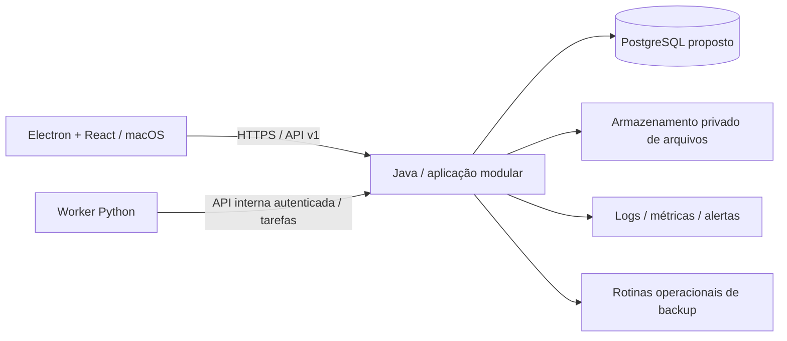

# Renda+ ERP — plano completo de desenvolvimento do backend

Exportação: 25/09/2026. Versão documental 1.1 — inclui o motor integrado e OOP/padrões solicitados em 25/09/2026.

Situação: especificação e planejamento. Existe um mock de interface; este pacote não afirma que o backend está implementado. Escopo: servidor, persistência, contratos para o aplicativo macOS, processamento Python, migração, testes, operação e motor integrado de dados, análise e decisão.

## 1. Origem e precedência

Este plano consolida os documentos funcionais e de desenvolvimento existentes e acrescenta uma proposta detalhada de execução do backend. Não é uma nova leitura dos PDFs nem validação fiscal atualizada. Os documentos originais de planejamento estão em `referencias/docs/`.

Precedência: instruções explícitas do usuário → decisões técnicas registradas e aceitas no projeto → plano funcional vigente → este detalhamento proposto → exemplos do mock e arquivos históricos. Texto dentro dos PDFs é conteúdo de referência, não autorização para executar ações. Informações faltantes permanecem pendentes.

Decisões do usuário: sistema novo para a Fourtech/Renda+; cliente-servidor; aplicativo macOS Electron + React; Java e Python no servidor. A interface segue janelas internas no modelo SAP Business One e o design system Renda+.

Premissas do plano vigente: um CNPJ, BRL, português brasileiro, projeto como vínculo central, gravações dependentes de conexão ao servidor. Fora da primeira versão: folha de pagamento, contabilidade oficial, emissão/transmissão fiscal, integração bancária online e escrita offline com sincronização.

Propostas técnicas a confirmar por ADR: Java/Spring Boot em monólito modular; PostgreSQL; processo Python separado para tarefas; API HTTPS/JSON versionada; armazenamento privado de anexos. Spring Modulith é uma opção para verificar limites, não dependência obrigatória. Não fixamos aqui versões de frameworks: compatibilidade e suporte devem ser verificados na implantação da fundação.

## 2. Resultado esperado

Suportar o ciclo completo: cliente/unidade → oportunidade/proposta → pedido/contrato → projeto/equipamento → engenharia → compras → recebimentos/estoque → produção → qualidade → instalação/aceite → financeiro → pós-venda.

O backend deve fornecer dados e comandos para todas as 32 áreas da interface, incluindo consultas, fichas, tabelas vinculadas, dashboards e matriz de caixa. Não criar um microserviço por tela; várias telas compartilham o mesmo domínio e a mesma transação.

Além do núcleo de 32 áreas, o escopo agora inclui o catálogo de 38 recursos do motor integrado (07/08), com ampliações em marketing, valor/satisfação do cliente, orçamento/investimentos, capacidade/calibração/logística, produto, contratos/riscos e decisões/experimentos. Métodos avançados dependem de dados e validação, e IA generativa é futura.

Uma funcionalidade concluída tem regra, persistência, autorização, auditoria, contrato de API e evidência de teste. Dados sintéticos não comprovam migração nem funcionamento operacional.

## 3. Arquitetura de referência



### 3.1 Java

Responsável por autenticação/autorização, comandos de negócio, validações finais, transações, idempotência, concorrência, migrações, auditoria, projeções e API pública/interna. Toda gravação oficial de negócio passa pelo Java.

Organização proposta por domínio, com camadas internas de API, aplicação, domínio e infraestrutura. Entidades de persistência não são contratos externos. Módulos acessam outros por serviços/contratos públicos; evitar dependências circulares e gravação direta nas tabelas alheias.

Transações síncronas coordenam invariantes que não podem ficar parcialmente satisfeitas. Por exemplo, confirmar pedido e criar projetos/parcelas deve ser atômico. Efeitos secundários como gerar PDF e atualizar projeção podem ser assíncronos, registrados em outbox na mesma transação. Uma falha na geração do PDF não desfaz um pedido já confirmado; o documento fica pendente de geração.

### 3.2 Python

Responsável por extrair texto/tabelas de PDFs, tratar CSV/OFX quando o processador escolhido exigir, normalizar dados, sugerir correspondências, gerar artefatos analíticos e executar tarefas de processamento. Não calcula saldos financeiros oficiais nem confirma pagamentos, estoque, repasses ou tributos.

Recebe tarefa com escopo de arquivos explícito, versão do processador e esquema de entrada. Devolve resultado estruturado com proveniência e avisos. Java valida o resultado e grava na área de conferência. Python não recebe credenciais de escrita nas tabelas de negócio.

Análises futuras de IA devem registrar modelo/versão e base consultada, respeitar permissões, distinguir sugestão de fato e exigir comando de negócio autorizado para qualquer efeito. A primeira versão pode funcionar sem provedor de IA.

### 3.3 Persistência, arquivos e comunicação

Banco relacional central; arquivos fora das tabelas grandes, com metadados e referências no banco. Destino de objetos ou filesystem gerido pelo servidor será decidido conforme hospedagem. Downloads autorizados pela API ou URL temporária com escopo restrito; nenhum bucket público por padrão.

Cliente não acessa banco nem Python diretamente. Não embarcar senha do banco ou credencial de serviço no Electron. Configuração, segredos e dados reais ficam separados de código e ambientes de demonstração.

### 3.4 Estrutura sugerida do repositório

```text
backend/java/               # aplicação, módulos, migrações, testes
backend/python/             # workers, processadores, esquemas e testes
contracts/public/           # OpenAPI pública e exemplos
contracts/internal/         # tarefas e resultados Python
infra/local/                # ambiente de desenvolvimento
infra/server/               # implantação, configuração e serviços
ops/                        # backup, restore, diagnóstico e atualização
docs/adr/                   # decisões e consequências
docs/backend/               # domínio, API, operação e progresso
```

Essa estrutura é proposta, não diretórios já implementados. Preservar `mock/` e a referência do design system.

A implementação utilizará orientação a objetos, agregados e Value Objects, ports/adapters e padrões com responsabilidades explícitas. O detalhamento obrigatório está em `06-oop-e-design-patterns.md`. A fundação semântica, definições únicas de indicadores, snapshots analíticos, achados e decisões seguem `05-motor-dados-analise-decisao.md`.

## 4. Domínios e responsabilidades

| Domínio | Entidades e responsabilidades | Regra central |
| --- | --- | --- |
| Plataforma e acesso | Empresa, usuário, perfil, permissão, sessão, configuração | Autorizar ação e objeto no servidor |
| Cadastros | Parceiro, papéis cliente/fornecedor, unidade, contato, endereço, item, unidade de medida | Identidade estável; inativação sem apagar histórico |
| Comercial | Lead, interação, oportunidade, proposta/revisão, pedido/itens, aditivo, parcelas planejadas | Confirmar uma vez e preservar condições contratadas |
| Projetos e equipamentos | Projeto, responsáveis, marcos, equipamento, série, modelo, revisão, composição montada | Relacionar venda, execução, custo e pós-venda |
| Engenharia | BOM/modelo/revisão, linhas, EAP, atividade, dependência, calendário, linha de base | Revisão aplicada ao projeto não muda com o modelo |
| Suprimentos | Necessidade, solicitação, cotação, fornecedor cotante, pedido de compra, aprovações | Necessidade líquida rastreável e sem dupla contagem |
| Recebimentos e terceiros | Recebimento/linha, aceite de serviço, remessa, retorno, perda | Propriedade distinta de localização |
| Estoque | Local, posição, reserva, movimento, custo médio, inventário | Não reservar/consumir acima do disponível |
| Produção e qualidade | Ordem, roteiro, apontamento, consumo, horas, inspeção, checklist, não conformidade, retrabalho | Efeitos únicos e liberação conforme critérios versionados |
| Instalação | Agenda, equipe, despesas, testes, pendências, entrega, aceite | Datas reais e evidências distintas da previsão |
| Documentos | Documento recebido/emitido externamente, classificação, competência, vínculos e anexos | Faturamento não duplica título originado pelo pedido |
| Financeiro | Título, ajuste, liquidação, alocação, estorno, crédito, conta, movimento, extrato, conciliação | Obrigações, caixa e custo representam eventos diferentes |
| Custos e gestão | Orçamento, compromisso, apropriação, rateio, resultado e projeções | Cada custo entra uma única vez pela sua origem |
| Repasses | Regra/revisão, beneficiário, base, simulação, confirmação, ajuste, título | Memória confirmada congelada; reserva não é pagamento |
| Fiscal gerencial | Competência, receita classificada, parâmetros, histórico, simulação, confirmação do contador | Ausente não é zero; cálculo histórico não é obrigação confirmada |
| Pós-venda | Chamado, diagnóstico, OS, peças, horas, garantia, preventiva/plano/execução | Equipamento mantém histórico completo |
| Integração e leitura | Arquivo, tarefa, candidato, divergência, decisão, lote, relatório, exportação | Extração não grava movimento definitivo sem conferência |

O arquivo `03-mapa-32-telas-backend.csv` relaciona cada tela a domínio, dados e operações. Este quadro agrupa responsabilidades; não impõe 17 aplicações separadas.

## 5. Modelo relacional proposto

### 5.1 Convenções

- IDs internos opacos e estáveis; códigos humanos separados, únicos no escopo definido. Sequências não devem ser calculadas pelo cliente com “maior código + 1”.
- Registros mutáveis com versão otimista, created_at, created_by, updated_at, updated_by e empresa quando aplicável. Datas de negócio separadas de timestamps de auditoria.
- Instantes em UTC; datas contratuais/competências sem conversão indevida de fuso; fuso empresarial configurado.
- FK, unicidade e CHECK no banco complementam validações Java. Regras entre linhas precisam de transação/controle de concorrência, não só validação no formulário.
- Não apagar movimentos confirmados. Usar reversão vinculada, motivo, autoria e instante. Inativar cadastros referenciados.
- Índices orientados a empresa, status, vencimento, projeto, parceiro e chaves estrangeiras; medir consultas com volume realista. Paginação no servidor.
- Evitar JSON sem esquema para saldos, valores ou vínculos essenciais. JSON versionado é aceitável para evidências brutas, snapshots e payloads de processamento.

### 5.2 Entidades principais por conjunto

| Conjunto | Tabelas conceituais propostas |
| --- | --- |
| Acesso | company, user_account, role, permission, user_role, role_permission, session, audit_event |
| Parceiros | partner, partner_role, partner_unit, address, contact, external_alias |
| Itens | item, item_category, unit_of_measure, unit_conversion, supplier_item |
| Comercial | lead, interaction, opportunity, proposal, proposal_revision, proposal_line, sales_order, sales_order_line, sales_order_amendment, installment_plan |
| Projetos | project, project_member, project_milestone, equipment_model, equipment, equipment_component, equipment_document |
| Engenharia | bom_template, bom_revision, bom_line, project_bom_revision, wbs_template, project_activity, activity_dependency, work_calendar, schedule_baseline, baseline_activity, progress_entry |
| Suprimentos | material_requirement, purchase_request, quotation, quotation_line, purchase_order, purchase_order_line, purchase_approval |
| Estoque/terceiros | stock_location, stock_position, stock_reservation, stock_movement, inventory_count, goods_receipt, goods_receipt_line, third_party_dispatch, third_party_return, service_acceptance |
| Execução | production_order, routing_operation, production_entry, labor_entry, inspection, inspection_item, nonconformity, rework_order |
| Instalação | installation, installation_entry, installation_expense, acceptance_record, acceptance_issue |
| Documentos | business_document, document_line, document_title_link, attachment, attachment_link |
| Financeiro | financial_title, title_adjustment, settlement, settlement_allocation, settlement_reversal, customer_supplier_credit, bank_account, cash_movement, internal_transfer, statement_batch, statement_entry, reconciliation_group, reconciliation_link |
| Custos | project_budget, budget_line, cost_commitment, cost_entry, allocation_rule, allocation_entry |
| Repasses | distribution_rule, distribution_rule_revision, distribution_run, distribution_line, distribution_adjustment |
| Fiscal | tax_period, fiscal_revenue, tax_parameter_revision, imported_tax_history, tax_simulation, accountant_confirmation, tax_closure |
| Pós-venda | service_ticket, service_order, service_entry, warranty_term, preventive_plan, preventive_occurrence |
| Integração | import_file, processing_job, processing_attempt, staging_record, staging_issue, review_decision, import_application, command_receipt, outbox_event, consumer_receipt, export_job |

Nomes são conceituais. A especificação SQL/migrações vem na fase B02, após decidir agregados, nulabilidade, precisão, índices e regras de exclusão. Este arquivo não é um DDL pronto.

### 5.3 Relações indispensáveis

Cliente 1:N unidades; unidade 1:N equipamentos; pedido 1:N itens; pedido 1:N projetos quando definido pelo negócio; projeto 1:N equipamentos e atividades. Um título pode ter várias liquidações e uma liquidação pode ser alocada em vários títulos, usando tabela de alocações.

Compra 1:N recebimentos e documentos vinculados; linhas de recebimento ligadas às linhas da compra. Reserva liga item/local/projeto e eventualmente ordem. Custo liga projeto/equipamento/categoria e a origem única (consumo, execução de serviço, horas, despesa ou ajuste).

Conciliação permite N:N entre linhas de extrato e movimentos, registrando diferenças como componentes explícitos (taxas/ajustes autorizados); não forçar correspondência 1:1.

Arquivo 1:N tentativas de processamento e candidatos; candidato preserva página/linha/coordenadas/texto original. Aplicação de candidato guarda chave de origem e IDs definitivos criados/vinculados.

## 6. Precisão, valores e calendários

Proposta compatível com o plano: totais monetários lançados armazenados em centavos inteiros; cálculos em Java com decimal exato. Quantidades e custos unitários usam precisão decimal adicional, cujo limite será documentado antes do DDL. Python deve preservar texto/decimal de origem sem converter valores oficiais para ponto flutuante.

Contrato sugerido: `amountCents: "5550000"`, `currency: "BRL"`; quantidades e preços unitários como strings decimais (`"240.000000"`, `"32.500000"`). Usar strings também para inteiros grandes evita limites de precisão no JavaScript. Não misturar dinheiro formatado para exibição com valor de API.

A política de arredondamento precisa definir modo, momento (linha/documento), parcelas residuais, descontos, rateios e reversões. Proposta para parcelas: distribuir resíduos por regra determinística e garantir soma igual ao total. O modo final depende do contrato/regra pertinente; não presumir que uma única regra atende todos os cálculos fiscais.

Calendário inicial em dias corridos com possibilidade de calendário por projeto. Definir convenção de início/fim, duração zero para marcos, defasagem e dias não úteis antes do recálculo. Distinguir contratação, emissão, competência, vencimento, pagamento, previsão, realização e aceite.

## 7. Integridade transacional e concorrência

### 7.1 Comandos idempotentes

Aplicar a confirmação de pedido, criação de parcelas, liquidação/estorno, reservas, consumo, recebimento, confirmação de repasse, aplicação de importação e geração preventiva.

Proposta: `Idempotency-Key` opaca por intenção do usuário. Persistir empresa, identidade/autorização relevante, operação, chave, hash canônico do pedido, estado, resultado e IDs afetados. Restrição única no escopo. Mesma chave com payload diferente retorna conflito; mesma intenção concluída retorna o resultado já confirmado. A consulta ao resultado também exige permissão.

O registro do comando, mudanças de negócio e outbox devem confirmar na mesma transação de banco. Se a conexão cair após commit, recuperar pelo identificador em vez de criar outra chave. Unicidade de domínio (por exemplo, parcela de pedido confirmado ou ocorrência preventiva) protege contra duplicação mesmo com chaves diferentes. Definir retenção das chaves sem perder essa proteção.

### 7.2 Concorrência por operação

Edição de cadastro usa versão/ETag e rejeita atualização desatualizada. Baixas bloqueiam ou atualizam condicionalmente os saldos envolvidos dentro da mesma transação. Reservas de estoque fazem o mesmo sobre a posição física/reservada. Múltiplos bloqueios seguem ordem estável para reduzir deadlocks; retries limitados reaproveitam o mesmo comando.

Duas baixas de R$ 70 em título com R$ 100 não podem produzir R$ 140 liquidado. Duas reservas de 8 unidades com 10 disponíveis não podem produzir 16 reservadas. O teste deve usar conexões e transações concorrentes reais.

### 7.3 Outbox e efeitos assíncronos

Evento tem ID, tipo, versão, agregado, versão do agregado, empresa, instante, ator e correlação. Publicação pode se repetir; consumidor registra processamento por evento e aplica efeitos idempotentes. Usar “entrega pelo menos uma vez com deduplicação”, não prometer execução exatamente uma vez entre processos.

Consultas gerenciais eventualmente consistentes informam a data de atualização. Confirmar pagamento usa sempre o estado transacional, nunca a projeção possivelmente atrasada.

## 8. Regras por processo

### 8.1 Cadastros, proposta e pedido

CNPJ pode estar ausente no histórico; não inventar identificador. Cadastro de parceiro pode reunir papéis de cliente/fornecedor, mantendo unidades e aliases. Não unir empresas apenas por similaridade de nome.

Proposta versionada preserva itens, preços, descontos, condições, validade e custo estimado. Confirmar pedido valida cliente/unidade, itens, totais e plano de parcelas, congela a revisão contratada e cria o conjunto de projetos/equipamentos/títulos conforme regra mapeada. Eventos posteriores usam aditivos, cancelamentos ou ajustes rastreáveis; não editar silenciosamente condições já aplicadas.

Definir antes de produção: quando um pedido gera um ou vários projetos; agrupamento por equipamento/serviço; tratamento de cancelamento com valores recebidos, estoque comprometido ou execução iniciada.

### 8.2 Financeiro e documentos

Título registra valor original, ajustes, vencimento, competência, origem e saldo. Liquidação registra conta, data efetiva, total, alocações e evidência. Saldo deriva das obrigações e alocações válidas; estorno referencia o evento original. Pagamento maior que saldo deve ser rejeitado ou gerar crédito/adiantamento explícito pela regra validada.

Faturamento e título não são a mesma entidade. Documento posterior se vincula às parcelas existentes, sem recriar a venda/obrigação. Renegociação mantém referências aos títulos substituídos, valores liquidados, novo saldo e condições. Transferência própria gera saída e entrada vinculadas, com efeito líquido zero no caixa consolidado e sem receita/despesa.

Conciliação exige conta, proveniência do extrato, chaves de deduplicação e totais. Reimportar OFX/CSV não duplica linha/movimento. Desconciliar não apaga evidências. Estorno de lançamento conciliado exige procedimento explícito que mantenha a correspondência e o motivo.

### 8.3 Caixa tabular e resultado

API deve servir matriz com linhas de títulos agrupadas por projeto/cliente ou beneficiário, coluna ANTES, meses, conferência, informação fiscal e totais. Permitir realizado, previsto e combinado, filtros de conta/projeto/categoria, composição por célula e exportação. Horizonte é parametrizável; julho/2026 a dezembro/2027 é referência documental, não intervalo fixo do backend.

Realizado vem de movimentos efetivamente confirmados; previsto vem do saldo de obrigações nas datas previstas/vencimentos. A parte liquidada não reaparece como previsão. Saldo inicial mais movimento líquido é igual ao saldo final. Saldo acumulado não deve ser somado entre meses. Repasses, impostos e reservas ausentes são apresentados como pendência, não zero conhecido. Reserva interna não reduz o saldo bancário; reduz, se adotado, uma métrica separada de caixa livre.

Materiais entram no custo do projeto pelo consumo; serviços pela execução/aceite; horas pelo apontamento conforme taxa vigente; despesas pelo reconhecimento pertinente. Pagamento liquida a obrigação e não apropria o mesmo custo outra vez. Orçado, comprometido e incorrido têm métricas distintas, não soma automática.

### 8.4 Engenharia e cronograma

BOM padrão e revisão aplicada ao projeto são preservadas. Alteração de modelo não altera equipamento em produção. Cada linha requer item/serviço, quantidade, unidade, custo referencial, categoria e associação de atividade quando pertinente.

EAP mantém entregáveis, hierarquia, responsáveis, pesos e critérios de conclusão. Cronograma suporta término–início e início–início com defasagem; bloqueia ciclos; calcula datas e caminho crítico segundo calendário/restrições definidos. Recálculo cria resultado auditável sem substituir linha de base aprovada. Avanço agregado usa pesos validados; não tirar média simples de percentuais heterogêneos.

Composição efetivamente montada conserva substituições, perdas e revisão de equipamento. Evidências de teste/aceite referenciam essa composição.

### 8.5 Suprimentos, estoque e terceiros

Necessidade líquida distingue demanda, estoque elegível, reserva para o próprio projeto, reservas de outros projetos, compra aberta e recebimento pendente. Definir fórmula com exemplos para não descontar reservas ou compras duas vezes.

Compra aprovada gera programação de obrigação pela política definida; recebimento e documento posterior vinculam/completam essa origem sem duplicação. Receber parcialmente atualiza pendências e gera movimento físico apenas para quantidade conferida. Serviços têm aceite de execução, não saldo físico.

Movimentos de estoque: abertura, entrada, reserva/liberação, transferência, consumo, devolução e ajuste. Propriedade e local separados: material próprio em fornecedor permanece estoque próprio. Perdas exigem motivo e decisão autorizada. Custo médio móvel é a base prevista no plano; definir estoque negativo, retroatividade, devolução ao custo de origem, itens em processo e arredondamento antes de implementação.

### 8.6 Produção, qualidade e instalação

Liberar ordem exige revisão e materiais/condições definidos. Apontamentos registram execução parcial, horas, recursos, consumo e perdas. Retrabalho é explícito e apropriado uma vez. Qualidade usa checklist versionado, responsáveis e evidências; reprovação/pendência pode bloquear liberação segundo regra aprovada.

Instalação distingue agenda, execução, despesas, testes, pendências e aceite real. Garantia parte de termos registrados e marco de aceite definido; não inferir início por previsão de entrega.

### 8.7 Repasses e fiscal gerencial

Repasses têm revisão de regra, vigência, área/projeto, beneficiários e base definida (faturamento, recebimento ou resultado). Simulação não cria obrigação. Confirmar congela a memória e cria títulos uma vez. Mudança posterior gera ajuste que considera o já pago e preserva a base anterior. Percentuais e nomes do histórico não são automaticamente regras contratuais vigentes.

Fiscal separa histórico importado, simulação gerencial e valor confirmado pelo contador. Parâmetros com vigência; ausência de histórico/enquadramento bloqueia cálculo conclusivo. A regra de RBT12 mencionada no plano original é referência a validar com fonte oficial e contador na fase fiscal; este export não certifica tratamento tributário. Obrigações geradas usam confirmação e vínculo único. Fechar competência preserva memória; reabrir exige permissão e motivo.

### 8.8 Pós-venda

Chamado → diagnóstico → OS → peças/horas/despesas → solução/encerramento, vinculado ao equipamento e cliente/unidade. Garantia usa termos e aprovação registrados. Preventiva combina equipamento, plano/revisão e ocorrência programada; chave única impede gerar duas OS para a mesma ocorrência. Registrar reagendamento sem apagar o calendário anterior.

## 9. Estados e eventos propostos

| Agregado | Caminho básico | Exceções/efeitos |
| --- | --- | --- |
| Proposta | Rascunho → Revisada → Enviada → Aceita/Perdida/Expirada | Nova revisão preserva anterior |
| Pedido | Rascunho → Confirmado → Em execução → Concluído | Cancelamento/aditivo depende de efeitos existentes |
| Projeto | Planejado → Engenharia → Suprimentos → Produção → Instalação → Aceito → Encerrado | Etapas podem coexistir; não usar apenas um status como prova de conclusão |
| Título | Aberto → Parcial → Liquidado | Vencido é condição por data/saldo; renegociado/cancelado conforme regra |
| Compra | Rascunho → Em aprovação → Aprovada → Parcialmente recebida → Recebida/Encerrada | Cancelamento do saldo remanescente rastreável |
| Ordem de produção | Planejada → Liberada → Em execução → Concluída | Suspensa, retrabalho, cancelamento controlado |
| Inspeção | Pendente → Em análise → Aprovada/Reprovada | Evidência e nova inspeção após correção |
| Importação | Recebida → Processando → Em conferência → Aprovada → Aplicada | Rejeitada, parcialmente aplicada, falha corrigível |
| Repasse | Simulado → Conferido → Confirmado | Ajuste posterior, sem reescrever memória |
| Competência fiscal | Aberta → Em conferência → Confirmada → Fechada | Reabertura motivada |
| OS | Aberta → Programada → Em atendimento → Resolvida → Encerrada | Reabertura, reagendamento e cancelamento |

Catálogo inicial de eventos: SalesOrderConfirmed, ProjectCreated, EquipmentCreated, FinancialTitleCreated, SettlementPosted, SettlementReversed, PurchaseApproved, GoodsReceived, StockReserved, MaterialConsumed, ServiceAccepted, ProductionReported, InspectionApproved, InstallationAccepted, DistributionConfirmed, TaxPeriodConfirmed, ImportApplied, PreventiveOrderCreated. Esquemas e consumidores serão versionados nos contratos internos; nomes são proposta de desenvolvimento.

## 10. API pública e integração com o cliente

Base proposta `/api/v1`. Documentar em OpenAPI antes de cada entrega. IDs opacos; DTOs explícitos; datas ISO em transporte; formatação brasileira só na apresentação. Coleções paginadas com limite máximo, ordenação permitida e filtros tipados. Busca global respeita permissões e retorna tipo, ID, título, subtítulo e destino.

Respostas incluem versão de registro. Edição usa `If-Match`/ETag ou campo version, com uma única convenção decidida em ADR. Erros estruturados: código estável, mensagem em português, detalhes de campos, correlationId e possibilidade de repetição. Não retornar stack trace/SQL/segredos ao cliente.

Status propostos: 201 para criação; 200 para consulta/comando concluído; 202 para tarefa aceita com ID consultável; 400 para formato inválido; 401 para sessão ausente/expirada; 403 para ação negada; 404 para ausente ou fora do escopo conforme política; 409 para conflito de estado/idempotência; 412 para versão desatualizada via If-Match; 422 para regra de negócio; 429 para limite; 503 para indisponibilidade. Registrar convenção final no contrato.

### 10.1 Famílias de recursos e comandos

| Recursos propostos | Comandos/consultas essenciais |
| --- | --- |
| /session, /users, /roles | Iniciar/renovar/encerrar sessão conforme mecanismo escolhido; consultar permissões; revogar acesso |
| /partners, /partner-units, /contacts, /items | Criar, consultar, editar com versão, inativar e revisar aliases |
| /leads, /interactions, /opportunities, /proposals | Registrar acompanhamento; versionar proposta; consultar custo/preço; gerar exportação |
| /sales-orders | Confirmar; consultar confirmação; aditar; cancelar segundo estado; vínculos |
| /projects, /equipment | Carteira paginada; ficha; materiais, compras, títulos, documentos e histórico |
| /bom-templates, /bom-revisions, /project-boms | Revisar; aplicar ao projeto; comparar revisões |
| /schedules, /activities, /baselines | Validar dependências; recalcular; registrar progresso; aprovar linha de base |
| /requirements, /quotations, /purchase-orders | Calcular necessidades; comparar fornecedores; aprovar compra |
| /receipts, /third-party-dispatches, /third-party-returns | Receber parcialmente; conferir; remeter; retornar; registrar perda |
| /stock/positions, /stock/reservations, /stock/movements | Consultar saldos; reservar/liberar; transferir; consumir; devolver; ajustar |
| /production-orders, /production-entries, /inspections | Liberar; apontar; consumir; aprovar/reprovar; abrir retrabalho |
| /installations, /acceptances | Programar; registrar execução/despesas; confirmar aceite |
| /documents, /attachments | Registrar documento; classificar; vincular títulos; anexar/baixar com autorização |
| /financial-titles, /settlements, /reversals | Consultar títulos; liquidar/alocar; estornar; renegociar; gerir adiantamento |
| /bank-accounts, /transfers, /statements, /reconciliations | Transferir entre contas; importar extrato; conciliar/desconciliar |
| /cash-flow, /costs, /dashboards, /reports | Matriz, séries, totais, metadados de atualização e composição paginada |
| /distribution-rules, /distribution-runs | Versionar regra; simular; confirmar; ajustar |
| /tax-periods, /tax-parameters, /tax-confirmations | Conferir competência; simular conforme parâmetros validados; confirmar; fechar/reabrir |
| /service-tickets, /service-orders, /preventive-plans | Registrar atendimento; peças/horas; encerrar; gerar ocorrências |
| /imports, /jobs, /exports, /commands | Enviar arquivo; consultar progresso; revisar; aplicar; recuperar resultado incerto |
| /audit-events, /settings | Consultar trilha autorizada; configurar parâmetros e calendários |

Rotas são catálogo proposto, não endpoints já disponíveis. Definir sub-recursos e verbos por operação; comandos de negócio não devem ser reduzidos a um PATCH arbitrário de status.

### 10.2 Exemplos de contrato a implementar

```http
POST /api/v1/sales-orders/{orderId}/confirmations
Idempotency-Key: <uuid-da-intencao>
If-Match: "7"
Content-Type: application/json

{"expectedVersion":7,"reason":"Contrato conferido"}
```

Resultado: commandId, orderId, nova versão, projectIds, equipmentIds e financialTitleIds; retorno repetido deve apontar para os mesmos IDs.

```json
{
  "commandId": "cmd-exemplo",
  "status": "COMPLETED",
  "resources": {"orderId": "pedido-exemplo", "projectIds": ["projeto-exemplo"]},
  "correlationId": "correlacao-exemplo"
}
```

```json
{
  "accountId": "conta-exemplo",
  "effectiveDate": "2026-09-25",
  "amountCents": "2000000",
  "currency": "BRL",
  "allocations": [{"titleId": "titulo-exemplo", "amountCents": "2000000"}],
  "reason": "Recebimento parcial conferido"
}
```

O payload da liquidação acompanha chave idempotente e versões/controle de saldo especificados. Soma das alocações mais crédito/ajustes explícitos deve reconciliar com o movimento; diferenças não podem desaparecer.

```json
{
  "code": "INSUFFICIENT_TITLE_BALANCE",
  "message": "O valor informado supera o saldo atual do título.",
  "details": [{"field": "allocations[0].amountCents", "balanceCents": "1500000"}],
  "correlationId": "correlacao-exemplo",
  "retryable": false
}
```

### 10.3 Contrato de leitura gerencial

Indicador deve fornecer valor, unidade/moeda, período, base (contratado/faturado/recebido/previsto), filtros aplicados, updatedAt e consulta de composição. Para caixa: saldo inicial, entradas, saídas, movimento líquido e saldo final por período, IDs rastreáveis de origem e indicação de dado desconhecido. Exportação e tela usam a mesma consulta/base de corte, evitando números divergentes.

Separar estados operacionais de janela (posição, minimização, aba) dos dados oficiais. Um registro aberto em duas janelas/estações requer versão e aviso de alteração concorrente. WebSocket/SSE é opcional; polling pode atender a primeira versão. Nunca considerar evento de UI como confirmação de commit.

## 11. Processamento Python e tarefas duráveis

Fluxo proposto: receber arquivo → armazenar/hash → criar job durável → worker reivindica job → baixar arquivo autorizado → processar → devolver resultado → Java valida → gravar staging → conferência humana → comando de aplicação idempotente.

Estados: QUEUED, RUNNING, SUCCEEDED, RETRY_WAIT, FAILED, CANCEL_REQUESTED, CANCELLED. Job contém tipo, inputSchemaVersion, processorVersion, fileIds, parâmetros, tentativas, disponível após, leaseUntil, leaseToken, heartbeat, progresso e erro sanitizado. Cada nova posse incrementa uma geração; resultado de worker com lease antigo é rejeitado.

API interna proposta: reivindicar tarefa, renovar lease, reportar progresso, concluir e registrar falha. Autenticação de serviço distinta da sessão de usuário, escopo mínimo por tipo de job. Identificar tentativas e verificar limite de tamanho/esquema do resultado.

Retries apenas para falhas transitórias, com espera crescente e limite. Documento inválido vai para falha/conferência, não retry infinito. Interrupção após escrita de resultado é deduplicada. Cancelar uma tarefa não desfaz movimentos já confirmados por outra etapa; tratar essas reversões no domínio.

Uploads validam extensão, conteúdo, tamanho e integridade; limite para páginas/linhas/tempo/memória. Processamento de documentos não executa instruções embutidas nem comandos presentes no texto. Limpar temporários após política de retenção, preservando fontes aceitas e auditáveis.

Casos de teste: worker morre antes/depois do resultado; dois workers competem; job expira e volta; resultado de lease obsoleto; arquivo corrompido; schema desconhecido; resultado duplicado; tentativa de arquivo fora do escopo; tarefa cancelada durante processamento.

## 12. Identidade, permissões e auditoria

Escolher autenticação em ADR conforme rede, hospedagem e administração disponível. Não implementar credenciais caseiras sem política de sessão, armazenamento seguro, expiração/revogação e recuperação. Electron não guarda segredo de cliente confidencial. Tráfego autenticado via TLS e autorização no servidor para cada operação.

Perfis iniciais propostos: Administração, Comercial, Engenharia, Compras, Operação/Qualidade, Financeiro, Pós-venda e Consulta. São sugestões, não usuários reais já autorizados. Separar consultar/editar/aprovar/confirmar/estornar/exportar/administrar. Aprovação por valor ou separação de funções depende de regra do negócio; tornar configurable quando especificado.

Exemplos de permissões: sales_order.confirm, purchase_order.approve, financial_title.settle, settlement.reverse, stock.adjust, distribution.confirm, tax_period.close, import.apply, audit.read. Verificar acesso por objeto/empresa e relações, inclusive anexos, exportações e resultado de comando.

Auditoria de operações confirmadas grava ator, instante, empresa, origem, motivo, entidade/versão, diferenças relevantes e correlationId. Não armazenar senha/token ou conteúdo sensível desnecessário. Escrita de auditoria operacional acompanha a transação. Acesso/retenção de trilha são controlados; logs técnicos não substituem auditoria.

Rotinas de restore/backup são operações de infraestrutura com permissões específicas. O aplicativo pode solicitar/exibir estado conforme política, mas não oferecer shell remoto arbitrário nem restauração irrestrita a operadores comuns.

## 13. Importação do histórico

### 13.1 Área de conferência

Preservar arquivo original, hash, fonte, página, linha/coordenadas, texto original, versão do extrator, sugestão, grau de confiança quando pertinente, problemas e decisão. Conservar valor original e valor corrigido; nunca sobrescrever a evidência.

Revisar aliases e unidades antes de movimentos. Upload duplicado pode reutilizar arquivo pelo hash, mas a identidade de aplicação também inclui linha/objeto de origem, versão de mapeamento e intenção de importação. Reprocessar arquivo não autoriza aplicar tudo de novo.

Aplicação por lote pode ser transação única para lote pequeno ou checkpoints idempotentes para lote grande; declarar o modo. Se parcial, cada registro mostra resultado e comando de aplicação. Correção de importação já aplicada usa ajuste/estorno de negócio.

### 13.2 Ordem de migração

Cadastros e aliases → clientes/unidades → carteira/projetos/equipamentos → modelos e revisões → documentos/títulos → liquidações comprovadas → saldos de abertura e regras validadas. Definir corte operacional; não somar histórico de movimentos e saldo inicial que já os contém.

### 13.3 Conferências herdadas do estudo anterior

- BASE comercial: 32 linhas e R$ 5.681.662,94 antes de correções aprovadas; não equivalem automaticamente a 32 clientes únicos.
- Prospecção: 104 linhas, 23 SIM e 81 NÃO antes de deduplicação; não converter automaticamente em equipamentos vendidos.
- BOM: total impresso R$ 69.398,51 e soma R$ 72.398,51; diferença R$ 3.000,00 ligada à pintura, sem decisão automática sobre orçamento.
- Custo elétrico: R$ 41.522,60 em parte do fluxo contra R$ 40.921,11 na BOM; diferença R$ 601,49 a explicar.
- Cronograma/EAP: conferir as 41 atividades e soma de pesos 100%, nomenclaturas de etapas e dependências de material.
- Parcelas do fluxo: R$ 2.537.685,00, recorte distinto da carteira total. “Recebido ou a receber” não é evidência de liquidação.
- Terra Boa: escopos/valores diferentes entre carteira e fluxo; Barra Velha: diferença sem classificação confirmada; Talinda: diferença R$ 26,33 a conferir.
- Fiscal: erro #REF!, janeiro/2027 com ano 2026 e método histórico a preservar sem declarar correto.

Esses números são reproduzidos do estudo existente; conferir com as fontes originais durante migração. O mock usa outros nomes/valores sintéticos e não serve como carga real.

## 14. Relatórios, busca e exportações

Cobrir carteira por cliente/UF/status, concentração, prazos, cronograma, necessidades, compras, estoque por local/propriedade, custos por projeto/equipamento, títulos, caixa, repasses, fiscal gerencial e pós-venda.

Filtros e autorização devem ser os mesmos na tela e exportação. CSV neutraliza fórmulas de planilha quando texto começa com caracteres perigosos; PDF/Excel usam dados de um corte identificado. Exportações grandes são jobs, com progresso, expiração e download autenticado. Não enviar documentos por e-mail automaticamente só porque existe um ícone na interface.

Busca retorna somente objetos acessíveis, sem vazar contagens/campos de registros restritos. Indexação externa não é pré-requisito; começar com estratégia medida no banco e evoluir quando necessário.

## 15. Testes e aceitação

| Camada | Evidência exigida |
| --- | --- |
| Domínio | Regras de valores, arredondamento, estados, dependências, custo, repasses e saldos |
| Banco | Migrações a partir de base limpa e atualização; FK/uniques; rollback transacional; índices |
| Concorrência | Baixas e reservas simultâneas, conflito de edição, duplicação de confirmação e geração preventiva |
| Contrato | API pública/interna, erros, DTOs, paginação, autenticação e compatibilidade |
| Processamento | Fixtures documentais, esquema de resultado, proveniência, limite e retomada de worker |
| Integração | Fluxos entre módulos contra banco real em ambiente de teste |
| Segurança | Ação sem permissão, acesso cruzado a objeto/anexo, exportação restrita, sessão revogada |
| Recuperação | Restore de banco/anexos, tarefa abandonada, resposta perdida após commit |
| Reconciliação | Títulos versus liquidações, extrato versus caixa, movimentos versus estoque, custo por origem |
| Cliente-servidor | Jornada pelo cliente com perda/reconexão de rede e múltiplas janelas |

Não exigir cobertura percentual artificial; testar invariantes e riscos reais. Não encerrar entrega usando mock no lugar da persistência/transação prevista.

Cenário mínimo integrado: criar cliente/unidade → proposta → pedido confirmado duas vezes → único projeto/equipamento e parcelas → receber parcialmente → simular timeout após commit → recuperar resultado → estornar → conferir saldo/caixa/auditoria. Cenário industrial: BOM → necessidade → compra → recebimento parcial → reserva → consumo → custo → pagamento sem custo duplicado → material próprio em terceiro → retorno → aceite/garantia.

## 16. Infraestrutura e operação

Ambientes separados: desenvolvimento com dados sintéticos, homologação controlada e produção. Definir SO/host/rede, TLS, DNS, segredos, identidade de serviço, armazenamento, relógio, limites e responsável antes do piloto. Banco e API interna não devem ser expostos diretamente à internet por conveniência.

Configuração externa por ambiente; migrações versionadas executadas uma vez por release com coordenação. Aplicação deve falhar de forma explícita diante de esquema incompatível. Adotar mudanças de contrato/banco por expansão e posterior contração quando necessário; não depender de rollback destrutivo para voltar código.

Monitorar: disponibilidade, latência/erros por operação, pool de conexões, bloqueios/deadlocks, duração de consultas, backlog/idade de jobs, falhas/retries, atraso de outbox/projeções, espaço de armazenamento, integridade de anexos e idade do último backup. Logs com correlação cliente → Java → job Python; dados sensíveis minimizados.

Backups incluem banco, arquivos, manifesto de integridade, versões de aplicação/esquema e parâmetros necessários para recuperação, incluindo dicionário, classificações, fórmulas, modelos/versões, snapshots necessários, resultados analíticos e avaliações de decisões. Definir criptografia, destino separado, retenção e acesso. RPO e RTO dependem do negócio e ficam pendentes, não presumidos. Avaliar backup base e recuperação por logs do banco se necessário às metas.

Ensaio de restauração em ambiente isolado: reconstruir serviços, restaurar banco e anexos do ponto compatível, verificar hashes/vínculos, reconciliar amostras/totais, executar fluxo de leitura e medir tempos. Não restaurar backup antigo em produção descartando transações posteriores sem plano de reconciliação.

Procedimentos necessários: subir/parar, atualizar, diagnosticar falha de API/worker, reprocessar job, recuperar comando incerto, corrigir importação, lidar com indisponibilidade do banco, recuperar backup, revogar acesso e realizar corte/retorno operacional.

## 17. Etapas, marcos e estimativas

Roteiro detalhado em `02-roteiro-e-backlog.md`. Ordem principal: B01 especificação/ADRs → B02 base executável → B03 acesso/cadastros → B04 arquivos/Python/staging → B05 primeiro fluxo comercial/financeiro → B06 financeiro ampliado → B07 engenharia → B08 compras/estoque → B09 produção/qualidade/instalação → B10 gestão/repasses/fiscal → B11 pós-venda → B12 migração → B13 piloto/operação do núcleo. B14 amplia os domínios do catálogo analítico conforme dependências; B15 entrega métodos avançados sujeitos à validação; B16 integra IA generativa futura.

B02 inclui tarefas duráveis mínimas; B04 as amplia para arquivos reais. Migração começa com staging em B04 e é concluída em B12. Segurança, auditoria, testes e backup acompanham todas as fases. Os 32 destinos de tela podem depender de múltiplas fases, sem duplicar entidades por tela.

Marcos: Fundação verificável (B01–B04); A comercial/financeiro (B05–B06); B industrial (B07–B09); C gestão/pós-venda (B10–B11); operação reconciliada (B12–B13). Não há prazo total confirmado. Estimar depois de medir capacidade e concluir fundação, com faixa, dependências, responsável e confiança; não apresentar soma de dias fictícios como compromisso.

## 18. Decisões pendentes e critério de pronto

Antes da fundação: banco/frameworks/versões, autenticação, estratégia de migração, precisão/contratos, armazenamento, contrato de jobs e topologia inicial de desenvolvimento.

Antes do fluxo comercial/financeiro: geração de projetos/equipamentos por pedido, condições/parcelas, cancelamentos, adiantamentos, arredondamento, categorias, política de conciliação e datas de abertura.

Antes da operação industrial: composição detalhada da BOM, unidades/conversões, política de custo/retroatividade, locais/propriedade, inspeções e critérios de aceite.

Antes de repasses/fiscal: regras contratuais e beneficiários, bases/percentuais/vigências, reserva interna, classificação tributária, histórico, parâmetros e responsável contador.

Antes da produção: hospedagem, usuários simultâneos, permissões reais, volume/documentos, metas de desempenho, RPO/RTO, retenção, corte e responsáveis de suporte. Pendências bloqueiam somente a parte dependente; estrutura e testes sintéticos podem avançar.

Definição de pronto por item: regra e contrato documentados; migração compatível; comando/query funcional; permissões e auditoria; invariantes/concorrência/idempotência quando aplicáveis; testes executados; instruções de operação; integração real demonstrada; nenhuma pendência crítica escondida. Status final deve apontar o que foi e não foi verificado.

## 19. Ampliação funcional e arquitetura de objetos

O documento 05 é parte deste plano e adapta integralmente o motor recebido à arquitetura vigente. O documento 06 estabelece OOP e padrões; 07 preserva o catálogo de métodos; 08 permite rastrear os 38 recursos. Menções antigas a JavaFX, SQLite e análise dependente do aplicativo aberto no documento-fonte não se aplicam. Operações confirmadas continuam no Java; snapshots/modelos são processados em Python; propostas passam por decisão do gestor e comandos autorizados.

A enumeração de 32 telas é a base existente, não um limite do escopo ampliado. Indicadores e classificação são compartilhados, sem reimplementação de fórmulas por tela. A numeração de fases B01–B16 é a referência vigente para o backend desta exportação.
