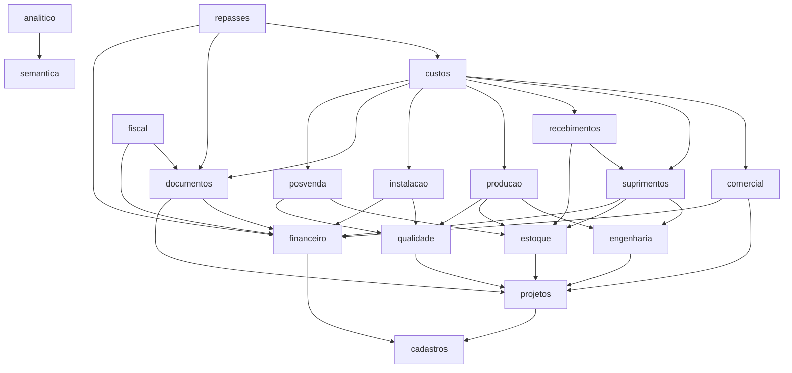

# B01 — Módulos e direção das dependências

Situação: especificação proposta no B01 (ADR-016). Fonte canônica: `b01/modulos.json`. Verificação: `python3 tools/b01/verificar_b01.py`.

## 1. Princípios

- Monólito modular Java: cada módulo tem camadas `api` (contratos públicos: comandos, consultas, tipos de evento), `application` (casos de uso), `domain` (agregados e Value Objects) e `infrastructure` (persistência, HTTP, adaptadores).
- Um módulo usa apenas a `api` pública dos módulos dos quais depende. Nunca grava tabelas de outro módulo nem usa suas classes internas.
- **O consumidor depende do provedor.** O comercial chama a API do financeiro para emitir títulos; o financeiro não conhece o comercial, só guarda a origem como `EntityRef` opaco (`{type: "SALES_ORDER_INSTALLMENT", id}`).
- **Síncrono quando a invariante exige atomicidade.** Confirmar pedido, criar projetos/equipamentos e emitir títulos acontece em uma transação local.
- **Assíncrono quando o efeito é gerencial.** Custo incorrido, bases de repasse e receita fiscal consomem eventos pelo outbox, com deduplicação por `eventId` e unicidade por origem `(sourceType, sourceId)`.
- O motor analítico consome o **fato operacional genérico** publicado pela plataforma. Não depende dos módulos de negócio, e a falha dele não bloqueia operações.
- `consultas` só lê: dashboards, relatórios, visão do projeto, busca global e exportações. Nenhum módulo depende dele.

## 2. Grafo do núcleo de negócio

`kernel`, `acesso`, `auditoria` e `plataforma` são usados por todos e foram omitidos. `integracao` (aplica importações pelas APIs públicas de cadastros, comercial, projetos, financeiro, engenharia, estoque, documentos e fiscal) e `consultas` (lê todos) também ficam fora do desenho.

Diagrama completo: `python3 tools/b01/verificar_b01.py --diagrama`. O verificador falha se houver ciclo, dependência inexistente, consumidor de evento que não dependa do produtor ou comando que emita evento de módulo não dependente.

## 3. Módulos

| Módulo | Possui | Chama (síncrono) | Consome eventos de |
|---|---|---|---|
| kernel | Money, Quantity, Rate, DateRange, CompetencePeriod, EntityRef, IDs, RoundingPolicy, AllocationPolicy | — | — |
| acesso | Empresa, usuário, perfil, permissão, sessão, AuthorizationDecision | — | — |
| auditoria | AuditEvent (mesma transação) | acesso | — |
| plataforma | CommandReceipt, OutboxEvent, ConsumerReceipt, OperationalFact, ProcessingJob, StoredFile, Setting | acesso, auditoria | — |
| semantica | BusinessConcept, FormDefinition, ClassificationRule/Assignment | plataforma | — |
| cadastros | Partner (papéis), PartnerUnit, Contact, Alias, Item, UnitOfMeasure, UnitConversion, Category | — | — |
| projetos | Project, ProjectMember, Milestone, EquipmentModel, Equipment, AssembledComposition | cadastros | — |
| financeiro | FinancialTitle, Settlement, SettlementReversal, PartnerCredit, BankAccount, CashMovement, Transfer, StatementBatch, ReconciliationGroup, CashMatrixQuery | cadastros | — |
| comercial | Lead, Interaction, Opportunity, Proposal/Revision, SalesOrder, Amendment, PaymentSchedule | projetos (ProjectProvisioningApi), financeiro (TitleIssuanceApi) | — |
| engenharia | BomTemplate/Revision, ProjectBom, WbsTemplate, Activity, Dependency, WorkCalendar, Baseline, ProgressEntry | projetos | — |
| estoque | StockLocation, StockPosition, Reservation, StockMovement, InventoryCount, ThirdPartyDispatch/Return | projetos | — |
| suprimentos | RequirementRun, PurchaseRequest, Quotation, PurchaseOrder, Approval | engenharia, estoque, financeiro (TitleIssuanceApi) | — |
| recebimentos | GoodsReceipt, ServiceAcceptance, SupplierReturn | suprimentos, estoque (StockMovementApi) | — |
| qualidade | ChecklistRevision, Inspection, Nonconformity, Rework | projetos | — |
| producao | ProductionOrder, Routing, ProductionEntry | engenharia, estoque, qualidade | — |
| instalacao | Installation, InstallationEntry, InstallationExpense, Acceptance | qualidade, financeiro | — |
| documentos | BusinessDocument, DocumentLine, DocumentTitleLink, AttachmentLink | financeiro (TitleQueryApi) | — |
| posvenda | ServiceTicket, ServiceOrder, WarrantyTerm, PreventivePlan, PreventiveOccurrence | estoque, qualidade | — |
| custos | ProjectBudget, CostCommitment, CostEntry, AllocationRule | — | comercial, engenharia, suprimentos, recebimentos, estoque, producao, instalacao, posvenda, documentos |
| repasses | DistributionRule/Revision, DistributionRun, DistributionAdjustment | financeiro (TitleIssuanceApi) | documentos, financeiro, custos |
| fiscal | TaxPeriod, TaxParameterRevision, ImportedTaxHistory, TaxSimulation, AccountantConfirmation | financeiro (TitleIssuanceApi) | documentos |
| analitico | IndicatorDefinition, DatasetSnapshot, AnalysisRun, ModelVersion, Finding, Decision, ActionPlan, DecisionEvaluation, Experiment | semantica | fatos operacionais (plataforma) |
| integracao | ImportFile, StagingRecord, StagingIssue, ReviewDecision, ImportApplication | APIs públicas dos módulos de destino | — |
| consultas | ProjectOverviewQuery, DashboardQuery, ReportQuery, GlobalSearch, ExportJob | leitura de todos | — |

## 4. Portas intermodulares iniciais

| Porta pública | Provedor | Consumidores | Transação |
|---|---|---|---|
| `ProjectProvisioningApi.provisionFor(order, lines)` | projetos | comercial | mesma do chamador |
| `TitleIssuanceApi.issue(origin, direction, schedule)` | financeiro | comercial, suprimentos, repasses, fiscal, instalacao | mesma do chamador |
| `TitleIssuanceApi.cancelOpen(origin, reason)` | financeiro | comercial, suprimentos | mesma do chamador |
| `TitleQueryApi.balances(titleIds)` | financeiro | documentos, consultas | leitura |
| `StockMovementApi.post(movement)` | estoque | recebimentos, producao, posvenda | mesma do chamador |
| `ReservationApi.reserve/release` | estoque | producao, suprimentos | mesma do chamador |
| `PartnerQueryApi.activeCustomerWithUnit(customerId, unitId)` | cadastros | comercial e outros | leitura na transação |
| `InspectionQueryApi.releaseStatus(subjectRef)` | qualidade | producao, instalacao | leitura na transação |
| `FactRecorder.record(fact)` | plataforma | todos os módulos de negócio | mesma do chamador |
| `CommandReceiptStore`, `EventOutbox`, `AuditTrail` | plataforma/auditoria | todos | mesma do chamador |

Nomes são propostas de B01. Assinaturas finais são definidas no B02 com OpenAPI e testes de contrato.
