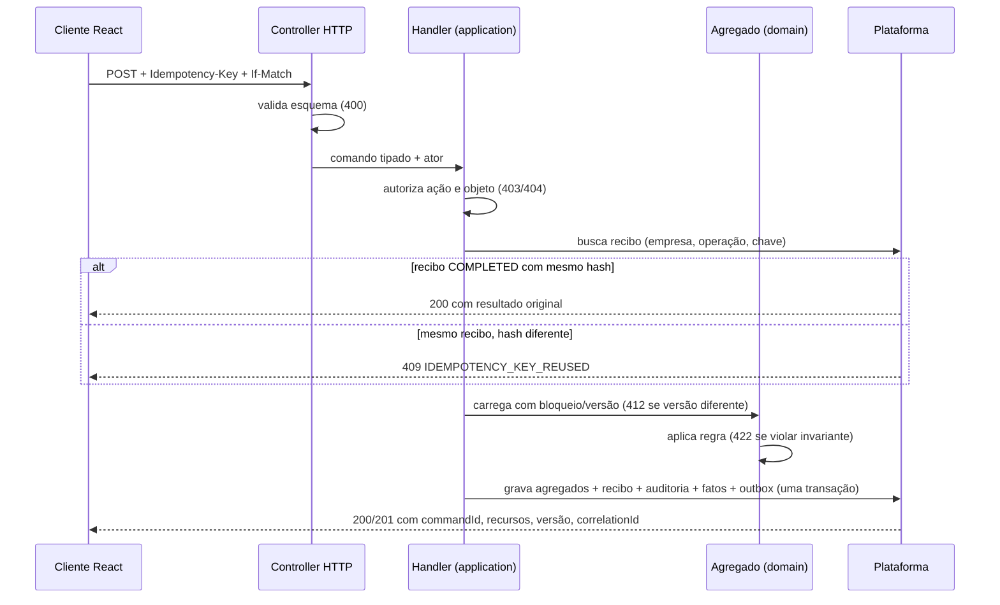

# B01 — Especificação de comandos: confirmação, cancelamento, baixa, estorno e qualidade

Situação: especificação B01 para implementação em B05 (pedido, baixa, estorno), B06 (ampliação financeira), B04 (qualidade de dados) e B09 (inspeção). As invariantes `INV-*` estão em `12-b01-modelo-de-dominio.md`.

## 1. Pipeline comum de um comando



1. **Recibo de comando.** Chave única `(companyId, operation, idempotencyKey)`. O recibo guarda hash canônico do corpo, ator, estado (`IN_PROGRESS`, `COMPLETED`, `REJECTED`), resposta e IDs afetados. É gravado na mesma transação dos efeitos.
2. **Resposta perdida.** O cliente consulta `GET /api/v1/commands/{commandId}` ou repete com a mesma chave. Nunca gera uma chave nova para a mesma intenção.
3. **Unicidade de domínio.** Protege mesmo com chave diferente: título por origem, confirmação por pedido, custo por origem, ocorrência preventiva.
4. **Erros de regra** (422) não deixam efeitos. O recibo registra `REJECTED`, e uma nova tentativa com a mesma chave devolve o mesmo erro. Uma nova intenção usa nova chave.
5. **Retries técnicos** (deadlock, falha de serialização) reaproveitam o mesmo comando, com limite; não viram erro ao usuário na primeira ocorrência.

### Catálogo inicial de erros

| Código | HTTP | Retentável | Quando |
|---|---|---|---|
| VALIDATION_FAILED | 400 | não | esquema/formato inválido |
| UNAUTHENTICATED | 401 | não | sessão ausente/expirada |
| FORBIDDEN | 403 | não | ação negada |
| NOT_FOUND | 404 | não | ausente ou fora do escopo |
| IDEMPOTENCY_KEY_REUSED | 409 | não | mesma chave, corpo diferente |
| INVALID_STATE_TRANSITION | 409 | não | estado não permite a operação |
| VERSION_MISMATCH | 412 | não | If-Match desatualizado |
| ORDER_INVALID | 422 | não | INV-SO-1..3 |
| PARTNER_INACTIVE_OR_UNIT_MISMATCH | 422 | não | INV-SO-6 |
| CANCELLATION_BLOCKED_BY_EFFECTS | 422 | não | INV-SO-7 (lista os efeitos) |
| INSUFFICIENT_TITLE_BALANCE | 422 | não | INV-FT-1 |
| SETTLEMENT_UNBALANCED | 422 | não | INV-ST-1 |
| SETTLEMENT_DIRECTION_MISMATCH | 422 | não | INV-ST-2 |
| SETTLEMENT_RECONCILED | 422 | não | INV-ST-5 |
| ACCOUNT_INACTIVE | 422 | não | conta inativa |
| INSPECTION_INCOMPLETE | 422 | não | INV-INS-1 |
| BLOCKING_DATA_QUALITY_ISSUE | 422 | não | INV-DQ-1 |
| CONCURRENCY_RETRY_EXHAUSTED | 503 | sim | retries técnicos esgotados |

Corpo do erro: `code`, `message` (português), `details[]`, `correlationId`, `retryable`. Sem stack trace, SQL ou segredos.

## 2. ConfirmSalesOrder

`POST /api/v1/sales-orders/{orderId}/confirmations` — permissão `sales_order.confirm`.

```json
{"expectedVersion": "7", "reason": "Contrato conferido"}
```

**Pré-condições.** Pedido em DRAFT; versão = 7; INV-SO-1..3; cliente e unidade ativos e vinculados (INV-SO-6).

**Transação única, nesta ordem:**
1. Bloquear o pedido (`SELECT … FOR UPDATE`) e conferir a versão.
2. Executar `order.confirm(policy, now, actor)`: status CONFIRMED, snapshot hash das linhas e parcelas.
3. `ProjectProvisioningApi.provisionFor(order, lines)`. Premissa B01 (PD-001): um projeto por pedido, e para cada linha `EQUIPMENT` com quantidade N, N equipamentos com identidade própria.
4. `TitleIssuanceApi.issue(origin = SALES_ORDER_INSTALLMENT:{orderId}:{seq}, RECEIVABLE, schedule)`: um título a receber por parcela, com vencimento, competência e projeto.
5. Registrar confirmação (IDs criados), recibo, auditoria, fatos `SALES_ORDER_CONFIRMED`, `PROJECT_CREATED`, `EQUIPMENT_CREATED`, `FINANCIAL_TITLE_CREATED`, e outbox com os mesmos eventos.

**Resposta 200:** `commandId`, `status: COMPLETED`, `resources: {orderId, projectIds, equipmentIds, financialTitleIds}`, `version: "8"`, `correlationId`.

**Idempotência.**
- Mesma chave: devolve a resposta original.
- Chave nova com o pedido já CONFIRMED: devolve a `OrderConfirmation` existente, sem efeitos (INV-SO-5).
- A unicidade dos títulos por origem (INV-FT-3) é a última barreira.

**Cenários de aceite.**
1. Duas confirmações, mesma chave → um projeto, N equipamentos, M títulos.
2. Duas confirmações concorrentes, chaves diferentes → uma vence; a outra recebe a mesma confirmação ou 412, sem duplicar efeitos.
3. Timeout após o commit → `GET /commands/{id}` devolve os mesmos IDs.
4. Σ parcelas ≠ total → 422 ORDER_INVALID e nenhum efeito.
5. Unidade de outro cliente → 422 PARTNER_INACTIVE_OR_UNIT_MISMATCH.

## 3. CancelSalesOrder

`POST /api/v1/sales-orders/{orderId}/cancellations` — permissão `sales_order.cancel`. Corpo: `expectedVersion`, `reason` (obrigatório).

| Estado | Efeitos existentes | Resultado (premissa B01, PD-003) |
|---|---|---|
| DRAFT | — | CANCELLED; sem outros efeitos |
| CONFIRMED | nenhum recebimento, reserva, consumo, produção, documento vinculado | CANCELLED; títulos abertos cancelados via `TitleIssuanceApi.cancelOpen`; projetos PLANEJADO passam a ENCERRADO com motivo; equipamentos marcados cancelados; fatos compensatórios |
| CONFIRMED/IN_EXECUTION | qualquer efeito listado acima | 422 CANCELLATION_BLOCKED_BY_EFFECTS com a lista (títulos com alocação, reservas, consumos, ordens) |

- Os fatos compensatórios (`reverses`) corrigem IND-001..003 sem apagar a confirmação original.
- Cancelar duas vezes devolve o cancelamento existente.
- Aditivo (`/amendments`) é o caminho para mudanças parciais; não é coberto por este comando.

## 4. PostSettlement (baixa)

`POST /api/v1/settlements` — permissão `financial_title.settle`.

```json
{
  "direction": "RECEIVABLE",
  "accountId": "conta-exemplo",
  "effectiveDate": "2026-10-10",
  "amountCents": "5550000",
  "currency": "BRL",
  "allocations": [{"titleId": "titulo-exemplo", "amountCents": "5550000", "expectedTitleVersion": "3"}],
  "creditCents": "0",
  "components": [],
  "reason": "Recebimento conferido no extrato"
}
```

**Transação:**
1. Validar INV-ST-1 e INV-ST-2 antes de tocar o banco.
2. Bloquear os títulos em ordem crescente de id (INV-ST-3) e conferir a versão de cada um, quando informada.
3. Para cada alocação, `title.applyAllocation`. Qualquer violação de INV-FT-1 aborta tudo (422 com o saldo atual em `details`).
4. Criar o `CashMovement` na conta (entrada ou saída) com data efetiva.
5. Gravar o recibo, a auditoria, o fato `SETTLEMENT_POSTED` com uma medida por alocação e o outbox.

**Cenário obrigatório de concorrência.** Título com saldo de R$ 100,00 e duas baixas simultâneas de R$ 70,00 em conexões diferentes: uma é confirmada e a outra recebe 422 com saldo R$ 30,00. O saldo final é R$ 30,00, nunca negativo.

**Efeitos que não ocorrem.** A baixa não cria custo nem receita. Não altera documentos fiscais nem carteira. O caixa realizado muda; o previsto deixa de conter a parte liquidada.

## 5. ReverseSettlement (estorno)

`POST /api/v1/settlements/{settlementId}/reversals` — permissão `settlement.reverse`. Corpo: `reason` (obrigatório).

1. Bloquear a liquidação. Se já estiver REVERSED, devolver o estorno existente (INV-ST-6).
2. Se estiver conciliada, 422 SETTLEMENT_RECONCILED (PD-006).
3. Bloquear os títulos em ordem crescente e aplicar `reverseAllocation` a cada um.
4. Criar o movimento de caixa inverso vinculado ao original.
5. Gravar o recibo, a auditoria (motivo), o fato `SETTLEMENT_REVERSED` com `reverses` e o outbox.

**Aceite.** Receber R$ 55.500,00 e estornar deixa o título de volta com saldo R$ 55.500,00 e status OPEN. O caixa volta ao saldo anterior. A liquidação original continua consultável como REVERSED e a trilha mostra ator, motivo e instante.

## 6. Qualidade

### 6.1 Inspeção (B09)

- `POST /inspections` (RecordInspection): registra itens, medições e evidências da revisão de checklist vigente.
- `POST /inspections/{id}/approvals`: exige INV-INS-1; senão 422 INSPECTION_INCOMPLETE.
- `POST /inspections/{id}/rejections`: exige motivo e abre não conformidade (INV-INS-2).
- Liberar a ordem de produção ou a instalação consulta `InspectionQueryApi.releaseStatus`. Critérios reais e bloqueios dependem de PD-014.

### 6.2 Qualidade de dados (B04, B12 e cadastros)

- **Detecção.** As regras rodam na importação (staging) e em comandos de cadastro. Cada problema vira um `DataQualityIssue` com evidência de origem.
- **Decisão.** `POST /data-quality/issues/{id}/decisions` com ACCEPT, CORRECT (valor corrigido) ou DISMISS e motivo. O original é preservado (INV-DQ-2).
- **Bloqueio.** Problema BLOCKING aberto impede `ApplyImport` do registro (422 BLOCKING_DATA_QUALITY_ISSUE); WARNING só é exibido.

| Regra inicial | Severidade | Exemplo da origem |
|---|---|---|
| Σ linhas ≠ total informado | BLOCKING para importar orçamento | BOM R$ 72.398,51 × R$ 69.398,51 |
| Data de entrega = venda + 90 dias em todas as linhas | WARNING (provável prazo, não entrega real) | BASE comercial |
| Competência e coluna Ano divergentes | BLOCKING | 01/2027 com ano 2026 |
| Célula com erro de planilha | BLOCKING | `#REF!` |
| Possível parceiro duplicado por nome | WARNING (revisão; nunca une sozinho) | AMAFIL × AMAGIL |
| Classificação ausente | WARNING (fica desconhecida, não zero) | estrelas vazias |
| "Recebido ou a receber" sem evidência | BLOCKING para gerar baixa | fluxo de caixa |
