# Modelo de dados do Renda+ ERP

Gerado por `tools/modelo-dados/modelo.py`. Não edite à mão.

- **Implementadas** (migração Flyway V1, Sprint 1): audit_event, company_profile.
- **Propostas** no plano do backend (doc 01 §5, doc 05 §3): 155 tabelas em 18 domínios, mais 22 complementos do catálogo analítico.
- Nomes e colunas propostas são conceituais: o DDL de cada tabela é definido na sprint que a implementa.
- Colunas comuns omitidas nas propostas: `version`, `created_at/by`, `updated_at/by`, `company_id`. Dinheiro em centavos inteiros (`*_cents`).
- Registros confirmados não são apagados: correção por estorno/ajuste, com referência ao original.

## Plataforma, auditoria e tarefas

Dados da empresa e auditoria já existem. Recibos de comando, outbox, fatos e tarefas duráveis vêm na Sprint 2. Fase: Sprint 1 / B02.

Implementadas: company_profile, audit_event.

Referências a outros domínios: user_account.

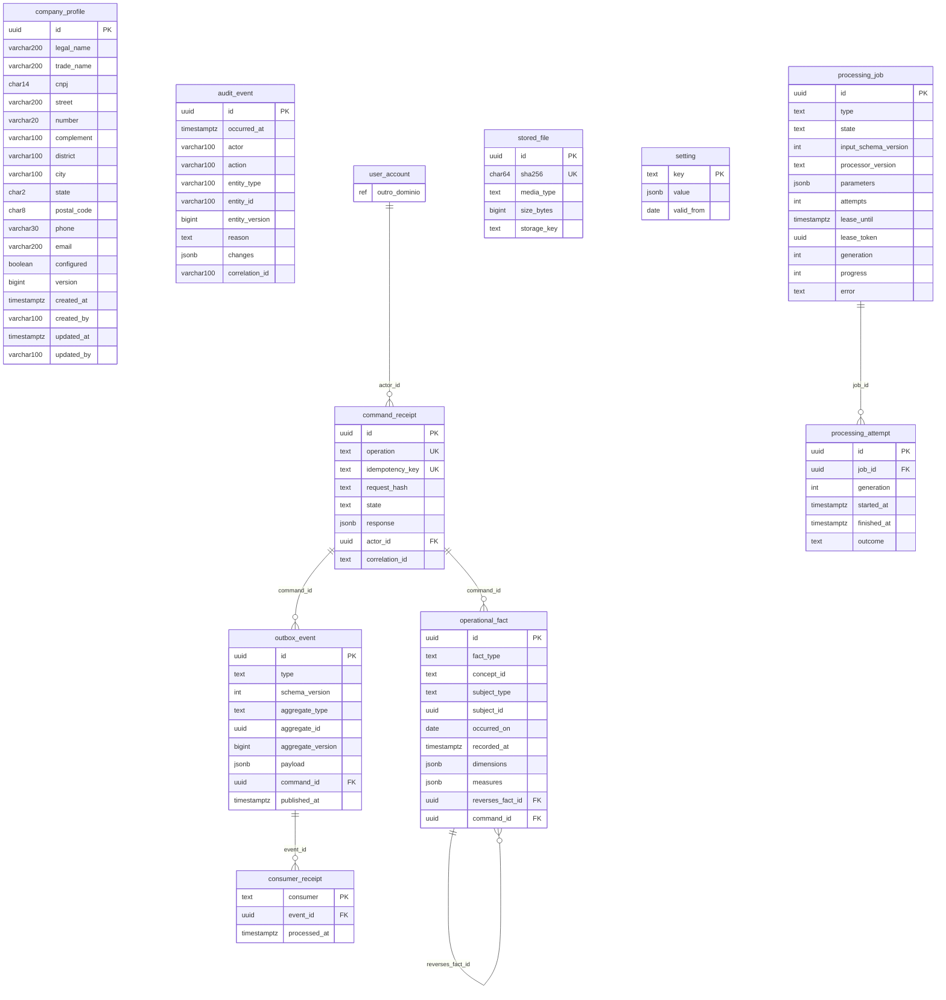
```mermaid
erDiagram
    company_profile {
        uuid id PK
        varchar200 legal_name
        varchar200 trade_name
        char14 cnpj
        varchar200 street
        varchar20 number
        varchar100 complement
        varchar100 district
        varchar100 city
        char2 state
        char8 postal_code
        varchar30 phone
        varchar200 email
        boolean configured
        bigint version
        timestamptz created_at
        varchar100 created_by
        timestamptz updated_at
        varchar100 updated_by
    }
    audit_event {
        uuid id PK
        timestamptz occurred_at
        varchar100 actor
        varchar100 action
        varchar100 entity_type
        varchar100 entity_id
        bigint entity_version
        text reason
        jsonb changes
        varchar100 correlation_id
    }
    command_receipt {
        uuid id PK
        text operation UK
        text idempotency_key UK
        text request_hash
        text state
        jsonb response
        uuid actor_id FK
        text correlation_id
    }
    outbox_event {
        uuid id PK
        text type
        int schema_version
        text aggregate_type
        uuid aggregate_id
        bigint aggregate_version
        jsonb payload
        uuid command_id FK
        timestamptz published_at
    }
    consumer_receipt {
        text consumer PK
        uuid event_id FK
        timestamptz processed_at
    }
    operational_fact {
        uuid id PK
        text fact_type
        text concept_id
        text subject_type
        uuid subject_id
        date occurred_on
        timestamptz recorded_at
        jsonb dimensions
        jsonb measures
        uuid reverses_fact_id FK
        uuid command_id FK
    }
    processing_job {
        uuid id PK
        text type
        text state
        int input_schema_version
        text processor_version
        jsonb parameters
        int attempts
        timestamptz lease_until
        uuid lease_token
        int generation
        int progress
        text error
    }
    processing_attempt {
        uuid id PK
        uuid job_id FK
        int generation
        timestamptz started_at
        timestamptz finished_at
        text outcome
    }
    stored_file {
        uuid id PK
        char64 sha256 UK
        text media_type
        bigint size_bytes
        text storage_key
    }
    setting {
        text key PK
        jsonb value
        date valid_from
    }
    user_account {
        ref outro_dominio
    }
    command_receipt ||--o{ operational_fact : "command_id"
    command_receipt ||--o{ outbox_event : "command_id"
    operational_fact ||--o{ operational_fact : "reverses_fact_id"
    outbox_event ||--o{ consumer_receipt : "event_id"
    processing_job ||--o{ processing_attempt : "job_id"
    user_account ||--o{ command_receipt : "actor_id"
```

## Acesso e identidade

Usuários, perfis e permissões verificados no servidor a cada operação. Fase: Sprint 2 / B03.

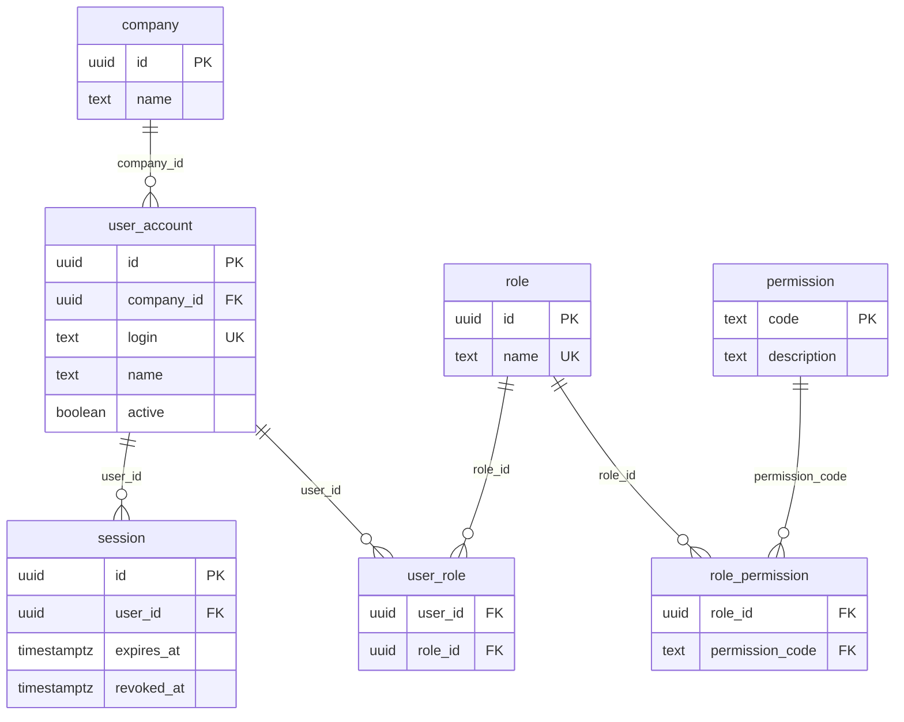
```mermaid
erDiagram
    company {
        uuid id PK
        text name
    }
    user_account {
        uuid id PK
        uuid company_id FK
        text login UK
        text name
        boolean active
    }
    role {
        uuid id PK
        text name UK
    }
    permission {
        text code PK
        text description
    }
    user_role {
        uuid user_id FK
        uuid role_id FK
    }
    role_permission {
        uuid role_id FK
        text permission_code FK
    }
    session {
        uuid id PK
        uuid user_id FK
        timestamptz expires_at
        timestamptz revoked_at
    }
    company ||--o{ user_account : "company_id"
    permission ||--o{ role_permission : "permission_code"
    role ||--o{ role_permission : "role_id"
    role ||--o{ user_role : "role_id"
    user_account ||--o{ session : "user_id"
    user_account ||--o{ user_role : "user_id"
```

## Parceiros e itens

Cliente e fornecedor são papéis do mesmo parceiro; unidades industriais pertencem ao cliente. Fase: Sprints 2–3 / B03.

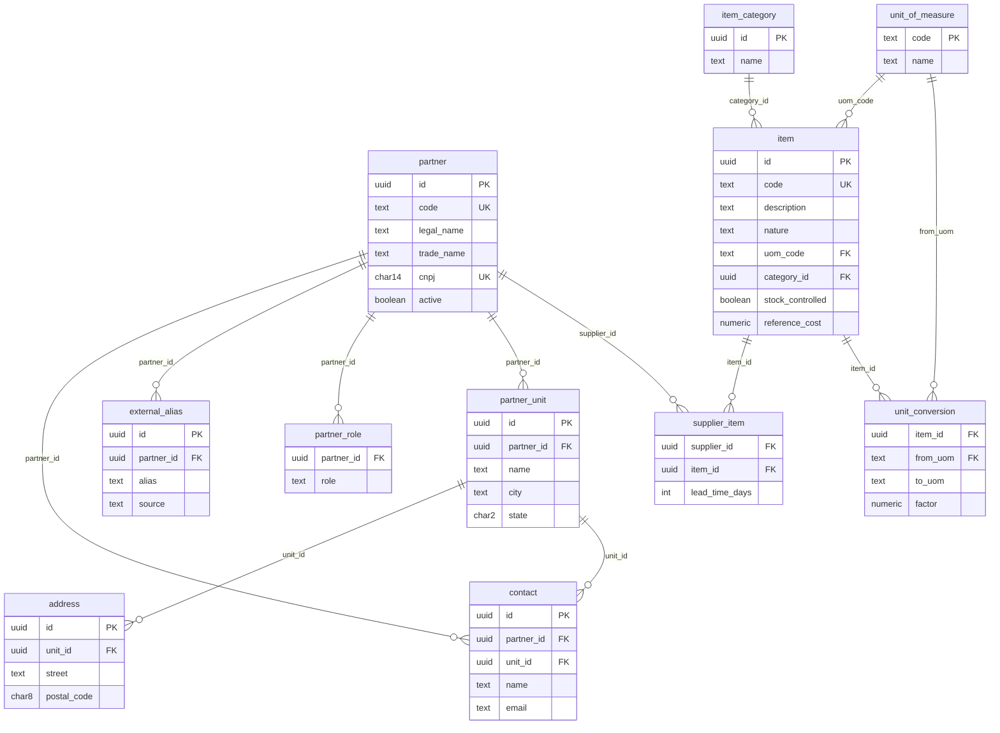
```mermaid
erDiagram
    partner {
        uuid id PK
        text code UK
        text legal_name
        text trade_name
        char14 cnpj UK
        boolean active
    }
    partner_role {
        uuid partner_id FK
        text role
    }
    partner_unit {
        uuid id PK
        uuid partner_id FK
        text name
        text city
        char2 state
    }
    address {
        uuid id PK
        uuid unit_id FK
        text street
        char8 postal_code
    }
    contact {
        uuid id PK
        uuid partner_id FK
        uuid unit_id FK
        text name
        text email
    }
    external_alias {
        uuid id PK
        uuid partner_id FK
        text alias
        text source
    }
    item {
        uuid id PK
        text code UK
        text description
        text nature
        text uom_code FK
        uuid category_id FK
        boolean stock_controlled
        numeric reference_cost
    }
    item_category {
        uuid id PK
        text name
    }
    unit_of_measure {
        text code PK
        text name
    }
    unit_conversion {
        uuid item_id FK
        text from_uom FK
        text to_uom
        numeric factor
    }
    supplier_item {
        uuid supplier_id FK
        uuid item_id FK
        int lead_time_days
    }
    item ||--o{ supplier_item : "item_id"
    item ||--o{ unit_conversion : "item_id"
    item_category ||--o{ item : "category_id"
    partner ||--o{ contact : "partner_id"
    partner ||--o{ external_alias : "partner_id"
    partner ||--o{ partner_role : "partner_id"
    partner ||--o{ partner_unit : "partner_id"
    partner ||--o{ supplier_item : "supplier_id"
    partner_unit ||--o{ address : "unit_id"
    partner_unit ||--o{ contact : "unit_id"
    unit_of_measure ||--o{ item : "uom_code"
    unit_of_measure ||--o{ unit_conversion : "from_uom"
```

## Comercial

Confirmar o pedido cria, numa transação, os projetos, os equipamentos e as parcelas a receber. Fase: Sprint 4 / B05.

Referências a outros domínios: item, partner, partner_unit.

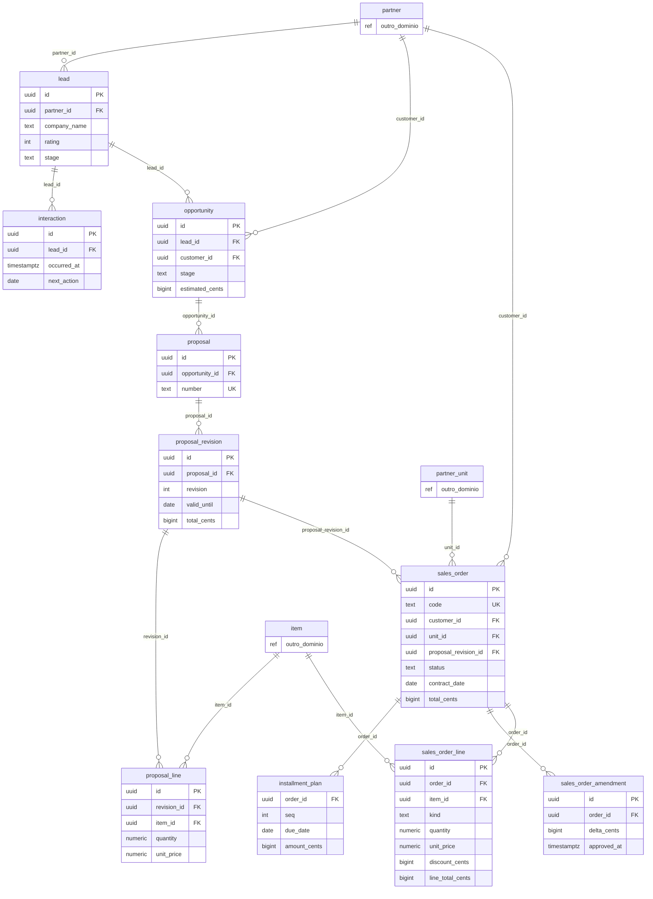
```mermaid
erDiagram
    lead {
        uuid id PK
        uuid partner_id FK
        text company_name
        int rating
        text stage
    }
    interaction {
        uuid id PK
        uuid lead_id FK
        timestamptz occurred_at
        date next_action
    }
    opportunity {
        uuid id PK
        uuid lead_id FK
        uuid customer_id FK
        text stage
        bigint estimated_cents
    }
    proposal {
        uuid id PK
        uuid opportunity_id FK
        text number UK
    }
    proposal_revision {
        uuid id PK
        uuid proposal_id FK
        int revision
        date valid_until
        bigint total_cents
    }
    proposal_line {
        uuid id PK
        uuid revision_id FK
        uuid item_id FK
        numeric quantity
        numeric unit_price
    }
    sales_order {
        uuid id PK
        text code UK
        uuid customer_id FK
        uuid unit_id FK
        uuid proposal_revision_id FK
        text status
        date contract_date
        bigint total_cents
    }
    sales_order_line {
        uuid id PK
        uuid order_id FK
        uuid item_id FK
        text kind
        numeric quantity
        numeric unit_price
        bigint discount_cents
        bigint line_total_cents
    }
    sales_order_amendment {
        uuid id PK
        uuid order_id FK
        bigint delta_cents
        timestamptz approved_at
    }
    installment_plan {
        uuid order_id FK
        int seq
        date due_date
        bigint amount_cents
    }
    item {
        ref outro_dominio
    }
    partner {
        ref outro_dominio
    }
    partner_unit {
        ref outro_dominio
    }
    item ||--o{ proposal_line : "item_id"
    item ||--o{ sales_order_line : "item_id"
    lead ||--o{ interaction : "lead_id"
    lead ||--o{ opportunity : "lead_id"
    opportunity ||--o{ proposal : "opportunity_id"
    partner ||--o{ lead : "partner_id"
    partner ||--o{ opportunity : "customer_id"
    partner ||--o{ sales_order : "customer_id"
    partner_unit ||--o{ sales_order : "unit_id"
    proposal ||--o{ proposal_revision : "proposal_id"
    proposal_revision ||--o{ proposal_line : "revision_id"
    proposal_revision ||--o{ sales_order : "proposal_revision_id"
    sales_order ||--o{ installment_plan : "order_id"
    sales_order ||--o{ sales_order_amendment : "order_id"
    sales_order ||--o{ sales_order_line : "order_id"
```

## Projetos e equipamentos

O projeto é o vínculo central; cada equipamento tem identidade e histórico próprios. Fase: Sprint 4 / B05.

Referências a outros domínios: attachment, item, partner, partner_unit, sales_order, user_account.

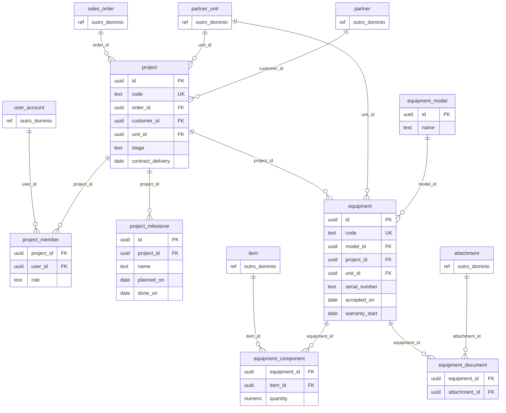
```mermaid
erDiagram
    project {
        uuid id PK
        text code UK
        uuid order_id FK
        uuid customer_id FK
        uuid unit_id FK
        text stage
        date contract_delivery
    }
    project_member {
        uuid project_id FK
        uuid user_id FK
        text role
    }
    project_milestone {
        uuid id PK
        uuid project_id FK
        text name
        date planned_on
        date done_on
    }
    equipment_model {
        uuid id PK
        text name
    }
    equipment {
        uuid id PK
        text code UK
        uuid model_id FK
        uuid project_id FK
        uuid unit_id FK
        text serial_number
        date accepted_on
        date warranty_start
    }
    equipment_component {
        uuid equipment_id FK
        uuid item_id FK
        numeric quantity
    }
    equipment_document {
        uuid equipment_id FK
        uuid attachment_id FK
    }
    attachment {
        ref outro_dominio
    }
    item {
        ref outro_dominio
    }
    partner {
        ref outro_dominio
    }
    partner_unit {
        ref outro_dominio
    }
    sales_order {
        ref outro_dominio
    }
    user_account {
        ref outro_dominio
    }
    attachment ||--o{ equipment_document : "attachment_id"
    equipment ||--o{ equipment_component : "equipment_id"
    equipment ||--o{ equipment_document : "equipment_id"
    equipment_model ||--o{ equipment : "model_id"
    item ||--o{ equipment_component : "item_id"
    partner ||--o{ project : "customer_id"
    partner_unit ||--o{ equipment : "unit_id"
    partner_unit ||--o{ project : "unit_id"
    project ||--o{ equipment : "project_id"
    project ||--o{ project_member : "project_id"
    project ||--o{ project_milestone : "project_id"
    sales_order ||--o{ project : "order_id"
    user_account ||--o{ project_member : "user_id"
```

## Engenharia e cronograma

BOM e EAP versionadas; o projeto conserva a revisão aplicada; recálculo não altera a linha de base. Fase: B07.

Referências a outros domínios: equipment, equipment_model, item, project.

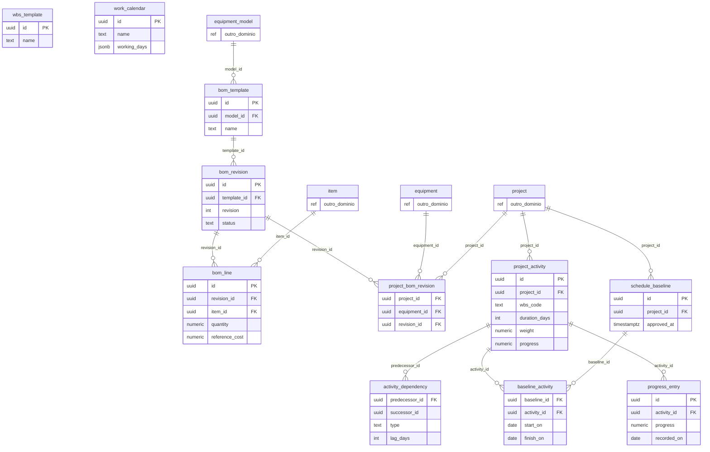
```mermaid
erDiagram
    bom_template {
        uuid id PK
        uuid model_id FK
        text name
    }
    bom_revision {
        uuid id PK
        uuid template_id FK
        int revision
        text status
    }
    bom_line {
        uuid id PK
        uuid revision_id FK
        uuid item_id FK
        numeric quantity
        numeric reference_cost
    }
    project_bom_revision {
        uuid project_id FK
        uuid equipment_id FK
        uuid revision_id FK
    }
    wbs_template {
        uuid id PK
        text name
    }
    project_activity {
        uuid id PK
        uuid project_id FK
        text wbs_code
        int duration_days
        numeric weight
        numeric progress
    }
    activity_dependency {
        uuid predecessor_id FK
        uuid successor_id
        text type
        int lag_days
    }
    work_calendar {
        uuid id PK
        text name
        jsonb working_days
    }
    schedule_baseline {
        uuid id PK
        uuid project_id FK
        timestamptz approved_at
    }
    baseline_activity {
        uuid baseline_id FK
        uuid activity_id FK
        date start_on
        date finish_on
    }
    progress_entry {
        uuid id PK
        uuid activity_id FK
        numeric progress
        date recorded_on
    }
    equipment {
        ref outro_dominio
    }
    equipment_model {
        ref outro_dominio
    }
    item {
        ref outro_dominio
    }
    project {
        ref outro_dominio
    }
    bom_revision ||--o{ bom_line : "revision_id"
    bom_revision ||--o{ project_bom_revision : "revision_id"
    bom_template ||--o{ bom_revision : "template_id"
    equipment ||--o{ project_bom_revision : "equipment_id"
    equipment_model ||--o{ bom_template : "model_id"
    item ||--o{ bom_line : "item_id"
    project ||--o{ project_activity : "project_id"
    project ||--o{ project_bom_revision : "project_id"
    project ||--o{ schedule_baseline : "project_id"
    project_activity ||--o{ activity_dependency : "predecessor_id"
    project_activity ||--o{ baseline_activity : "activity_id"
    project_activity ||--o{ progress_entry : "activity_id"
    schedule_baseline ||--o{ baseline_activity : "baseline_id"
```

## Suprimentos

Necessidade líquida por item e data (MRP), cotações e pedidos de compra com aprovação. Fase: B08.

Referências a outros domínios: item, partner, project, user_account.

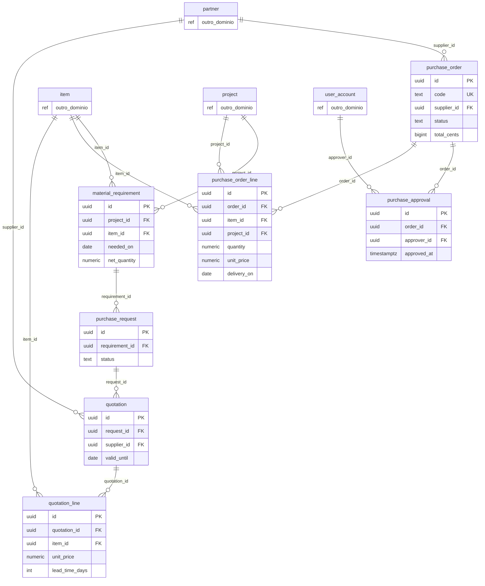
```mermaid
erDiagram
    material_requirement {
        uuid id PK
        uuid project_id FK
        uuid item_id FK
        date needed_on
        numeric net_quantity
    }
    purchase_request {
        uuid id PK
        uuid requirement_id FK
        text status
    }
    quotation {
        uuid id PK
        uuid request_id FK
        uuid supplier_id FK
        date valid_until
    }
    quotation_line {
        uuid id PK
        uuid quotation_id FK
        uuid item_id FK
        numeric unit_price
        int lead_time_days
    }
    purchase_order {
        uuid id PK
        text code UK
        uuid supplier_id FK
        text status
        bigint total_cents
    }
    purchase_order_line {
        uuid id PK
        uuid order_id FK
        uuid item_id FK
        uuid project_id FK
        numeric quantity
        numeric unit_price
        date delivery_on
    }
    purchase_approval {
        uuid id PK
        uuid order_id FK
        uuid approver_id FK
        timestamptz approved_at
    }
    item {
        ref outro_dominio
    }
    partner {
        ref outro_dominio
    }
    project {
        ref outro_dominio
    }
    user_account {
        ref outro_dominio
    }
    item ||--o{ material_requirement : "item_id"
    item ||--o{ purchase_order_line : "item_id"
    item ||--o{ quotation_line : "item_id"
    material_requirement ||--o{ purchase_request : "requirement_id"
    partner ||--o{ purchase_order : "supplier_id"
    partner ||--o{ quotation : "supplier_id"
    project ||--o{ material_requirement : "project_id"
    project ||--o{ purchase_order_line : "project_id"
    purchase_order ||--o{ purchase_approval : "order_id"
    purchase_order ||--o{ purchase_order_line : "order_id"
    purchase_request ||--o{ quotation : "request_id"
    quotation ||--o{ quotation_line : "quotation_id"
    user_account ||--o{ purchase_approval : "approver_id"
```

## Estoque, recebimentos e terceiros

Saldo físico, reservado e disponível por item, local e propriedade; material em terceiros continua próprio. Fase: B08.

Referências a outros domínios: item, partner, project, purchase_order, purchase_order_line.

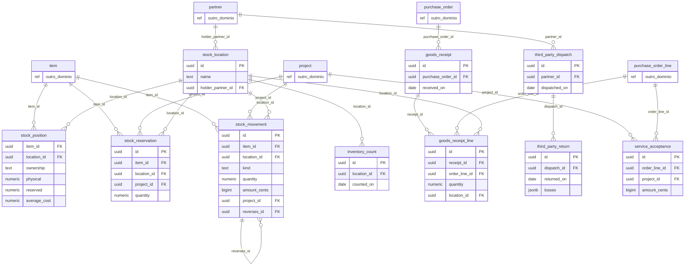
```mermaid
erDiagram
    stock_location {
        uuid id PK
        text name
        uuid holder_partner_id FK
    }
    stock_position {
        uuid item_id FK
        uuid location_id FK
        text ownership
        numeric physical
        numeric reserved
        numeric average_cost
    }
    stock_reservation {
        uuid id PK
        uuid item_id FK
        uuid location_id FK
        uuid project_id FK
        numeric quantity
    }
    stock_movement {
        uuid id PK
        uuid item_id FK
        uuid location_id FK
        text kind
        numeric quantity
        bigint amount_cents
        uuid project_id FK
        uuid reverses_id FK
    }
    inventory_count {
        uuid id PK
        uuid location_id FK
        date counted_on
    }
    goods_receipt {
        uuid id PK
        uuid purchase_order_id FK
        date received_on
    }
    goods_receipt_line {
        uuid id PK
        uuid receipt_id FK
        uuid order_line_id FK
        numeric quantity
        uuid location_id FK
    }
    third_party_dispatch {
        uuid id PK
        uuid partner_id FK
        date dispatched_on
    }
    third_party_return {
        uuid id PK
        uuid dispatch_id FK
        date returned_on
        jsonb losses
    }
    service_acceptance {
        uuid id PK
        uuid order_line_id FK
        uuid project_id FK
        bigint amount_cents
    }
    item {
        ref outro_dominio
    }
    partner {
        ref outro_dominio
    }
    project {
        ref outro_dominio
    }
    purchase_order {
        ref outro_dominio
    }
    purchase_order_line {
        ref outro_dominio
    }
    goods_receipt ||--o{ goods_receipt_line : "receipt_id"
    item ||--o{ stock_movement : "item_id"
    item ||--o{ stock_position : "item_id"
    item ||--o{ stock_reservation : "item_id"
    partner ||--o{ stock_location : "holder_partner_id"
    partner ||--o{ third_party_dispatch : "partner_id"
    project ||--o{ service_acceptance : "project_id"
    project ||--o{ stock_movement : "project_id"
    project ||--o{ stock_reservation : "project_id"
    purchase_order ||--o{ goods_receipt : "purchase_order_id"
    purchase_order_line ||--o{ goods_receipt_line : "order_line_id"
    purchase_order_line ||--o{ service_acceptance : "order_line_id"
    stock_location ||--o{ goods_receipt_line : "location_id"
    stock_location ||--o{ inventory_count : "location_id"
    stock_location ||--o{ stock_movement : "location_id"
    stock_location ||--o{ stock_position : "location_id"
    stock_location ||--o{ stock_reservation : "location_id"
    stock_movement ||--o{ stock_movement : "reverses_id"
    third_party_dispatch ||--o{ third_party_return : "dispatch_id"
```

## Produção e qualidade

Ordens com roteiro, apontamentos de horas e consumo; inspeções por checklist versionado. Fase: B09.

Referências a outros domínios: bom_revision, equipment, project.

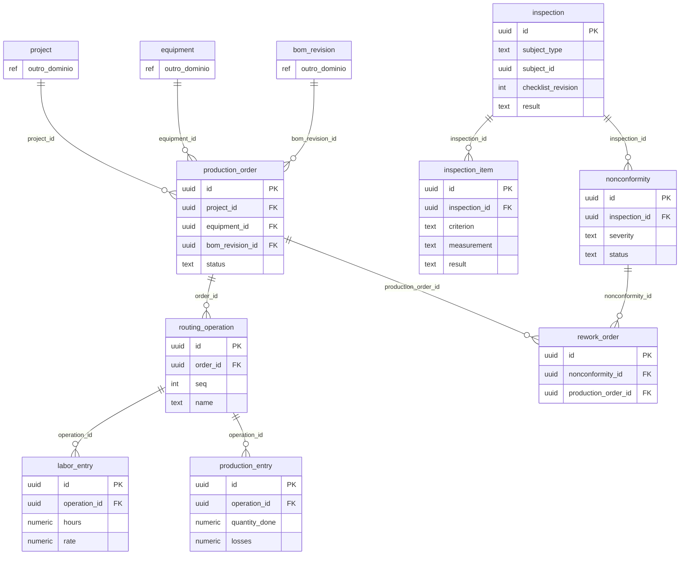
```mermaid
erDiagram
    production_order {
        uuid id PK
        uuid project_id FK
        uuid equipment_id FK
        uuid bom_revision_id FK
        text status
    }
    routing_operation {
        uuid id PK
        uuid order_id FK
        int seq
        text name
    }
    production_entry {
        uuid id PK
        uuid operation_id FK
        numeric quantity_done
        numeric losses
    }
    labor_entry {
        uuid id PK
        uuid operation_id FK
        numeric hours
        numeric rate
    }
    inspection {
        uuid id PK
        text subject_type
        uuid subject_id
        int checklist_revision
        text result
    }
    inspection_item {
        uuid id PK
        uuid inspection_id FK
        text criterion
        text measurement
        text result
    }
    nonconformity {
        uuid id PK
        uuid inspection_id FK
        text severity
        text status
    }
    rework_order {
        uuid id PK
        uuid nonconformity_id FK
        uuid production_order_id FK
    }
    bom_revision {
        ref outro_dominio
    }
    equipment {
        ref outro_dominio
    }
    project {
        ref outro_dominio
    }
    bom_revision ||--o{ production_order : "bom_revision_id"
    equipment ||--o{ production_order : "equipment_id"
    inspection ||--o{ inspection_item : "inspection_id"
    inspection ||--o{ nonconformity : "inspection_id"
    nonconformity ||--o{ rework_order : "nonconformity_id"
    production_order ||--o{ rework_order : "production_order_id"
    production_order ||--o{ routing_operation : "order_id"
    project ||--o{ production_order : "project_id"
    routing_operation ||--o{ labor_entry : "operation_id"
    routing_operation ||--o{ production_entry : "operation_id"
```

## Instalação e entrega

Execução em campo, despesas, testes, pendências e aceite real do equipamento. Fase: B09.

Referências a outros domínios: equipment.

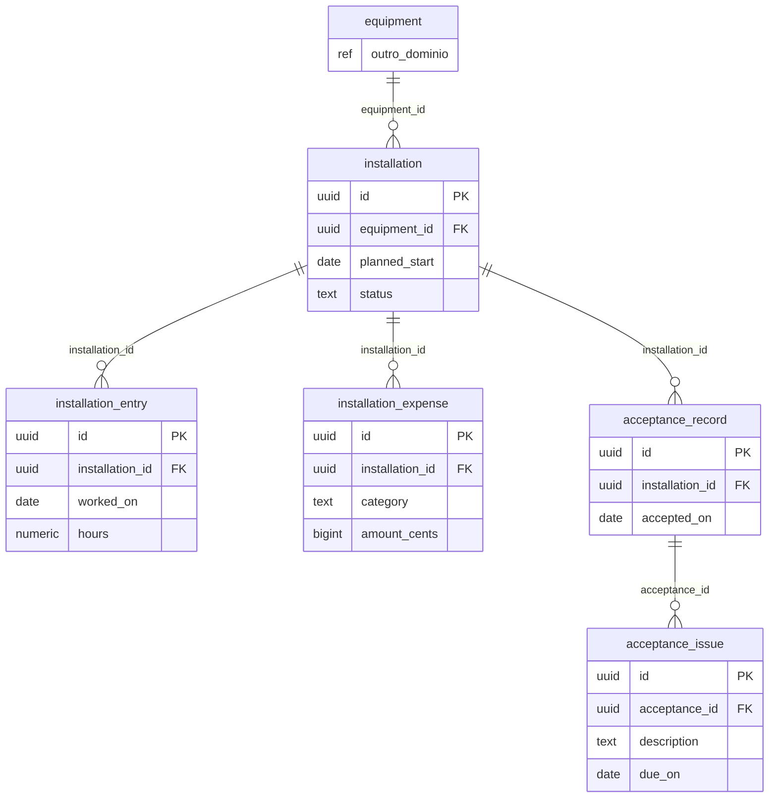
```mermaid
erDiagram
    installation {
        uuid id PK
        uuid equipment_id FK
        date planned_start
        text status
    }
    installation_entry {
        uuid id PK
        uuid installation_id FK
        date worked_on
        numeric hours
    }
    installation_expense {
        uuid id PK
        uuid installation_id FK
        text category
        bigint amount_cents
    }
    acceptance_record {
        uuid id PK
        uuid installation_id FK
        date accepted_on
    }
    acceptance_issue {
        uuid id PK
        uuid acceptance_id FK
        text description
        date due_on
    }
    equipment {
        ref outro_dominio
    }
    acceptance_record ||--o{ acceptance_issue : "acceptance_id"
    equipment ||--o{ installation : "equipment_id"
    installation ||--o{ acceptance_record : "installation_id"
    installation ||--o{ installation_entry : "installation_id"
    installation ||--o{ installation_expense : "installation_id"
```

## Documentos e anexos

Notas registradas se vinculam às parcelas existentes, sem criar nova obrigação. Fase: Sprint 6 / B06.

Referências a outros domínios: financial_title, partner, stored_file.

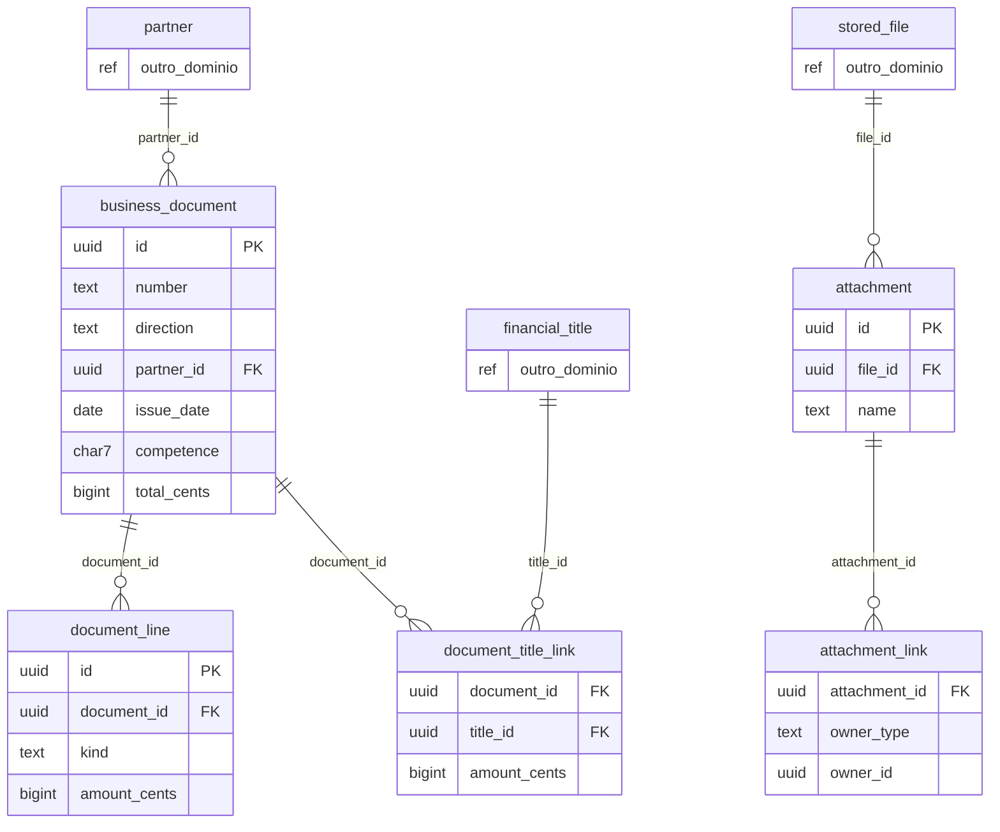
```mermaid
erDiagram
    business_document {
        uuid id PK
        text number
        text direction
        uuid partner_id FK
        date issue_date
        char7 competence
        bigint total_cents
    }
    document_line {
        uuid id PK
        uuid document_id FK
        text kind
        bigint amount_cents
    }
    document_title_link {
        uuid document_id FK
        uuid title_id FK
        bigint amount_cents
    }
    attachment {
        uuid id PK
        uuid file_id FK
        text name
    }
    attachment_link {
        uuid attachment_id FK
        text owner_type
        uuid owner_id
    }
    financial_title {
        ref outro_dominio
    }
    partner {
        ref outro_dominio
    }
    stored_file {
        ref outro_dominio
    }
    attachment ||--o{ attachment_link : "attachment_id"
    business_document ||--o{ document_line : "document_id"
    business_document ||--o{ document_title_link : "document_id"
    financial_title ||--o{ document_title_link : "title_id"
    partner ||--o{ business_document : "partner_id"
    stored_file ||--o{ attachment : "file_id"
```

## Financeiro

Títulos com saldo derivado de alocações; liquidação N:N; conciliação N:N com diferenças explícitas. Fase: Sprints 5–6 / B05–B06.

Referências a outros domínios: partner, project, stored_file.

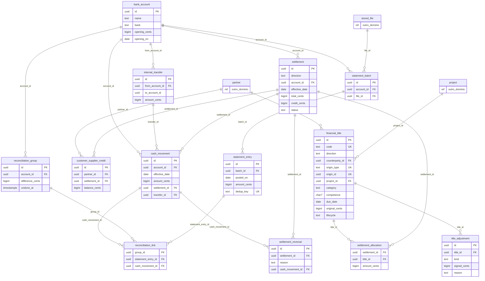
```mermaid
erDiagram
    financial_title {
        uuid id PK
        text code UK
        text direction
        uuid counterparty_id FK
        text origin_type UK
        uuid origin_id UK
        uuid project_id FK
        text category
        char7 competence
        date due_date
        bigint original_cents
        text lifecycle
    }
    title_adjustment {
        uuid id PK
        uuid title_id FK
        text kind
        bigint signed_cents
        text reason
    }
    settlement {
        uuid id PK
        text direction
        uuid account_id FK
        date effective_date
        bigint total_cents
        bigint credit_cents
        text status
    }
    settlement_allocation {
        uuid settlement_id FK
        uuid title_id FK
        bigint amount_cents
    }
    settlement_reversal {
        uuid id PK
        uuid settlement_id FK
        text reason
        uuid cash_movement_id FK
    }
    customer_supplier_credit {
        uuid id PK
        uuid partner_id FK
        uuid settlement_id FK
        bigint balance_cents
    }
    bank_account {
        uuid id PK
        text name
        text bank
        bigint opening_cents
        date opening_on
    }
    cash_movement {
        uuid id PK
        uuid account_id FK
        date effective_date
        bigint amount_cents
        uuid settlement_id FK
        uuid transfer_id FK
    }
    internal_transfer {
        uuid id PK
        uuid from_account_id FK
        uuid to_account_id
        bigint amount_cents
    }
    statement_batch {
        uuid id PK
        uuid account_id FK
        uuid file_id FK
    }
    statement_entry {
        uuid id PK
        uuid batch_id FK
        date posted_on
        bigint amount_cents
        text dedup_key UK
    }
    reconciliation_group {
        uuid id PK
        uuid account_id FK
        bigint difference_cents
        timestamptz undone_at
    }
    reconciliation_link {
        uuid group_id FK
        uuid statement_entry_id FK
        uuid cash_movement_id FK
    }
    partner {
        ref outro_dominio
    }
    project {
        ref outro_dominio
    }
    stored_file {
        ref outro_dominio
    }
    bank_account ||--o{ cash_movement : "account_id"
    bank_account ||--o{ internal_transfer : "from_account_id"
    bank_account ||--o{ reconciliation_group : "account_id"
    bank_account ||--o{ settlement : "account_id"
    bank_account ||--o{ statement_batch : "account_id"
    cash_movement ||--o{ reconciliation_link : "cash_movement_id"
    cash_movement ||--o{ settlement_reversal : "cash_movement_id"
    financial_title ||--o{ settlement_allocation : "title_id"
    financial_title ||--o{ title_adjustment : "title_id"
    internal_transfer ||--o{ cash_movement : "transfer_id"
    partner ||--o{ customer_supplier_credit : "partner_id"
    partner ||--o{ financial_title : "counterparty_id"
    project ||--o{ financial_title : "project_id"
    reconciliation_group ||--o{ reconciliation_link : "group_id"
    settlement ||--o{ cash_movement : "settlement_id"
    settlement ||--o{ customer_supplier_credit : "settlement_id"
    settlement ||--o{ settlement_allocation : "settlement_id"
    settlement ||--o{ settlement_reversal : "settlement_id"
    statement_batch ||--o{ statement_entry : "batch_id"
    statement_entry ||--o{ reconciliation_link : "statement_entry_id"
    stored_file ||--o{ statement_batch : "file_id"
```

## Custos e resultado

Orçado, comprometido e incorrido separados; cada custo entra uma vez pela sua origem. Fase: B08–B10.

Referências a outros domínios: equipment, project, purchase_order_line.

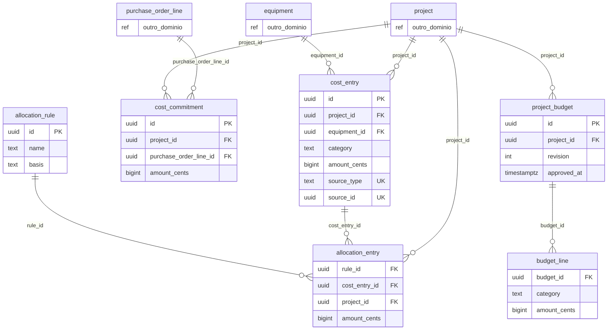
```mermaid
erDiagram
    project_budget {
        uuid id PK
        uuid project_id FK
        int revision
        timestamptz approved_at
    }
    budget_line {
        uuid budget_id FK
        text category
        bigint amount_cents
    }
    cost_commitment {
        uuid id PK
        uuid project_id FK
        uuid purchase_order_line_id FK
        bigint amount_cents
    }
    cost_entry {
        uuid id PK
        uuid project_id FK
        uuid equipment_id FK
        text category
        bigint amount_cents
        text source_type UK
        uuid source_id UK
    }
    allocation_rule {
        uuid id PK
        text name
        text basis
    }
    allocation_entry {
        uuid rule_id FK
        uuid cost_entry_id FK
        uuid project_id FK
        bigint amount_cents
    }
    equipment {
        ref outro_dominio
    }
    project {
        ref outro_dominio
    }
    purchase_order_line {
        ref outro_dominio
    }
    allocation_rule ||--o{ allocation_entry : "rule_id"
    cost_entry ||--o{ allocation_entry : "cost_entry_id"
    equipment ||--o{ cost_entry : "equipment_id"
    project ||--o{ allocation_entry : "project_id"
    project ||--o{ cost_commitment : "project_id"
    project ||--o{ cost_entry : "project_id"
    project ||--o{ project_budget : "project_id"
    project_budget ||--o{ budget_line : "budget_id"
    purchase_order_line ||--o{ cost_commitment : "purchase_order_line_id"
```

## Repasses

Regras versionadas; a confirmação congela a memória de cálculo e gera títulos uma única vez. Fase: B10.

Referências a outros domínios: financial_title, partner.

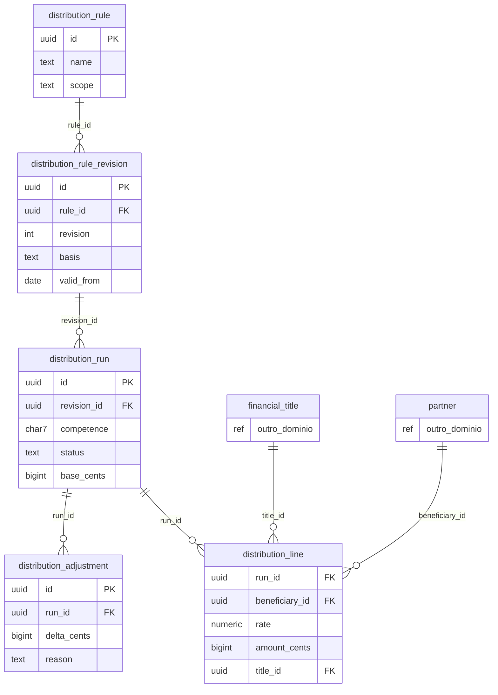
```mermaid
erDiagram
    distribution_rule {
        uuid id PK
        text name
        text scope
    }
    distribution_rule_revision {
        uuid id PK
        uuid rule_id FK
        int revision
        text basis
        date valid_from
    }
    distribution_run {
        uuid id PK
        uuid revision_id FK
        char7 competence
        text status
        bigint base_cents
    }
    distribution_line {
        uuid run_id FK
        uuid beneficiary_id FK
        numeric rate
        bigint amount_cents
        uuid title_id FK
    }
    distribution_adjustment {
        uuid id PK
        uuid run_id FK
        bigint delta_cents
        text reason
    }
    financial_title {
        ref outro_dominio
    }
    partner {
        ref outro_dominio
    }
    distribution_rule ||--o{ distribution_rule_revision : "rule_id"
    distribution_rule_revision ||--o{ distribution_run : "revision_id"
    distribution_run ||--o{ distribution_adjustment : "run_id"
    distribution_run ||--o{ distribution_line : "run_id"
    financial_title ||--o{ distribution_line : "title_id"
    partner ||--o{ distribution_line : "beneficiary_id"
```

## Fiscal gerencial

Histórico importado, simulação gerencial e valor confirmado pelo contador ficam separados. Fase: Sprint 7 / B10.

Referências a outros domínios: document_line, financial_title, stored_file.

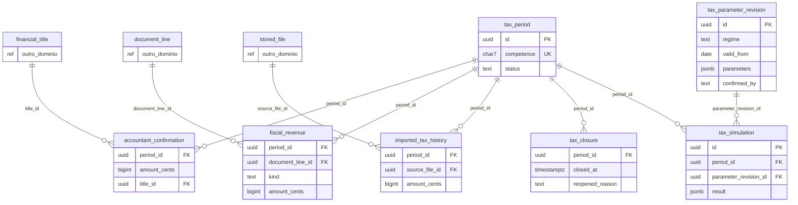
```mermaid
erDiagram
    tax_period {
        uuid id PK
        char7 competence UK
        text status
    }
    fiscal_revenue {
        uuid period_id FK
        uuid document_line_id FK
        text kind
        bigint amount_cents
    }
    tax_parameter_revision {
        uuid id PK
        text regime
        date valid_from
        jsonb parameters
        text confirmed_by
    }
    imported_tax_history {
        uuid period_id FK
        uuid source_file_id FK
        bigint amount_cents
    }
    tax_simulation {
        uuid id PK
        uuid period_id FK
        uuid parameter_revision_id FK
        jsonb result
    }
    accountant_confirmation {
        uuid period_id FK
        bigint amount_cents
        uuid title_id FK
    }
    tax_closure {
        uuid period_id FK
        timestamptz closed_at
        text reopened_reason
    }
    document_line {
        ref outro_dominio
    }
    financial_title {
        ref outro_dominio
    }
    stored_file {
        ref outro_dominio
    }
    document_line ||--o{ fiscal_revenue : "document_line_id"
    financial_title ||--o{ accountant_confirmation : "title_id"
    stored_file ||--o{ imported_tax_history : "source_file_id"
    tax_parameter_revision ||--o{ tax_simulation : "parameter_revision_id"
    tax_period ||--o{ accountant_confirmation : "period_id"
    tax_period ||--o{ fiscal_revenue : "period_id"
    tax_period ||--o{ imported_tax_history : "period_id"
    tax_period ||--o{ tax_closure : "period_id"
    tax_period ||--o{ tax_simulation : "period_id"
```

## Pós-venda

Chamados e ordens de serviço ligados ao equipamento; cada ocorrência preventiva gera no máximo uma OS. Fase: B11.

Referências a outros domínios: equipment.

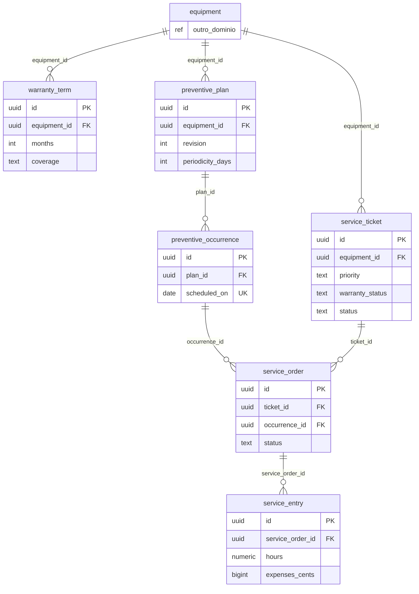
```mermaid
erDiagram
    service_ticket {
        uuid id PK
        uuid equipment_id FK
        text priority
        text warranty_status
        text status
    }
    service_order {
        uuid id PK
        uuid ticket_id FK
        uuid occurrence_id FK
        text status
    }
    service_entry {
        uuid id PK
        uuid service_order_id FK
        numeric hours
        bigint expenses_cents
    }
    warranty_term {
        uuid id PK
        uuid equipment_id FK
        int months
        text coverage
    }
    preventive_plan {
        uuid id PK
        uuid equipment_id FK
        int revision
        int periodicity_days
    }
    preventive_occurrence {
        uuid id PK
        uuid plan_id FK
        date scheduled_on UK
    }
    equipment {
        ref outro_dominio
    }
    equipment ||--o{ preventive_plan : "equipment_id"
    equipment ||--o{ service_ticket : "equipment_id"
    equipment ||--o{ warranty_term : "equipment_id"
    preventive_occurrence ||--o{ service_order : "occurrence_id"
    preventive_plan ||--o{ preventive_occurrence : "plan_id"
    service_order ||--o{ service_entry : "service_order_id"
    service_ticket ||--o{ service_order : "ticket_id"
```

## Importação e exportação

Arquivos vão para uma área de conferência; nada é aplicado sem decisão humana. Fase: B04 / B12.

Referências a outros domínios: command_receipt, processing_job, stored_file.

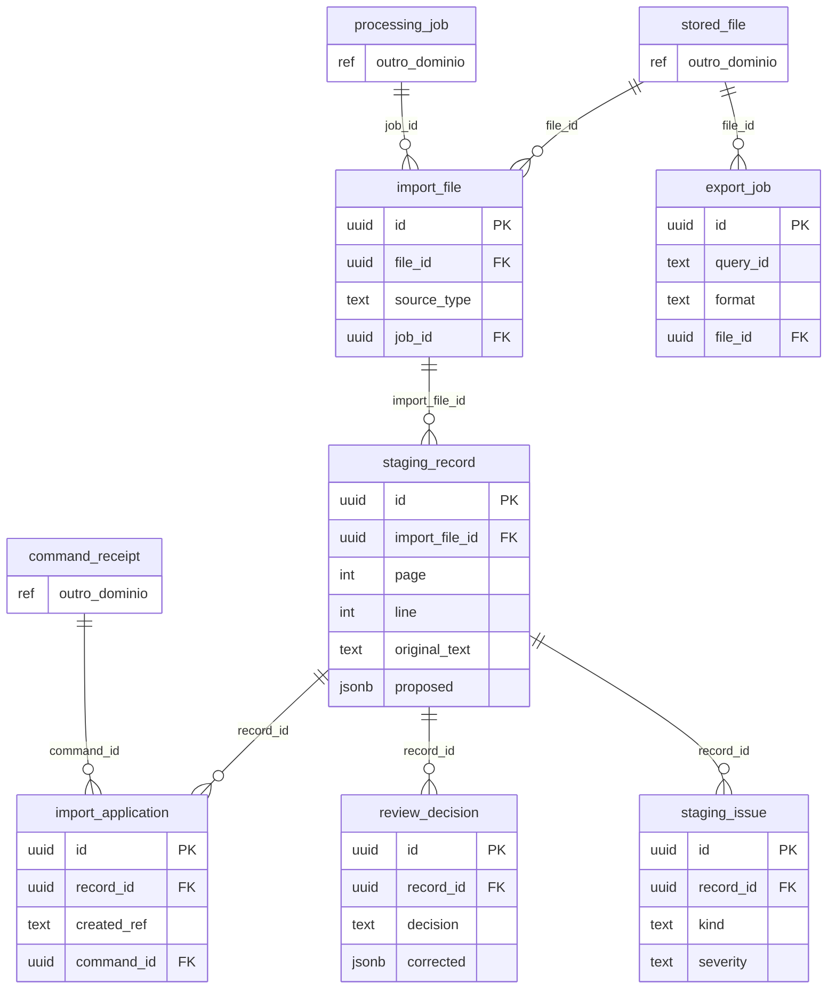
```mermaid
erDiagram
    import_file {
        uuid id PK
        uuid file_id FK
        text source_type
        uuid job_id FK
    }
    staging_record {
        uuid id PK
        uuid import_file_id FK
        int page
        int line
        text original_text
        jsonb proposed
    }
    staging_issue {
        uuid id PK
        uuid record_id FK
        text kind
        text severity
    }
    review_decision {
        uuid id PK
        uuid record_id FK
        text decision
        jsonb corrected
    }
    import_application {
        uuid id PK
        uuid record_id FK
        text created_ref
        uuid command_id FK
    }
    export_job {
        uuid id PK
        text query_id
        text format
        uuid file_id FK
    }
    command_receipt {
        ref outro_dominio
    }
    processing_job {
        ref outro_dominio
    }
    stored_file {
        ref outro_dominio
    }
    command_receipt ||--o{ import_application : "command_id"
    import_file ||--o{ staging_record : "import_file_id"
    processing_job ||--o{ import_file : "job_id"
    staging_record ||--o{ import_application : "record_id"
    staging_record ||--o{ review_decision : "record_id"
    staging_record ||--o{ staging_issue : "record_id"
    stored_file ||--o{ export_job : "file_id"
    stored_file ||--o{ import_file : "file_id"
```

## Motor de dados, análise e decisão

Catálogo semântico, indicadores com definição única, execuções analíticas, achados e decisões. Fase: B01–B16.

Referências a outros domínios: stored_file, user_account.

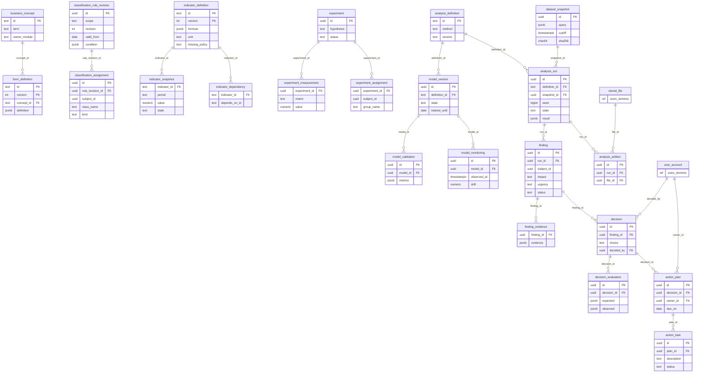
```mermaid
erDiagram
    business_concept {
        text id PK
        text term
        text owner_module
    }
    form_definition {
        text id PK
        int version PK
        text concept_id FK
        jsonb definition
    }
    classification_rule_revision {
        uuid id PK
        text scope
        int revision
        date valid_from
        jsonb condition
    }
    classification_assignment {
        uuid id PK
        uuid rule_revision_id FK
        uuid subject_id
        text class_name
        text kind
    }
    indicator_definition {
        text id PK
        int version PK
        jsonb formula
        text unit
        text missing_policy
    }
    indicator_dependency {
        text indicator_id FK
        text depends_on_id
    }
    indicator_snapshot {
        text indicator_id FK
        text period
        numeric value
        text state
    }
    dataset_snapshot {
        uuid id PK
        jsonb query
        timestamptz cutoff
        char64 sha256
    }
    analysis_definition {
        text id PK
        text method
        text version
    }
    analysis_run {
        uuid id PK
        text definition_id FK
        uuid snapshot_id FK
        bigint seed
        text state
        jsonb result
    }
    analysis_artifact {
        uuid id PK
        uuid run_id FK
        uuid file_id FK
    }
    model_version {
        uuid id PK
        text definition_id FK
        text state
        date trained_until
    }
    model_validation {
        uuid id PK
        uuid model_id FK
        jsonb metrics
    }
    model_monitoring {
        uuid id PK
        uuid model_id FK
        timestamptz observed_at
        numeric drift
    }
    finding {
        uuid id PK
        uuid run_id FK
        uuid subject_id
        text impact
        text urgency
        text status
    }
    finding_evidence {
        uuid finding_id FK
        jsonb evidence
    }
    decision {
        uuid id PK
        uuid finding_id FK
        text choice
        uuid decided_by FK
    }
    action_plan {
        uuid id PK
        uuid decision_id FK
        uuid owner_id FK
        date due_on
    }
    action_task {
        uuid id PK
        uuid plan_id FK
        text description
        text status
    }
    decision_evaluation {
        uuid id PK
        uuid decision_id FK
        jsonb expected
        jsonb observed
    }
    experiment {
        uuid id PK
        text hypothesis
        text status
    }
    experiment_assignment {
        uuid experiment_id FK
        uuid subject_id
        text group_name
    }
    experiment_measurement {
        uuid experiment_id FK
        text metric
        numeric value
    }
    stored_file {
        ref outro_dominio
    }
    user_account {
        ref outro_dominio
    }
    action_plan ||--o{ action_task : "plan_id"
    analysis_definition ||--o{ analysis_run : "definition_id"
    analysis_definition ||--o{ model_version : "definition_id"
    analysis_run ||--o{ analysis_artifact : "run_id"
    analysis_run ||--o{ finding : "run_id"
    business_concept ||--o{ form_definition : "concept_id"
    classification_rule_revision ||--o{ classification_assignment : "rule_revision_id"
    dataset_snapshot ||--o{ analysis_run : "snapshot_id"
    decision ||--o{ action_plan : "decision_id"
    decision ||--o{ decision_evaluation : "decision_id"
    experiment ||--o{ experiment_assignment : "experiment_id"
    experiment ||--o{ experiment_measurement : "experiment_id"
    finding ||--o{ decision : "finding_id"
    finding ||--o{ finding_evidence : "finding_id"
    indicator_definition ||--o{ indicator_dependency : "indicator_id"
    indicator_definition ||--o{ indicator_snapshot : "indicator_id"
    model_version ||--o{ model_monitoring : "model_id"
    model_version ||--o{ model_validation : "model_id"
    stored_file ||--o{ analysis_artifact : "file_id"
    user_account ||--o{ action_plan : "owner_id"
    user_account ||--o{ decision : "decided_by"
```

## Complementos do catálogo analítico (B14)

Tabelas conceituais, detalhadas quando cada recurso for priorizado.

- **Marketing e canais**: marketing_campaign, channel_touchpoint, attribution_rule, marketing_budget
- **Valor e satisfação do cliente**: customer_value_plan, customer_baseline, benefit_measurement, satisfaction_survey
- **Orçamento e investimentos**: corporate_budget_revision, investment_case, cash_scenario
- **Capacidade, calibração e logística**: resource_capacity, scheduling_scenario, calibration_session, measurement_observation, shipment, route_matrix, routing_scenario, product_experiment
- **Contratos e riscos**: contractual_obligation, legal_occurrence, risk_assessment
