# Diagramas de classes e padrões do backend

Situação em 25/09/2026. A parte **implementada** mostra as classes que existem hoje em `backend/java` (Sprints 1 e 2). A parte **planejada** mostra os agregados especificados no B01 (`12-b01-modelo-de-dominio.md`, `13-b01-especificacao-de-comandos.md` e `06-oop-e-design-patterns.md`), que ganham código na sprint indicada. Os nomes de classes seguem o código, em inglês; os textos, em português.

Notação: `+` público, `-` privado, `$` estático, `*` abstrato. `<|--` herança, `<|..` implementa interface, `*--` composição (a parte não existe sem o todo), `-->` referência, `..>` usa ou cria.

## Parte 1 — Implementado (Sprints 1 e 2)

### 1. Arquitetura em camadas: portas e adaptadores

Cada módulo tem três camadas. O domínio fica no centro e não conhece Spring, HTTP nem banco; isso é verificado no build pelo `ArchitectureTest`. As setas mostram a direção das dependências. O exemplo é o cadastro de clientes; os dados da empresa e os usuários seguem o mesmo desenho.

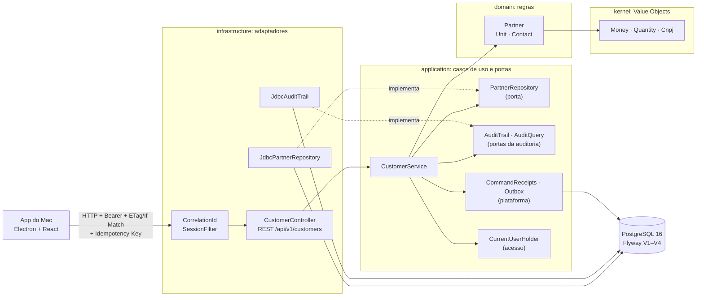

### 2. Kernel: Value Objects e políticas

Java puro, imutável e sem framework. Dinheiro é sempre um inteiro em centavos com moeda explícita. Arredondamento e rateio usam uma política informada, e a soma das partes é sempre exatamente o total (INV-MON-2).

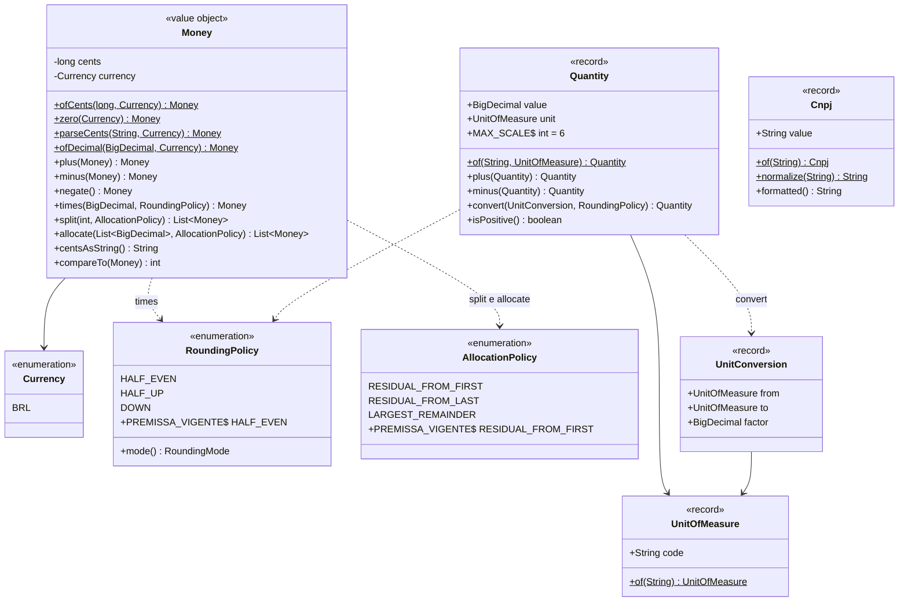

### 3. Erros de domínio e contrato de erro da API

As exceções de negócio carregam um código estável. Um único tratador (`ApiExceptionHandler`) converte cada uma no corpo padrão `ApiError` e no código HTTP correspondente: 401 sem sessão, 403 sem permissão, 404 não encontrado, 412 versão desatualizada, 422 regra violada, 428 falta `If-Match` e 400 formato inválido. O acesso negado é gravado na auditoria numa transação separada, para ficar registrado mesmo que a operação seja desfeita.

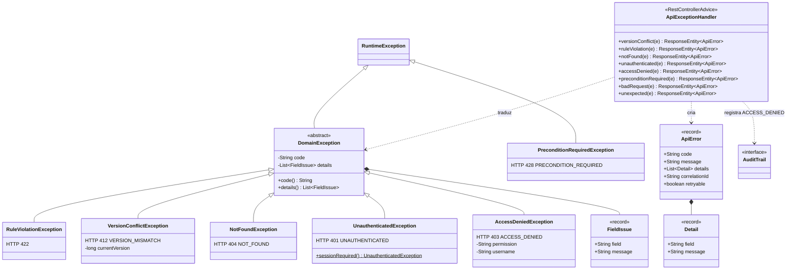

### 4. Plataforma web: correlação, sessão, status e relógio

Dois filtros rodam antes de qualquer controller. `CorrelationId` lê ou gera o `X-Correlation-Id`, grava no log (MDC) e devolve na resposta; o mesmo código aparece no erro, na auditoria e no log. `SessionFilter` valida o token `Bearer` e guarda o usuário da requisição em `CurrentUserHolder`. Só `GET /api/v1/status` e o login (`POST /api/v1/session`) dispensam sessão.

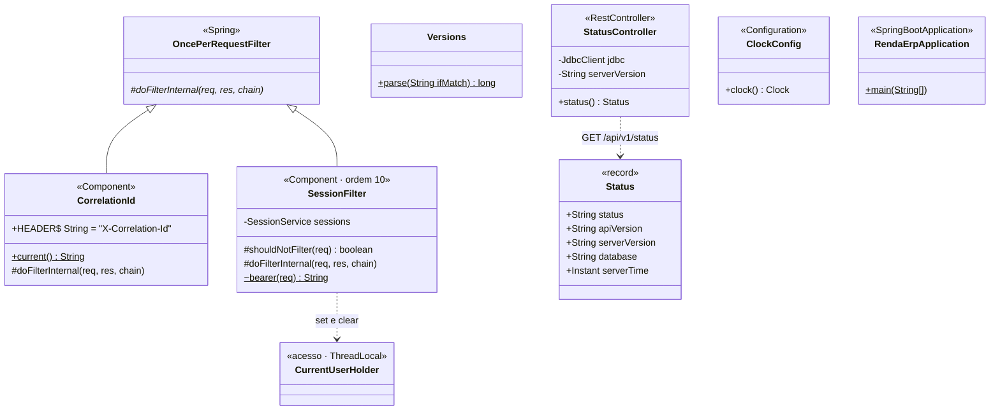

### 5. Dados da empresa: a fatia vertical completa

A primeira funcionalidade de ponta a ponta. O controller só traduz HTTP e DTOs. O serviço coordena transação, versão e auditoria. O agregado valida todos os campos de uma vez e devolve uma **nova versão** imutável. O repositório é uma porta, e a implementação JDBC é o adaptador.

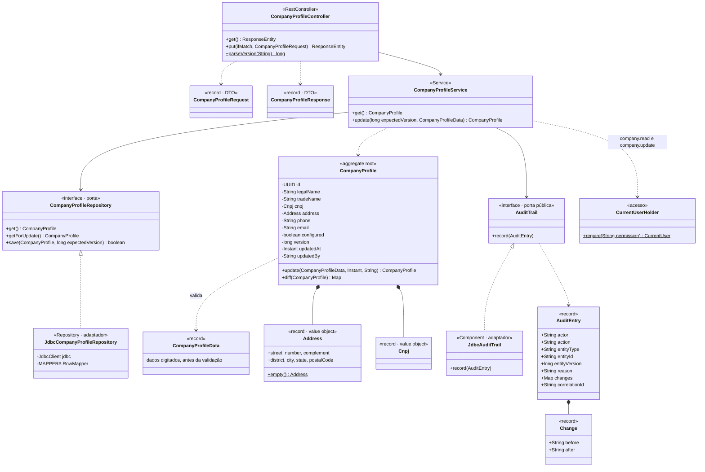

### 6. Sequência: salvar os dados da empresa

A mesma transação trava o registro, confere a versão, grava e audita. Se duas janelas salvarem ao mesmo tempo, só uma vence; a outra recebe 412 e o app mostra o aviso de conflito. O teste `CompanyProfileApiTest` faz 8 gravações simultâneas e confere 1 sucesso e 7 conflitos.

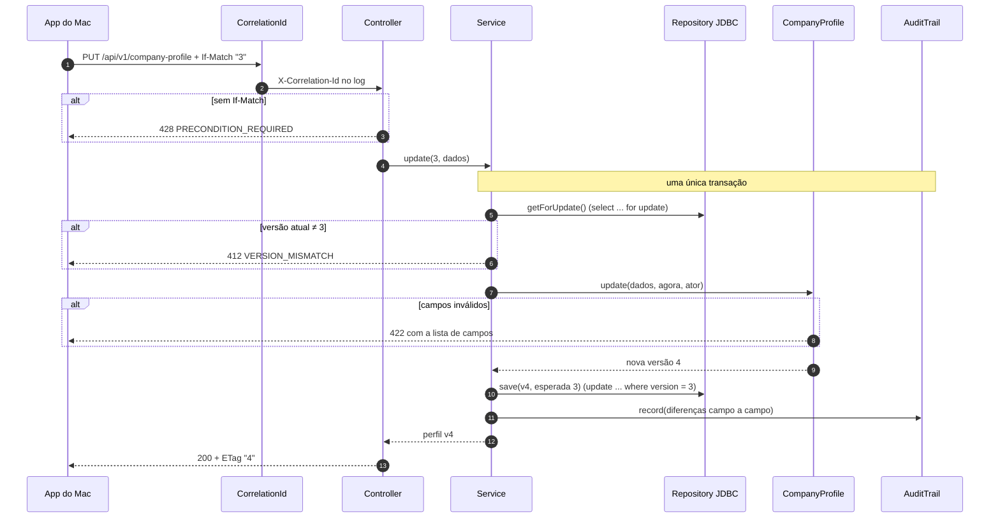

### 7. Acesso: usuários, perfis e sessões (Sprint 2)

Usuários do próprio Renda+, com senha guardada só como hash Argon2id. A sessão é um token opaco: o banco guarda apenas o hash do token, e a sessão expira após 8 h sem uso ou 12 h no total. Depois de 5 senhas erradas, o usuário fica bloqueado por 15 minutos. Há dois perfis nesta fase, com permissões por ação.

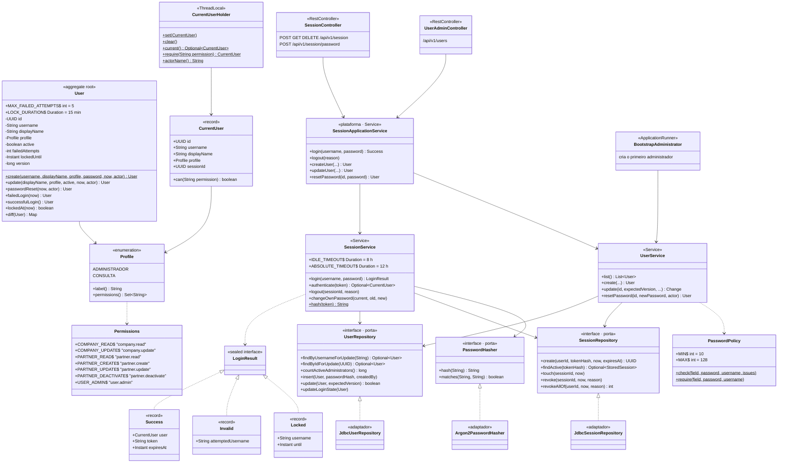

### 8. Cadastros: clientes, unidades e contatos (Sprint 2)

O cliente é um `Partner` com papel de cliente. Unidades e contatos fazem parte do agregado e são gravados junto com ele. O código (`C00001`) é gerado pelo sistema; o CNPJ, quando informado, é válido e único. Cadastrar usa recibo de comando; editar usa versão; nada é apagado, só inativado com motivo.

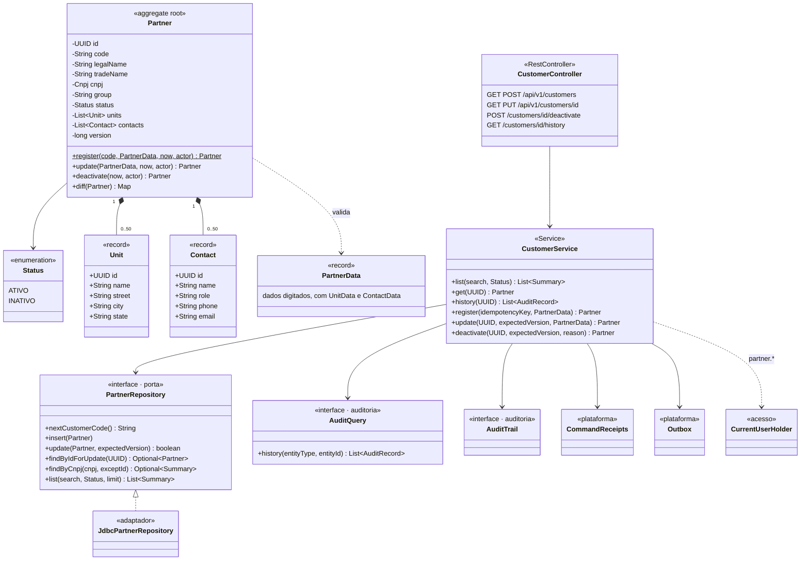

### 9. Plataforma: recibos de comando, outbox e fatos (Sprint 2)

`CommandReceipts` reserva a chave de idempotência com um `insert ... on conflict do nothing`. Por isso duas tentativas simultâneas com a mesma chave se enfileiram no banco, e a segunda recebe o resultado da primeira. `Outbox` grava o evento na transação do comando. `OutboxDispatcher` entrega os pendentes a cada 2 segundos, usando `for update skip locked`, e registra cada consumo em `event_consumption`. Assim, cada consumidor processa um evento uma única vez.

Diferenças em relação à especificação do B01, adotadas na Sprint 2: o recibo é identificado por (usuário, chave), e reutilizar a chave com outro conteúdo devolve 422 `IDEMPOTENCY_KEY_REUSED`, em vez de 409.

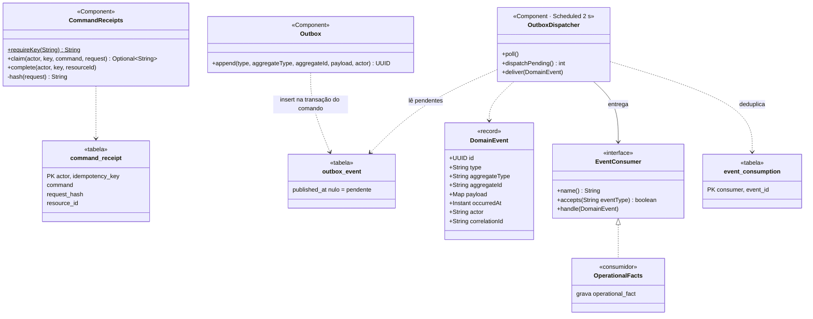

## Parte 2 — Planejado (especificado no B01)

### 10. Comercial: agregado SalesOrder (Sprint 4 · B05)

O pedido protege suas regras: pelo menos uma linha, parcelas que somam exatamente o total e edição só em rascunho. A confirmação acontece uma única vez; a segunda tentativa devolve a confirmação existente.

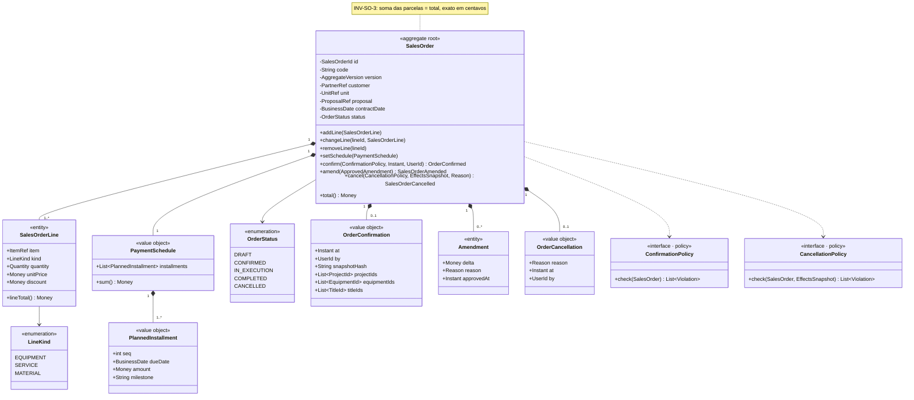

### 11. Estados do pedido

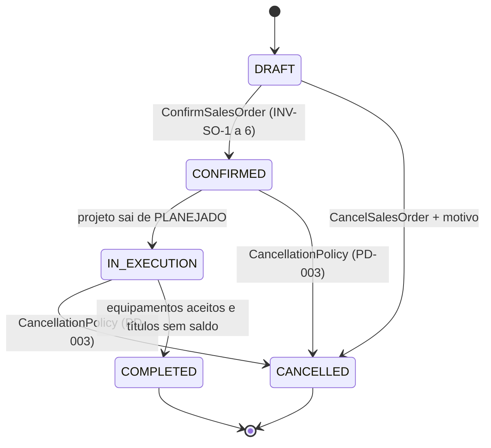

### 12. Caso de uso: confirmar pedido (Sprint 4 · B05)

O handler coordena; a regra fica no agregado. Projetos, equipamentos e parcelas são criados por portas de outros módulos, **dentro da mesma transação**, porque a confirmação não pode ficar pela metade. Recibo, outbox e auditoria reaproveitam as classes da Sprint 2.

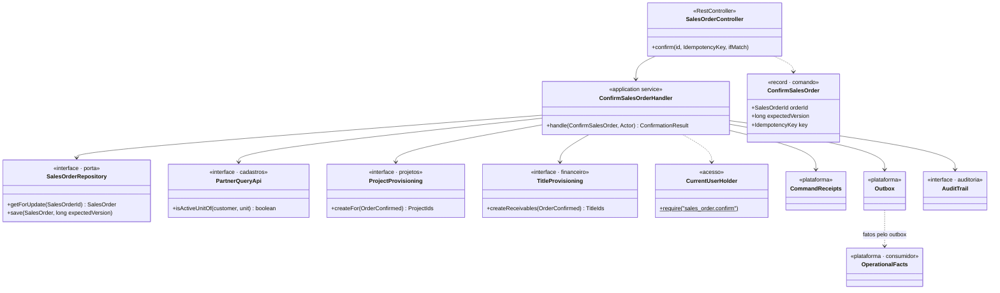

### 13. Financeiro: FinancialTitle e Settlement (Sprints 5 e 8+ · B05/B06)

O título (parcela a receber ou conta a pagar) nunca tem saldo negativo. A liquidação (baixa) distribui um pagamento entre títulos; a soma das alocações, créditos e componentes é sempre igual ao total. O estorno é total, cria um movimento de caixa inverso e preserva o original.

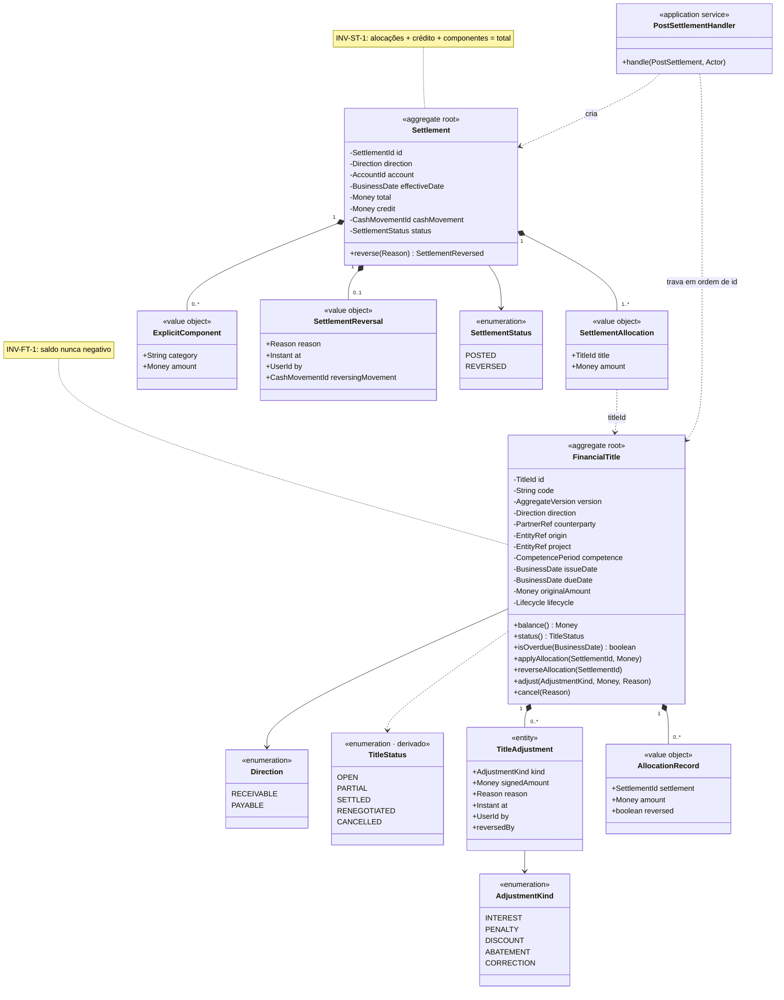

### 14. Motor de dados e análise (B02, B10, B14 e B15)

Fatos são imutáveis e alimentam os indicadores. Cada indicador tem uma definição única e versionada; valor ausente nunca vira zero. Os métodos analíticos são estratégias trocáveis, habilitadas só quando há dados suficientes.

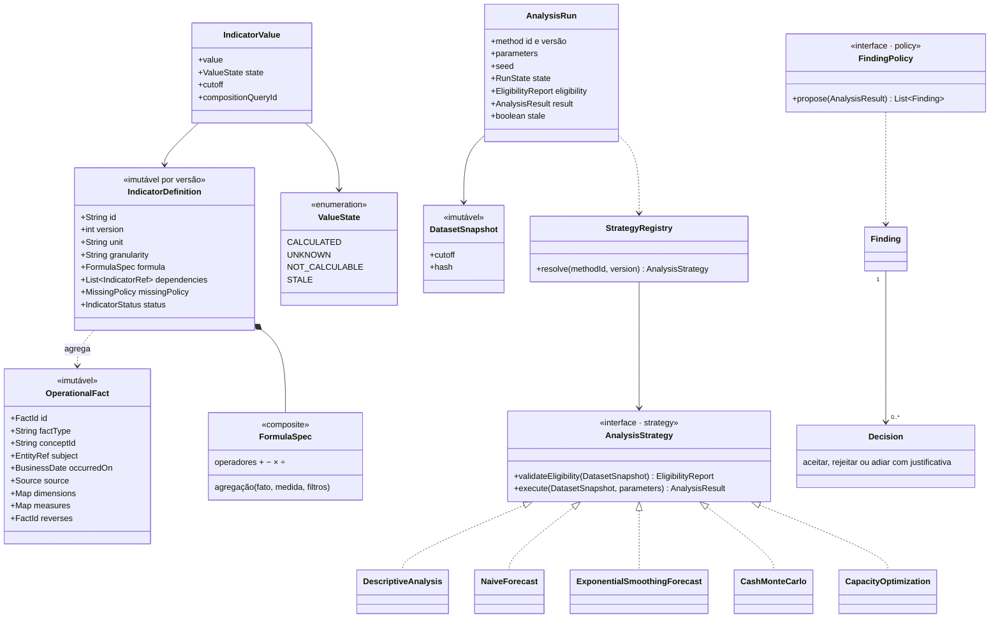

### 15. Estados de uma execução analítica

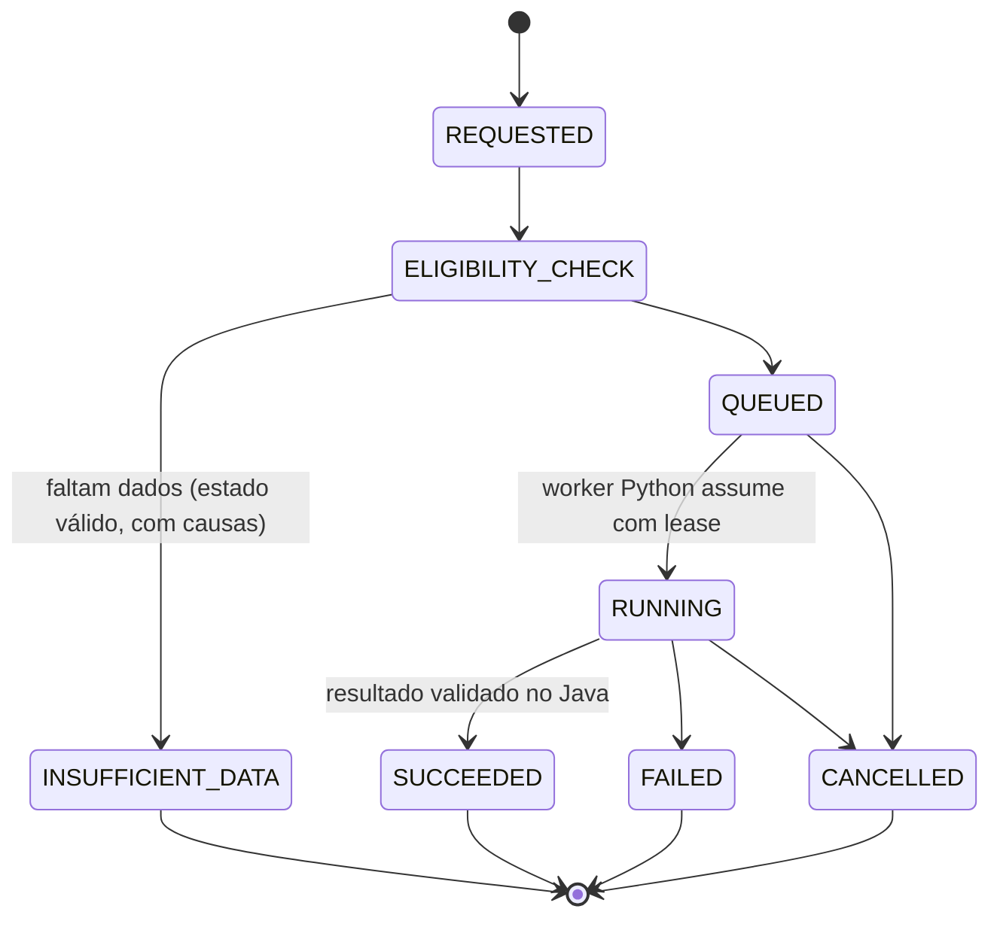

### 16. Qualidade de produto e qualidade de dados (B04 e B09)

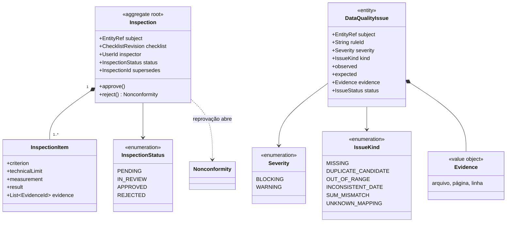

### 17. Demais agregados previstos

| Agregado | Regra central | Fase |
|---|---|---|
| Partner | CNPJ único quando presente; cliente e fornecedor são papéis do mesmo parceiro | Sprint 2–3 · B03 |
| Proposal / Revision | revisão emitida não muda | Sprint 4 · B05 |
| Project | ligado a pedido, cliente e unidade | Sprint 4 · B05 |
| Equipment | identidade própria; aceite e garantia vêm de evento real | B05/B09 |
| BomRevision / ProjectBom | revisão aprovada não muda; o projeto conserva a sua | B07 |
| Schedule / Baseline | sem ciclos; recalcular não altera a linha de base | B07 |
| StockPosition / Reservation | reservado ≤ físico, mesmo com acessos simultâneos | B08 |
| PurchaseOrder | soma das condições = total | B08 |
| ProductionOrder | liberação exige revisão e inspeção | B09 |
| CostEntry | um custo por origem | B08/B09 |
| DistributionRun | confirmação congela a memória de cálculo; títulos gerados uma vez | B10 |
| TaxPeriod | histórico, simulação e valor do contador separados | Sprint 7 · B10 |
| PreventiveOccurrence | uma ocorrência por plano, revisão, equipamento e data | B11 |
| StagingRecord | o original é preservado; aplicar de novo não duplica | B04/B12 |

## Parte 3 — Técnicas e padrões de engenharia de software

Situação: **Em uso** já está no código (Sprints 1 e 2). **Planejado** está especificado e entra na sprint indicada.

### 3.1 Arquitetura

| Técnica | O que resolve | Onde | Situação |
|---|---|---|---|
| Cliente-servidor | App do Mac sem regra de negócio; o servidor decide | ADR-001; app Electron + API `/api/v1` | Em uso |
| Monólito modular | 24 módulos com fronteiras claras, num único servidor | pacotes em `br.com.fourtech.rendamais`; `modulos.json`; ADR-016 | Em uso |
| Portas e adaptadores (hexagonal) | Domínio independente de banco e HTTP | `CompanyProfileRepository` ↔ `JdbcCompanyProfileRepository`; `AuditTrail` ↔ `JdbcAuditTrail` | Em uso |
| Camadas domain / application / infrastructure | Cada classe tem um só papel | `plataforma/empresa/*` | Em uso |
| Inversão e injeção de dependência | O serviço recebe as portas pelo construtor e pode ser testado sem banco | `CompanyProfileService(repository, audit, clock)` | Em uso |
| Testes de arquitetura | O build falha se um módulo usar outro não declarado, ou se o domínio importar Spring | `ArchitectureTest` (ArchUnit lendo `modulos.json`) | Em uso |
| CQRS leve | Escrita por comandos; consultas gerenciais separadas, no mesmo banco | módulo `consultas` | Planejado · Sprint 4+ |
| Worker Python separado | Processamento pesado sem acesso às tabelas de negócio | ADR-008 (ficou fora da Sprint 2) | Planejado · B04 |

### 3.2 Domínio (DDD)

| Técnica | O que resolve | Onde | Situação |
|---|---|---|---|
| Linguagem ubíqua | Mesmas palavras no negócio, no código e nas telas | `b01/conceitos.json` (57 conceitos) | Em uso |
| Contextos delimitados | Cada conceito tem um único módulo dono | `modulos.json`, `conceitos.json` | Em uso |
| Value Object | Dinheiro, quantidade e CNPJ se validam sozinhos e não mudam | `Money`, `Quantity`, `Cnpj`, `UnitOfMeasure`, `UnitConversion`, `Address` | Em uso |
| Agregado e raiz | Um objeto protege suas próprias regras | `CompanyProfile`, `User`, `Partner` (com unidades e contatos); depois `SalesOrder`, `FinancialTitle`, `Settlement` | Em uso |
| Repositório | Salvar e buscar agregados sem expor SQL | `CompanyProfileRepository`, `UserRepository`, `SessionRepository`, `PartnerRepository` | Em uso |
| Serviço de aplicação | Coordena permissão, transação, versão e auditoria de um caso de uso | `CompanyProfileService`, `CustomerService`, `SessionService`, `UserService`; depois `ConfirmSalesOrderHandler` | Em uso |
| Invariantes numeradas | Regras testáveis e rastreáveis (INV-*) | `12-b01-modelo-de-dominio.md` | Em uso (especificação) |
| Eventos de domínio | Um módulo avisa os outros do que aconteceu | `PartnerRegistered`, `PartnerUpdated`, `PartnerDeactivated` (dos 95 de `b01/eventos.json`) | Em uso · Sprint 2 |
| Registros compensatórios | Nada confirmado é apagado; corrige-se com estorno ou ajuste | `Settlement.reverse`, `OperationalFact.reverses` | Planejado · Sprint 5 |

### 3.3 Padrões de projeto

| Padrão | Uso no Renda+ | Situação |
|---|---|---|
| Static Factory Method | `Money.ofCents`, `Money.parseCents`, `Cnpj.of`, `Quantity.of`, `Address.empty` | Em uso |
| Strategy (por enum) | `RoundingPolicy` e `AllocationPolicy` escolhem como arredondar e ratear | Em uso |
| Imutabilidade / objeto que devolve nova versão | `CompanyProfile.update` devolve uma nova versão; `Money.plus` devolve um novo valor | Em uso |
| Notification | A validação reúne todos os campos com problema antes de recusar | `CompanyProfile.update` | Em uso |
| Data Mapper | Converte linha do banco em objeto de domínio | `JdbcCompanyProfileRepository.MAPPER` | Em uso |
| DTO | Formato da API separado do domínio | records `CompanyProfileRequest` e `CompanyProfileResponse` | Em uso |
| Template Method | O filtro implementa só o passo variável | `CorrelationId extends OncePerRequestFilter` | Em uso |
| Chain of Responsibility (filtros) | Correlação aplicada antes de qualquer controller | cadeia de filtros do servidor | Em uso |
| Tratamento centralizado de erros | Uma exceção vira sempre o mesmo formato de erro | `ApiExceptionHandler` + `ApiError` | Em uso |
| Tipo fechado (sealed interface) | O login só pode terminar em sucesso, inválido ou bloqueado, e o compilador confere | `SessionService.LoginResult` | Em uso |
| Contexto da requisição por thread | O usuário da requisição fica disponível sem passá-lo em todo método | `CurrentUserHolder` (preenchido pelo `SessionFilter`) | Em uso |
| Observer (consumidores de eventos) | Um evento é entregue a quem se interessa por ele | `EventConsumer` + `OperationalFacts` | Em uso |
| Policy / Specification | Regras compostas e testáveis para confirmar, cancelar e habilitar modelos | `ConfirmationPolicy`, `CancellationPolicy`, `EligibilityPolicy` | Planejado · Sprint 4 |
| State (enum + transições) | Pedido, tarefa e execução analítica só mudam por transições válidas | `OrderStatus`, `RunState` | Planejado · Sprint 4 |
| Strategy + Registry | Métodos analíticos trocáveis e versionados | `AnalysisStrategy`, `StrategyRegistry` | Planejado · B10/B15 |
| Composite | Fórmula de indicador como árvore de operações | `FormulaSpec` | Planejado · B10 |
| Pipeline | arquivo → extração → normalização → qualidade → conferência | importação | Planejado · B04 |
| Adapter | Leitores de PDF e OFX, armazenamento, solver, IA | módulo `integracao` | Planejado · B04+ |
| Facade | Visão do projeto reunindo vários módulos, só leitura | `ProjectOverviewQuery` | Planejado · Sprint 4 |
| Decorator | Métricas, logs e timeout em volta de consultas | plataforma | Planejado · B13 |

### 3.4 Dados, concorrência e integridade

| Técnica | O que resolve | Onde | Situação |
|---|---|---|---|
| Dinheiro em centavos inteiros | Sem erro de ponto flutuante; soma exata | `Money` (`long`), colunas `*_cents`; API envia texto | Em uso |
| Aritmética com estouro detectado | Nunca "vira" um valor absurdo em silêncio | `Math.addExact`, `longValueExact` | Em uso |
| Rateio com resíduo controlado | Parcelas somam exatamente o total | `Money.allocate` (maiores restos e resíduo pela primeira) | Em uso |
| Concorrência otimista | Duas pessoas editando: a segunda é avisada, sem perder dados | `version`, ETag/If-Match, `update ... where version = ?` → 412 | Em uso |
| Bloqueio pessimista | Operações críticas em sequência dentro da transação | `select ... for update` em `getForUpdate` | Em uso |
| Transação única com auditoria | A auditoria nunca fica de fora | `@Transactional` + `AuditTrail` com `Propagation.MANDATORY` | Em uso |
| Restrições no banco | Segunda linha de defesa, mesmo contra bugs | `check` de CNPJ e CEP; índice que garante uma única empresa | Em uso |
| Migrações versionadas | Banco evolui junto com o código, igual em toda máquina | Flyway `V1__...sql` | Em uso |
| Comando idempotente | Clique duplo ou queda de conexão não duplicam | `Idempotency-Key` + `CommandReceipts` (`insert ... on conflict do nothing`) | Em uso · Sprint 2 |
| Outbox transacional + consumidor idempotente | Eventos entregues pelo menos uma vez, sem efeito duplicado | `Outbox`, `OutboxDispatcher`, `outbox_event`, `event_consumption` | Em uso · Sprint 2 |
| Fila no banco sem disputa | Vários entregadores nunca pegam o mesmo evento | `for update skip locked` no `OutboxDispatcher` | Em uso · Sprint 2 |
| Auditoria em transação separada | Acesso negado fica registrado mesmo que a operação seja desfeita | `ApiExceptionHandler.accessDenied` (nova transação) | Em uso · Sprint 2 |
| Travas em ordem estável | Evita impasse (deadlock) em baixas de vários títulos | INV-ST-3 | Planejado · Sprint 5 |
| Lease com geração | Resultado de tentativa antiga do worker é recusado | tarefas Python | Planejado · B04 |
| Snapshot imutável | Análise reproduzível: mesmos dados, mesma semente | `DatasetSnapshot` | Planejado · B04/B15 |

### 3.5 API e observabilidade

| Técnica | Onde | Situação |
|---|---|---|
| API REST versionada (`/api/v1`) | todos os controllers | Em uso |
| Contrato de erro estável (`code`, `message`, `details`, `correlationId`, `retryable`) | `ApiError` | Em uso |
| Códigos HTTP com significado (400, 404, 412, 422, 428) | `ApiExceptionHandler` | Em uso |
| Identificador de correlação de ponta a ponta | `CorrelationId` + MDC nos logs + auditoria | Em uso |
| Endpoint de status (servidor e banco) | `StatusController` | Em uso |
| Relógio injetável (testes com data controlada) | `ClockConfig` | Em uso |
| Configuração por variáveis de ambiente | `RENDA_DB_URL`, `RENDA_SERVER_PORT`… | Em uso |
| Contrato OpenAPI conferido por teste | `docs/backend/api/openapi.yaml` + `OpenApiContractTest` | Em uso · Sprint 2 |
| Autenticação por token `Bearer` | `SessionFilter`; públicos só `GET /status` e `POST /session` | Em uso · Sprint 2 |

### 3.6 Segurança

| Técnica | Onde | Situação |
|---|---|---|
| Senha com hash Argon2id (nunca a senha em si) | `Argon2PasswordHasher` | Em uso · Sprint 2 |
| Política de senha (10 a 128 caracteres, diferente do usuário) | `PasswordPolicy` | Em uso · Sprint 2 |
| Sessão opaca: o banco guarda só o hash do token | `SessionService.hash`, `JdbcSessionRepository` | Em uso · Sprint 2 |
| Expiração por inatividade (8 h) e absoluta (12 h); sair revoga na hora | `SessionService.authenticate`, `logout` | Em uso · Sprint 2 |
| Bloqueio após 5 tentativas, por 15 minutos | `User.failedLogin` | Em uso · Sprint 2 |
| Mesma resposta para usuário inexistente e senha errada, com o mesmo tempo de cálculo | `SessionService.login` (hash de referência) | Em uso · Sprint 2 |
| Permissões por ação, verificadas no servidor | `Profile`, `Permissions`, `CurrentUserHolder.require` | Em uso · Sprint 2 |
| Token só no processo principal do Electron, nunca no React | `electron/main.ts` | Em uso · Sprint 2 |
| Primeiro administrador criado por configuração, sem senha padrão | `BootstrapAdministrator` | Em uso · Sprint 2 |
| Sempre resta um administrador ativo; ninguém retira o próprio acesso | `UserService.update` | Em uso · Sprint 2 |
| TLS obrigatório para acesso por outros computadores | ADR-007 | Planejado · B13 |

### 3.7 Qualidade e testes

| Técnica | Onde | Situação |
|---|---|---|
| Testes unitários de Value Objects | `MoneyTest`, `QuantityTest`, `CnpjTest` | Em uso |
| Testes baseados em propriedades | `MoneyTest`: 20.000 casos gerados com semente fixa conferem que o rateio soma o total | Em uso |
| Testes de integração com PostgreSQL real | `IntegrationTest` (Testcontainers ou `RENDA_TEST_JDBC_URL`) | Em uso |
| Teste de concorrência real | `CompanyProfileApiTest`: 8 gravações simultâneas → 1 sucesso e 7 conflitos; `CustomerApiTest`: 6 reenvios simultâneos criam um único cliente | Em uso |
| Testes de segurança da sessão | `SessionApiTest`: 401, 403 auditado, bloqueio, expiração de 8 h e 12 h, senha nunca na resposta | Em uso · Sprint 2 |
| Teste de contrato da API | `OpenApiContractTest`: falha se o servidor e o `openapi.yaml` divergirem | Em uso · Sprint 2 |
| Testes de arquitetura | `ArchitectureTest` | Em uso |
| Especificação executável | catálogos JSON do B01 + `tools/b01/verificar_b01.py` (e testes do próprio verificador) | Em uso |
| Integração contínua | GitHub Actions: especificação, servidor e app | Em uso |
| Testes de contrato por adaptador | parsers, armazenamento, worker | Planejado · B04 |

### 3.8 No app do Mac

| Técnica | Onde | Situação |
|---|---|---|
| Reducer (estado previsível das janelas) | `windows/windowManager.ts` | Em uso |
| Adapter de transporte (troca em testes) | `api/client.ts` (`setTransport`) | Em uso |
| Ponte IPC isolada e validada | `electron/preload.ts` (`window.renda`) | Em uso |
| Menu gerado a partir de catálogo | `SideNav.tsx` lê `b01/menu.json` | Em uso |
| Chave de idempotência guardada até a resposta chegar | `CustomerWindow.tsx` reenvia com a mesma chave | Em uso · Sprint 2 |
| Design tokens (fonte única do visual) | `design-system/tokens.css`, classes `rp-*`; ADR-017 | Em uso |

### 3.9 Processo

| Técnica | Onde | Situação |
|---|---|---|
| Scrum com fatias verticais (tela + servidor + banco) | `docs/scrum/` | Em uso |
| Definição de Pronto e de Preparado | `docs/scrum/processo-scrum.md` | Em uso |
| Registros de decisão de arquitetura (ADR) | `docs/adr/` (17 ADRs) | Em uso |
| Pendências explícitas em vez de suposições escondidas | `b01/pendencias.json`, planilha de decisões | Em uso |

### 3.10 Evitados de propósito

| Não usamos | Motivo |
|---|---|
| Microsserviços | Complexidade de operação sem ganho para o tamanho da Fourtech |
| Event sourcing de todo o sistema | Tabelas normais + auditoria + fatos já dão o histórico necessário |
| Herança profunda | Composição é mais simples; cliente e fornecedor são papéis de um parceiro |
| Service Locator e Singleton com estado | Escondem dependências e dificultam testes |
| ORM na Sprint 1 | SQL explícito com `JdbcClient` deixa claras as travas e a condição de versão |
| Setters públicos no domínio | Um pedido não pode virar "confirmado" sem passar pelas regras |
