# Diagramas de atividades e de sequência do backend

Situação em 25/09/2026. A parte **implementada** descreve o que o código da Sprint 1 faz hoje. A parte **planejada** segue a especificação do B01 (`13-b01-especificacao-de-comandos.md`, `12-b01-modelo-de-dominio.md` e `01-plano-completo-backend.md`) e entra na sprint indicada. As classes citadas estão em `17-diagramas-de-classes-e-padroes.md`.

Diagrama de **atividades**: o passo a passo de um processo, com decisões e caminhos alternativos. Diagrama de **sequência**: as mensagens trocadas entre as partes do sistema, na ordem em que acontecem.

## Parte 1 — Implementado (Sprint 1)

### 1. Atividade: iniciar o servidor

Ao iniciar, o servidor aplica as migrações pendentes antes de aceitar requisições. Se o banco não estiver acessível ou o esquema for incompatível, ele para com erro explícito em vez de funcionar pela metade.

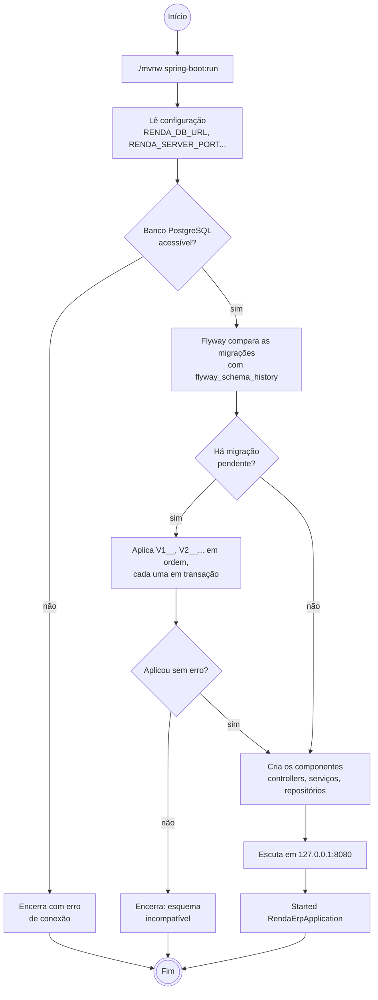
```mermaid
flowchart TD
    A((Início)) --> B["./mvnw spring-boot:run"]
    B --> C["Lê configuração<br/>RENDA_DB_URL, RENDA_SERVER_PORT..."]
    C --> D{"Banco PostgreSQL<br/>acessível?"}
    D -- não --> X["Encerra com erro<br/>de conexão"] --> Z(((Fim)))
    D -- sim --> E["Flyway compara as migrações<br/>com flyway_schema_history"]
    E --> F{"Há migração<br/>pendente?"}
    F -- sim --> G["Aplica V1__, V2__... em ordem,<br/>cada uma em transação"]
    G --> H{"Aplicou sem erro?"}
    H -- não --> X2["Encerra: esquema<br/>incompatível"] --> Z
    H -- sim --> I
    F -- não --> I["Cria os componentes<br/>controllers, serviços, repositórios"]
    I --> J["Escuta em 127.0.0.1:8080"]
    J --> K["Started RendaErpApplication"] --> Z
```

### 2. Sequência: abrir o app e verificar a conexão

A tela do app nunca acessa a rede diretamente. Ela pede ao processo principal do Electron, que valida método, caminho e cabeçalhos antes de chamar o servidor. O rodapé consulta o status a cada 10 segundos.

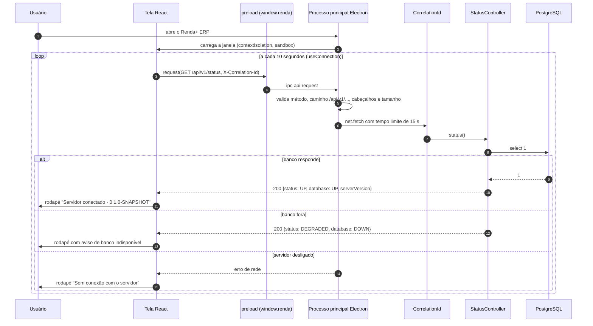
```mermaid
sequenceDiagram
    autonumber
    participant U as Usuário
    participant R as Tela React
    participant P as preload (window.renda)
    participant M as Processo principal Electron
    participant F as CorrelationId
    participant S as StatusController
    participant DB as PostgreSQL
    U->>M: abre o Renda+ ERP
    M->>R: carrega a janela (contextIsolation, sandbox)
    loop a cada 10 segundos (useConnection)
        R->>P: request(GET /api/v1/status, X-Correlation-Id)
        P->>M: ipc api:request
        M->>M: valida método, caminho /api/v1/..., cabeçalhos e tamanho
        M->>F: net.fetch com tempo limite de 15 s
        F->>S: status()
        S->>DB: select 1
        alt banco responde
            DB-->>S: 1
            S-->>R: 200 {status: UP, database: UP, serverVersion}
            R->>U: rodapé "Servidor conectado · 0.1.0-SNAPSHOT"
        else banco fora
            S-->>R: 200 {status: DEGRADED, database: DOWN}
            R->>U: rodapé com aviso de banco indisponível
        else servidor desligado
            M-->>R: erro de rede
            R->>U: rodapé "Sem conexão com o servidor"
        end
    end
```

### 3. Sequência: abrir "Dados da empresa"

A leitura devolve a versão atual no cabeçalho `ETag`. A janela guarda essa versão para enviá-la de volta ao salvar.

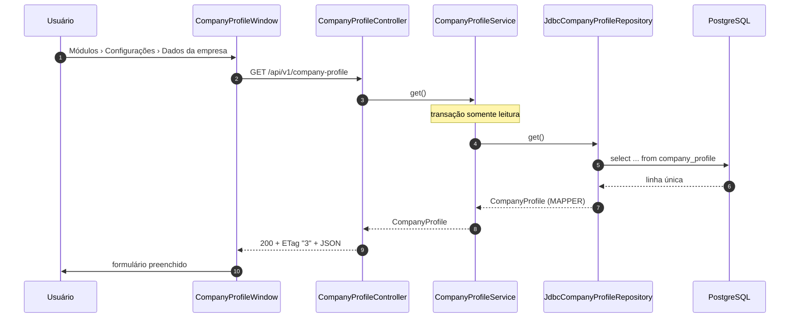
```mermaid
sequenceDiagram
    autonumber
    participant U as Usuário
    participant W as CompanyProfileWindow
    participant C as CompanyProfileController
    participant S as CompanyProfileService
    participant R as JdbcCompanyProfileRepository
    participant DB as PostgreSQL
    U->>W: Módulos › Configurações › Dados da empresa
    W->>C: GET /api/v1/company-profile
    C->>S: get()
    Note over S: transação somente leitura
    S->>R: get()
    R->>DB: select ... from company_profile
    DB-->>R: linha única
    R-->>S: CompanyProfile (MAPPER)
    S-->>C: CompanyProfile
    C-->>W: 200 + ETag "3" + JSON
    W->>U: formulário preenchido
```

### 4. Atividade: salvar "Dados da empresa"

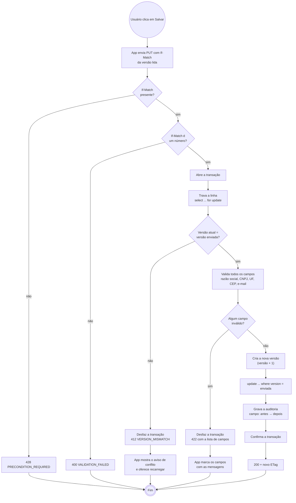
```mermaid
flowchart TD
    A((Usuário clica em Salvar)) --> B["App envia PUT com If-Match<br/>da versão lida"]
    B --> C{"If-Match<br/>presente?"}
    C -- não --> E428["428 PRECONDITION_REQUIRED"] --> Z(((Fim)))
    C -- sim --> D{"If-Match é<br/>um número?"}
    D -- não --> E400["400 VALIDATION_FAILED"] --> Z
    D -- sim --> T["Abre a transação"]
    T --> L["Trava a linha<br/>select ... for update"]
    L --> V{"Versão atual =<br/>versão enviada?"}
    V -- não --> E412["Desfaz a transação<br/>412 VERSION_MISMATCH"] --> AV["App mostra o aviso de conflito<br/>e oferece recarregar"] --> Z
    V -- sim --> VAL["Valida todos os campos<br/>razão social, CNPJ, UF, CEP, e-mail"]
    VAL --> OK{"Algum campo<br/>inválido?"}
    OK -- sim --> E422["Desfaz a transação<br/>422 com a lista de campos"] --> MARCA["App marca os campos<br/>com as mensagens"] --> Z
    OK -- não --> NV["Cria a nova versão<br/>(versão + 1)"]
    NV --> UP["update ... where version = enviada"]
    UP --> AU["Grava a auditoria<br/>campo: antes → depois"]
    AU --> CM["Confirma a transação"]
    CM --> R200["200 + novo ETag"] --> Z
```

### 5. Sequência: duas janelas salvam ao mesmo tempo

As duas leram a versão 3. A trava do banco coloca as gravações em fila: a primeira grava a versão 4; a segunda, ao conferir, encontra 4 ≠ 3 e recebe 412. Nenhuma alteração é perdida em silêncio. O teste `CompanyProfileApiTest` repete isso com 8 gravações simultâneas.

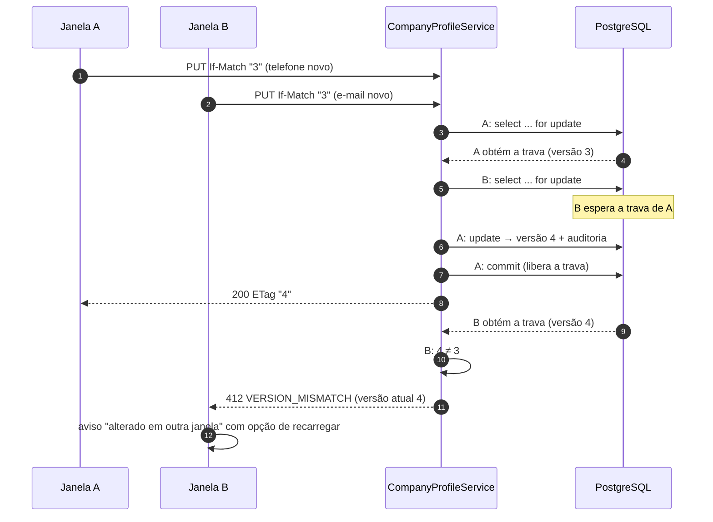
```mermaid
sequenceDiagram
    autonumber
    participant A as Janela A
    participant B as Janela B
    participant S as CompanyProfileService
    participant DB as PostgreSQL
    A->>S: PUT If-Match "3" (telefone novo)
    B->>S: PUT If-Match "3" (e-mail novo)
    S->>DB: A: select ... for update
    DB-->>S: A obtém a trava (versão 3)
    S->>DB: B: select ... for update
    Note over DB: B espera a trava de A
    S->>DB: A: update → versão 4 + auditoria
    S->>DB: A: commit (libera a trava)
    S-->>A: 200 ETag "4"
    DB-->>S: B obtém a trava (versão 4)
    S->>S: B: 4 ≠ 3
    S-->>B: 412 VERSION_MISMATCH (versão atual 4)
    B->>B: aviso "alterado em outra janela" com opção de recarregar
```

### 6. Sequência: erro inesperado com código de correlação

O usuário vê uma mensagem em português com um código. O suporte encontra o mesmo código no log do servidor, com os detalhes técnicos, que nunca vão para a tela.

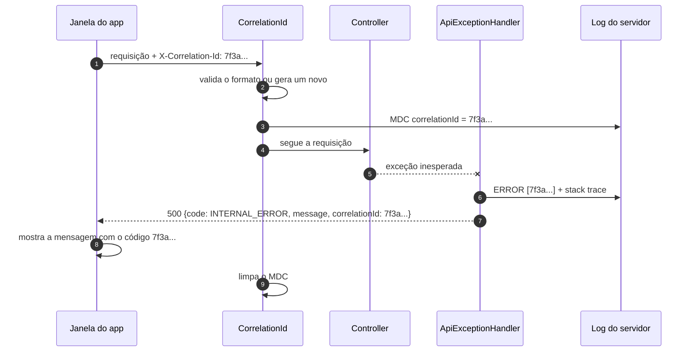
```mermaid
sequenceDiagram
    autonumber
    participant W as Janela do app
    participant F as CorrelationId
    participant C as Controller
    participant H as ApiExceptionHandler
    participant L as Log do servidor
    W->>F: requisição + X-Correlation-Id: 7f3a...
    F->>F: valida o formato ou gera um novo
    F->>L: MDC correlationId = 7f3a...
    F->>C: segue a requisição
    C--xH: exceção inesperada
    H->>L: ERROR [7f3a...] + stack trace
    H-->>W: 500 {code: INTERNAL_ERROR, message, correlationId: 7f3a...}
    W->>W: mostra a mensagem com o código 7f3a...
    F->>F: limpa o MDC
```

## Parte 2 — Planejado (especificado no B01)

### 7. Atividade: pipeline comum de um comando (Sprint 2 · B02)

Todos os comandos que mudam dinheiro, estoque ou compromissos seguem este caminho. O recibo de comando garante que repetir a mesma intenção não duplica nada.

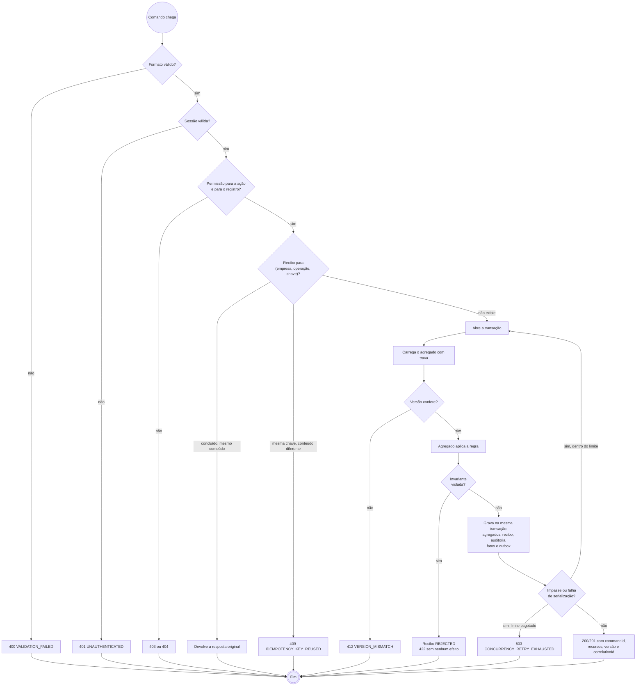
```mermaid
flowchart TD
    A((Comando chega)) --> B{"Formato válido?"}
    B -- não --> E400["400 VALIDATION_FAILED"] --> Z(((Fim)))
    B -- sim --> C{"Sessão válida?"}
    C -- não --> E401["401 UNAUTHENTICATED"] --> Z
    C -- sim --> D{"Permissão para a ação<br/>e para o registro?"}
    D -- não --> E403["403 ou 404"] --> Z
    D -- sim --> R{"Recibo para<br/>(empresa, operação, chave)?"}
    R -- "concluído, mesmo conteúdo" --> ORIG["Devolve a resposta original"] --> Z
    R -- "mesma chave, conteúdo diferente" --> E409["409 IDEMPOTENCY_KEY_REUSED"] --> Z
    R -- não existe --> T["Abre a transação"]
    T --> LK["Carrega o agregado com trava"]
    LK --> VS{"Versão confere?"}
    VS -- não --> E412["412 VERSION_MISMATCH"] --> Z
    VS -- sim --> RG["Agregado aplica a regra"]
    RG --> INV{"Invariante<br/>violada?"}
    INV -- sim --> REJ["Recibo REJECTED<br/>422 sem nenhum efeito"] --> Z
    INV -- não --> GR["Grava na mesma transação:<br/>agregados, recibo, auditoria,<br/>fatos e outbox"]
    GR --> DL{"Impasse ou falha<br/>de serialização?"}
    DL -- "sim, dentro do limite" --> T
    DL -- "sim, limite esgotado" --> E503["503 CONCURRENCY_RETRY_EXHAUSTED"] --> Z
    DL -- não --> OK["200/201 com commandId,<br/>recursos, versão e correlationId"] --> Z
```

### 8. Sequência: resposta perdida e repetição segura (Sprint 2 · B02)

A conexão cai depois que o servidor confirmou. O app repete com a **mesma chave** e recebe o mesmo resultado, sem criar nada novo.

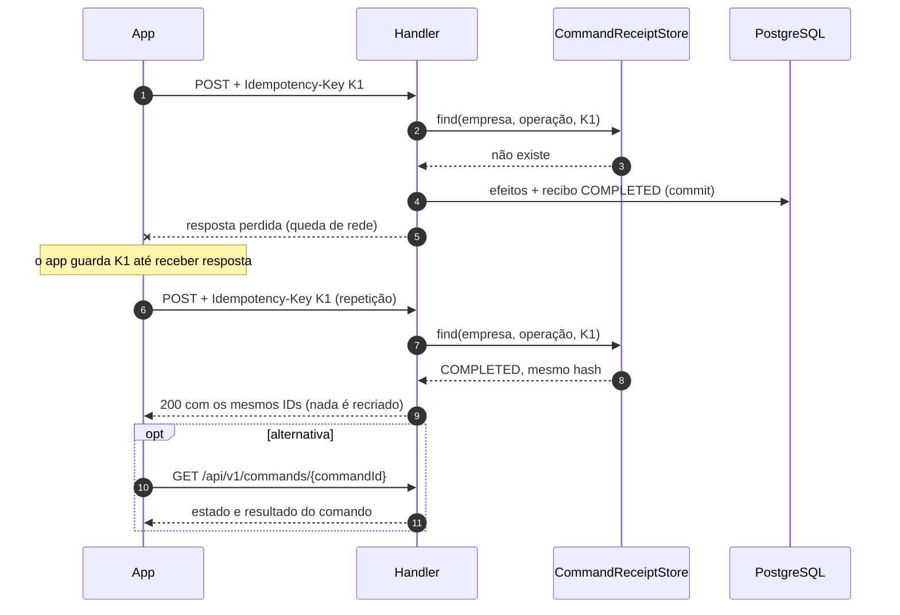
```mermaid
sequenceDiagram
    autonumber
    participant A as App
    participant H as Handler
    participant RC as CommandReceiptStore
    participant DB as PostgreSQL
    A->>H: POST + Idempotency-Key K1
    H->>RC: find(empresa, operação, K1)
    RC-->>H: não existe
    H->>DB: efeitos + recibo COMPLETED (commit)
    H--xA: resposta perdida (queda de rede)
    Note over A: o app guarda K1 até receber resposta
    A->>H: POST + Idempotency-Key K1 (repetição)
    H->>RC: find(empresa, operação, K1)
    RC-->>H: COMPLETED, mesmo hash
    H-->>A: 200 com os mesmos IDs (nada é recriado)
    opt alternativa
        A->>H: GET /api/v1/commands/{commandId}
        H-->>A: estado e resultado do comando
    end
```

### 9. Atividade: confirmar pedido (Sprint 4 · B05)

A confirmação cria projeto, equipamentos e parcelas a receber **de uma vez**. Se qualquer parte falhar, nada é gravado.

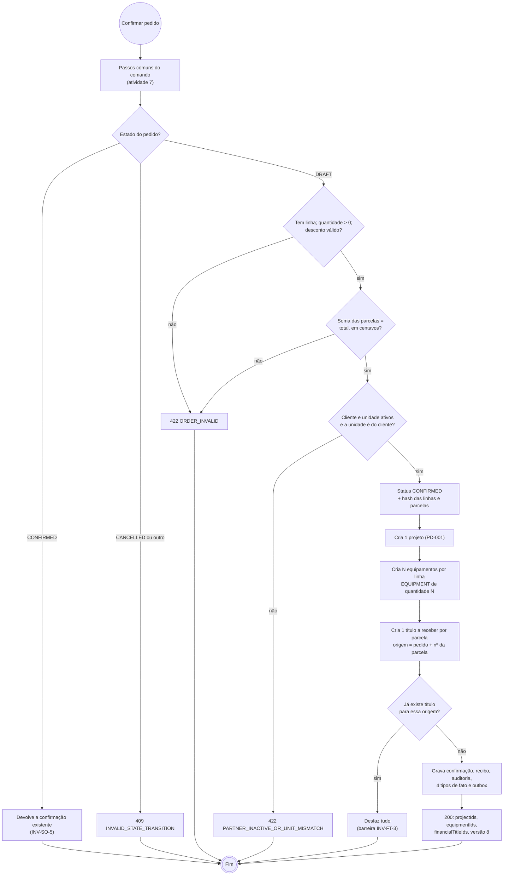
```mermaid
flowchart TD
    A((Confirmar pedido)) --> P["Passos comuns do comando<br/>(atividade 7)"]
    P --> ST{"Estado do pedido?"}
    ST -- CONFIRMED --> EX["Devolve a confirmação existente<br/>(INV-SO-5)"] --> Z(((Fim)))
    ST -- "CANCELLED ou outro" --> E409["409 INVALID_STATE_TRANSITION"] --> Z
    ST -- DRAFT --> L1{"Tem linha; quantidade > 0;<br/>desconto válido?"}
    L1 -- não --> E422a["422 ORDER_INVALID"] --> Z
    L1 -- sim --> L2{"Soma das parcelas =<br/>total, em centavos?"}
    L2 -- não --> E422a
    L2 -- sim --> L3{"Cliente e unidade ativos<br/>e a unidade é do cliente?"}
    L3 -- não --> E422b["422 PARTNER_INACTIVE_OR_UNIT_MISMATCH"] --> Z
    L3 -- sim --> CF["Status CONFIRMED<br/>+ hash das linhas e parcelas"]
    CF --> PJ["Cria 1 projeto (PD-001)"]
    PJ --> EQ["Cria N equipamentos por linha<br/>EQUIPMENT de quantidade N"]
    EQ --> TT["Cria 1 título a receber por parcela<br/>origem = pedido + nº da parcela"]
    TT --> UQ{"Já existe título<br/>para essa origem?"}
    UQ -- sim --> RB["Desfaz tudo<br/>(barreira INV-FT-3)"] --> Z
    UQ -- não --> GR["Grava confirmação, recibo, auditoria,<br/>4 tipos de fato e outbox"]
    GR --> OK["200: projectIds, equipmentIds,<br/>financialTitleIds, versão 8"] --> Z
```

### 10. Sequência: confirmar pedido (Sprint 4 · B05)

Exemplo: pedido com 3 máquinas e 6 parcelas. Tudo abaixo da nota acontece numa única transação.

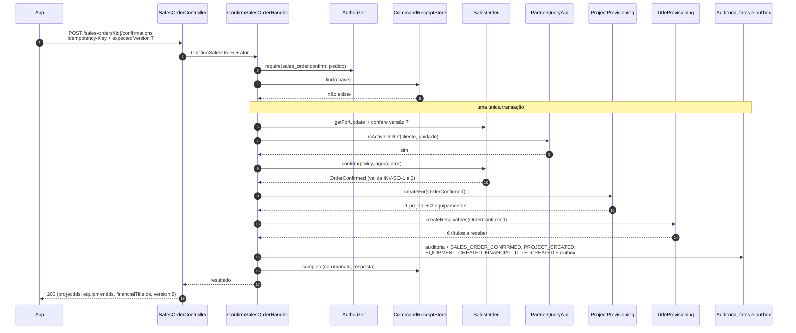
```mermaid
sequenceDiagram
    autonumber
    participant A as App
    participant C as SalesOrderController
    participant H as ConfirmSalesOrderHandler
    participant Z as Authorizer
    participant RC as CommandReceiptStore
    participant SO as SalesOrder
    participant PQ as PartnerQueryApi
    participant PP as ProjectProvisioning
    participant TP as TitleProvisioning
    participant PL as Auditoria, fatos e outbox
    A->>C: POST /sales-orders/{id}/confirmations<br/>Idempotency-Key + expectedVersion 7
    C->>H: ConfirmSalesOrder + ator
    H->>Z: require(sales_order.confirm, pedido)
    H->>RC: find(chave)
    RC-->>H: não existe
    Note over H,PL: uma única transação
    H->>SO: getForUpdate + confere versão 7
    H->>PQ: isActiveUnitOf(cliente, unidade)
    PQ-->>H: sim
    H->>SO: confirm(policy, agora, ator)
    SO-->>H: OrderConfirmed (valida INV-SO-1 a 3)
    H->>PP: createFor(OrderConfirmed)
    PP-->>H: 1 projeto + 3 equipamentos
    H->>TP: createReceivables(OrderConfirmed)
    TP-->>H: 6 títulos a receber
    H->>PL: auditoria + SALES_ORDER_CONFIRMED, PROJECT_CREATED,<br/>EQUIPMENT_CREATED, FINANCIAL_TITLE_CREATED + outbox
    H->>RC: complete(commandId, resposta)
    H-->>C: resultado
    C-->>A: 200 {projectIds, equipmentIds, financialTitleIds, version 8}
```

### 11. Atividade: cancelar pedido (Sprint 4 · B05)

A premissa atual (PD-003) só permite cancelar um pedido confirmado se nada tiver acontecido depois: nenhum recebimento, reserva, consumo, produção ou documento.

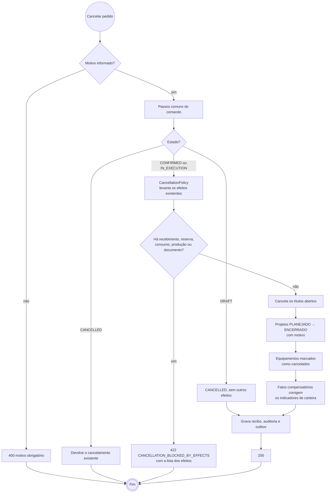
```mermaid
flowchart TD
    A((Cancelar pedido)) --> M{"Motivo informado?"}
    M -- não --> E400["400 motivo obrigatório"] --> Z(((Fim)))
    M -- sim --> P["Passos comuns do comando"]
    P --> S{"Estado?"}
    S -- CANCELLED --> EX["Devolve o cancelamento existente"] --> Z
    S -- DRAFT --> C1["CANCELLED, sem outros efeitos"] --> G
    S -- "CONFIRMED ou IN_EXECUTION" --> F["CancellationPolicy<br/>levanta os efeitos existentes"]
    F --> T{"Há recebimento, reserva,<br/>consumo, produção ou documento?"}
    T -- sim --> E422["422 CANCELLATION_BLOCKED_BY_EFFECTS<br/>com a lista dos efeitos"] --> Z
    T -- não --> C2["Cancela os títulos abertos"]
    C2 --> C3["Projetos PLANEJADO → ENCERRADO<br/>com motivo"]
    C3 --> C4["Equipamentos marcados<br/>como cancelados"]
    C4 --> C5["Fatos compensatórios corrigem<br/>os indicadores de carteira"]
    C5 --> G["Grava recibo, auditoria e outbox"]
    G --> OK["200"] --> Z
```

### 12. Atividade: registrar baixa (Sprint 5 · B05/B06)

Uma baixa pode quitar várias parcelas de uma vez. Os títulos são travados sempre na mesma ordem, para dois usuários nunca ficarem esperando um pelo outro.

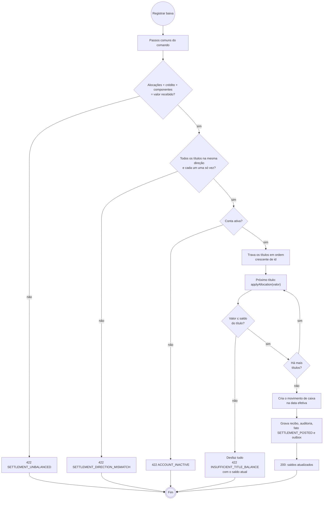
```mermaid
flowchart TD
    A((Registrar baixa)) --> P["Passos comuns do comando"]
    P --> B1{"Alocações + crédito + componentes<br/>= valor recebido?"}
    B1 -- não --> E1["422 SETTLEMENT_UNBALANCED"] --> Z(((Fim)))
    B1 -- sim --> B2{"Todos os títulos na mesma direção<br/>e cada um uma só vez?"}
    B2 -- não --> E2["422 SETTLEMENT_DIRECTION_MISMATCH"] --> Z
    B2 -- sim --> B3{"Conta ativa?"}
    B3 -- não --> E3["422 ACCOUNT_INACTIVE"] --> Z
    B3 -- sim --> L["Trava os títulos em ordem<br/>crescente de id"]
    L --> LOOP["Próximo título:<br/>applyAllocation(valor)"]
    LOOP --> SD{"Valor ≤ saldo<br/>do título?"}
    SD -- não --> E4["Desfaz tudo<br/>422 INSUFFICIENT_TITLE_BALANCE<br/>com o saldo atual"] --> Z
    SD -- sim --> MAIS{"Há mais<br/>títulos?"}
    MAIS -- sim --> LOOP
    MAIS -- não --> CX["Cria o movimento de caixa<br/>na data efetiva"]
    CX --> GR["Grava recibo, auditoria,<br/>fato SETTLEMENT_POSTED e outbox"]
    GR --> OK["200: saldos atualizados"] --> Z
```

### 13. Sequência: duas baixas simultâneas no mesmo título (Sprint 5 · B05)

Título com saldo de R$ 100,00 e duas baixas de R$ 70,00 ao mesmo tempo. Uma é confirmada; a outra recebe o saldo atual de R$ 30,00. O saldo nunca fica negativo.

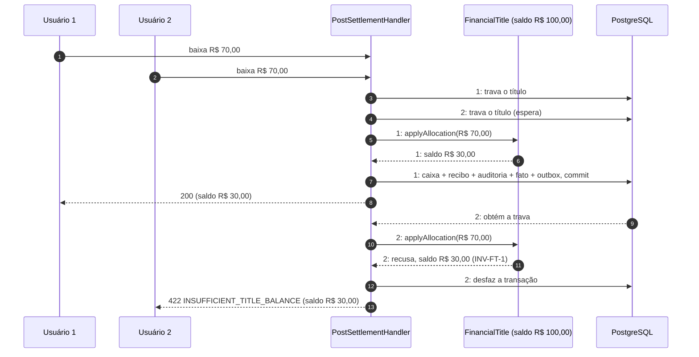
```mermaid
sequenceDiagram
    autonumber
    participant U1 as Usuário 1
    participant U2 as Usuário 2
    participant H as PostSettlementHandler
    participant T as FinancialTitle (saldo R$ 100,00)
    participant DB as PostgreSQL
    U1->>H: baixa R$ 70,00
    U2->>H: baixa R$ 70,00
    H->>DB: 1: trava o título
    H->>DB: 2: trava o título (espera)
    H->>T: 1: applyAllocation(R$ 70,00)
    T-->>H: 1: saldo R$ 30,00
    H->>DB: 1: caixa + recibo + auditoria + fato + outbox, commit
    H-->>U1: 200 (saldo R$ 30,00)
    DB-->>H: 2: obtém a trava
    H->>T: 2: applyAllocation(R$ 70,00)
    T-->>H: 2: recusa, saldo R$ 30,00 (INV-FT-1)
    H->>DB: 2: desfaz a transação
    H-->>U2: 422 INSUFFICIENT_TITLE_BALANCE (saldo R$ 30,00)
```

### 14. Sequência: estornar baixa (Sprint 5 · B05)

O estorno é total. A baixa original continua consultável como REVERSED, e um movimento de caixa inverso é criado vinculado a ela.

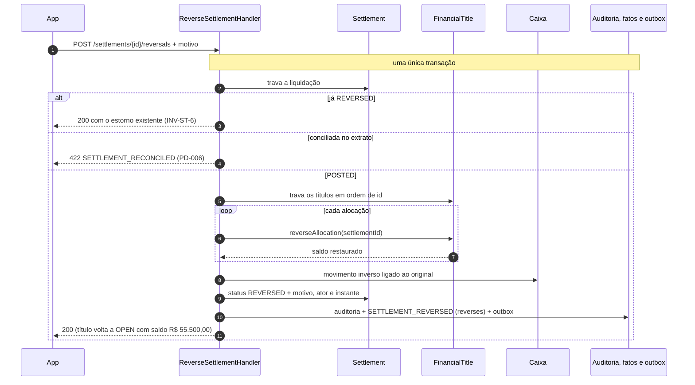
```mermaid
sequenceDiagram
    autonumber
    participant A as App
    participant H as ReverseSettlementHandler
    participant ST as Settlement
    participant T as FinancialTitle
    participant CX as Caixa
    participant PL as Auditoria, fatos e outbox
    A->>H: POST /settlements/{id}/reversals + motivo
    Note over H,PL: uma única transação
    H->>ST: trava a liquidação
    alt já REVERSED
        H-->>A: 200 com o estorno existente (INV-ST-6)
    else conciliada no extrato
        H-->>A: 422 SETTLEMENT_RECONCILED (PD-006)
    else POSTED
        H->>T: trava os títulos em ordem de id
        loop cada alocação
            H->>T: reverseAllocation(settlementId)
            T-->>H: saldo restaurado
        end
        H->>CX: movimento inverso ligado ao original
        H->>ST: status REVERSED + motivo, ator e instante
        H->>PL: auditoria + SETTLEMENT_REVERSED (reverses) + outbox
        H-->>A: 200 (título volta a OPEN com saldo R$ 55.500,00)
    end
```

### 15. Sequência: entrega de eventos pelo outbox (Sprint 2 · B02)

O evento é gravado na mesma transação do comando. Um publicador lê os pendentes e entrega aos consumidores; se entregar duas vezes, o consumidor reconhece o evento e ignora a repetição.

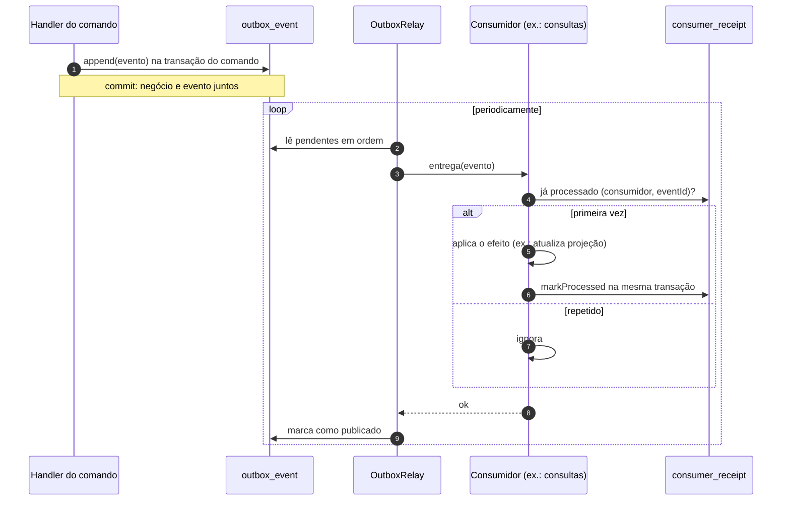
```mermaid
sequenceDiagram
    autonumber
    participant H as Handler do comando
    participant OB as outbox_event
    participant RL as OutboxRelay
    participant CN as Consumidor (ex.: consultas)
    participant CR as consumer_receipt
    H->>OB: append(evento) na transação do comando
    Note over H,OB: commit: negócio e evento juntos
    loop periodicamente
        RL->>OB: lê pendentes em ordem
        RL->>CN: entrega(evento)
        CN->>CR: já processado (consumidor, eventId)?
        alt primeira vez
            CN->>CN: aplica o efeito (ex.: atualiza projeção)
            CN->>CR: markProcessed na mesma transação
        else repetido
            CN->>CN: ignora
        end
        CN-->>RL: ok
        RL->>OB: marca como publicado
    end
```

### 16. Sequência: tarefa do worker Python com lease (Sprint 2 / B04)

O worker não acessa as tabelas de negócio: fala com o Java por uma API interna. Cada posse da tarefa tem uma geração; um resultado de uma posse antiga é recusado.

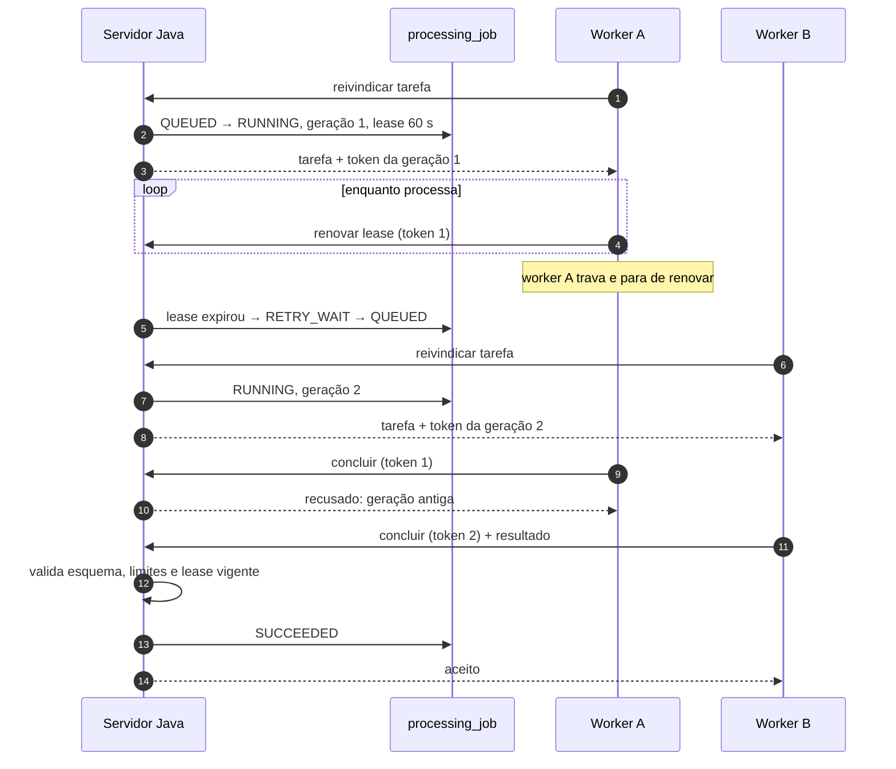
```mermaid
sequenceDiagram
    autonumber
    participant J as Servidor Java
    participant Q as processing_job
    participant W1 as Worker A
    participant W2 as Worker B
    W1->>J: reivindicar tarefa
    J->>Q: QUEUED → RUNNING, geração 1, lease 60 s
    J-->>W1: tarefa + token da geração 1
    loop enquanto processa
        W1->>J: renovar lease (token 1)
    end
    Note over W1: worker A trava e para de renovar
    J->>Q: lease expirou → RETRY_WAIT → QUEUED
    W2->>J: reivindicar tarefa
    J->>Q: RUNNING, geração 2
    J-->>W2: tarefa + token da geração 2
    W1->>J: concluir (token 1)
    J-->>W1: recusado: geração antiga
    W2->>J: concluir (token 2) + resultado
    J->>J: valida esquema, limites e lease vigente
    J->>Q: SUCCEEDED
    J-->>W2: aceito
```

### 17. Atividade: importar arquivo e conferir (B04 / B12)

Nada importado entra no sistema sem decisão de uma pessoa. O arquivo original e a origem de cada valor (página e linha) ficam guardados.

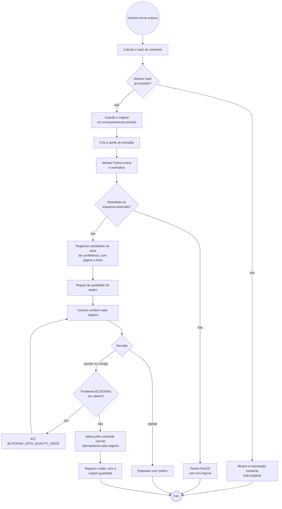
```mermaid
flowchart TD
    A((Usuário envia arquivo)) --> H["Calcula o hash do conteúdo"]
    H --> DUP{"Mesmo hash<br/>já recebido?"}
    DUP -- sim --> MS["Mostra a importação existente<br/>(não duplica)"] --> Z(((Fim)))
    DUP -- não --> ARM["Guarda o original<br/>em armazenamento privado"]
    ARM --> JOB["Cria a tarefa de extração"]
    JOB --> PY["Worker Python extrai<br/>e normaliza"]
    PY --> VAL{"Resultado no<br/>esquema esperado?"}
    VAL -- não --> FAL["Tarefa FAILED<br/>com erro legível"] --> Z
    VAL -- sim --> STG["Registros candidatos na área<br/>de conferência, com página e linha"]
    STG --> DQ["Regras de qualidade de dados"]
    DQ --> REV["Usuário confere cada registro"]
    REV --> DEC{"Decisão"}
    DEC -- rejeitar --> RJ["Rejeitado com motivo"] --> Z
    DEC -- "aceitar ou corrigir" --> BL{"Problema BLOCKING<br/>em aberto?"}
    BL -- sim --> E422["422 BLOCKING_DATA_QUALITY_ISSUE"] --> REV
    BL -- não --> AP["Aplica pelo comando normal<br/>(idempotente pela origem)"]
    AP --> OK["Registro criado, com a<br/>origem guardada"] --> Z
```

### 18. Atividade: calcular um indicador (B10)

O mesmo cálculo serve para a tela, o relatório e a exportação. Dado ausente fica como "desconhecido", nunca como zero.

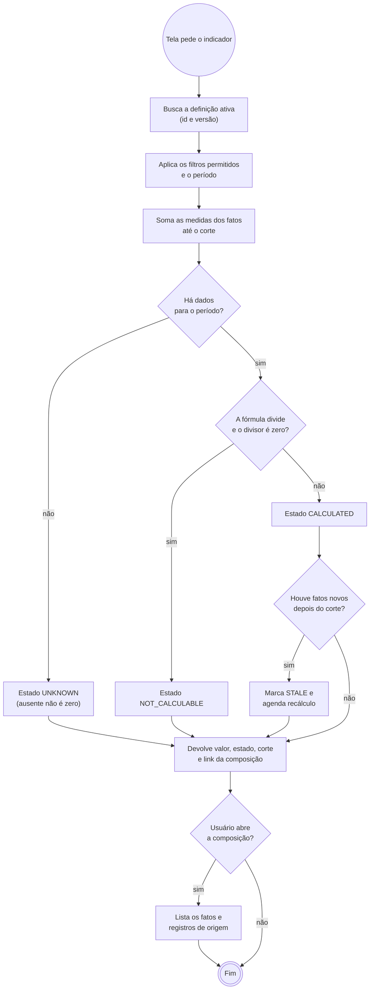
```mermaid
flowchart TD
    A((Tela pede o indicador)) --> D["Busca a definição ativa<br/>(id e versão)"]
    D --> F["Aplica os filtros permitidos<br/>e o período"]
    F --> AG["Soma as medidas dos fatos<br/>até o corte"]
    AG --> FA{"Há dados<br/>para o período?"}
    FA -- não --> UN["Estado UNKNOWN<br/>(ausente não é zero)"] --> R
    FA -- sim --> DV{"A fórmula divide<br/>e o divisor é zero?"}
    DV -- sim --> NC["Estado NOT_CALCULABLE"] --> R
    DV -- não --> CA["Estado CALCULATED"] --> AT{"Houve fatos novos<br/>depois do corte?"}
    AT -- sim --> SL["Marca STALE e<br/>agenda recálculo"] --> R
    AT -- não --> R["Devolve valor, estado, corte<br/>e link da composição"]
    R --> CP{"Usuário abre<br/>a composição?"}
    CP -- sim --> LS["Lista os fatos e<br/>registros de origem"] --> Z(((Fim)))
    CP -- não --> Z
```

### 19. Atividade: execução analítica (B15)

Um modelo só roda quando há dados suficientes. "Dados insuficientes" é uma resposta válida, com as causas.

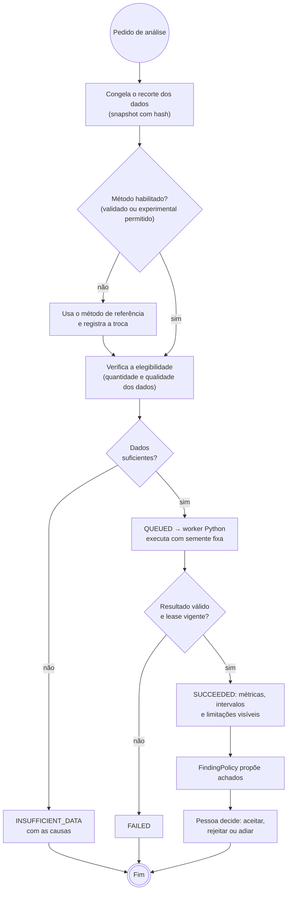
```mermaid
flowchart TD
    A((Pedido de análise)) --> SN["Congela o recorte dos dados<br/>(snapshot com hash)"]
    SN --> MT{"Método habilitado?<br/>(validado ou experimental permitido)"}
    MT -- não --> FB["Usa o método de referência<br/>e registra a troca"] --> EL
    MT -- sim --> EL["Verifica a elegibilidade<br/>(quantidade e qualidade dos dados)"]
    EL --> OK{"Dados<br/>suficientes?"}
    OK -- não --> INS["INSUFFICIENT_DATA<br/>com as causas"] --> Z(((Fim)))
    OK -- sim --> FI["QUEUED → worker Python<br/>executa com semente fixa"]
    FI --> RV{"Resultado válido<br/>e lease vigente?"}
    RV -- não --> FL["FAILED"] --> Z
    RV -- sim --> PB["SUCCEEDED: métricas, intervalos<br/>e limitações visíveis"]
    PB --> AC["FindingPolicy propõe achados"]
    AC --> DC["Pessoa decide: aceitar,<br/>rejeitar ou adiar"]
    DC --> Z
```

### 20. Atividade: inspeção de qualidade (B09)

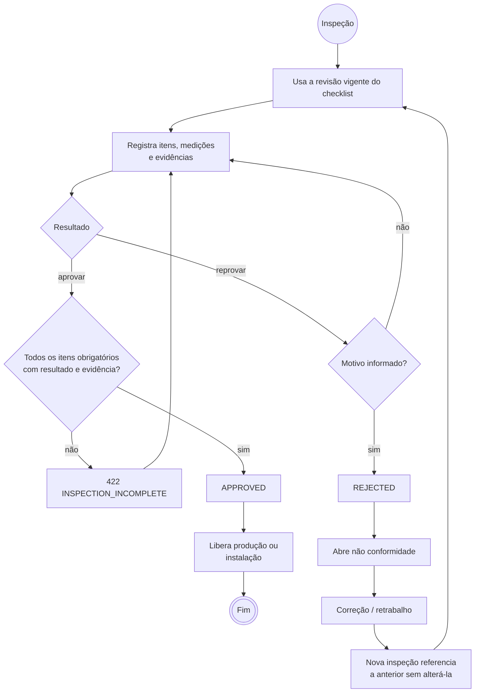
```mermaid
flowchart TD
    A((Inspeção)) --> CK["Usa a revisão vigente do checklist"]
    CK --> RG["Registra itens, medições<br/>e evidências"]
    RG --> DE{"Resultado"}
    DE -- aprovar --> CO{"Todos os itens obrigatórios<br/>com resultado e evidência?"}
    CO -- não --> E422["422 INSPECTION_INCOMPLETE"] --> RG
    CO -- sim --> AP["APPROVED"] --> LB["Libera produção ou<br/>instalação"] --> Z(((Fim)))
    DE -- reprovar --> MO{"Motivo informado?"}
    MO -- não --> RG
    MO -- sim --> RJ["REJECTED"] --> NC["Abre não conformidade"]
    NC --> CR["Correção / retrabalho"]
    CR --> NV["Nova inspeção referencia<br/>a anterior sem alterá-la"] --> CK
```

### 21. Atividade: gerar manutenção preventiva (B11)

Rodar a geração duas vezes não duplica ordens de serviço: cada ocorrência é única por plano, revisão, equipamento e data.

```mermaid
flowchart TD
    A((Rotina de geração)) --> PL["Lista os planos preventivos ativos"]
    PL --> EQ["Para cada equipamento coberto,<br/>calcula as próximas datas"]
    EQ --> EX{"Ocorrência já existe para<br/>plano, revisão, equipamento e data?"}
    EX -- sim --> PR["Pula<br/>(não duplica)"] --> MAIS
    EX -- não --> OC["Cria a ocorrência"] --> OS["Cria a ordem de serviço"] --> MAIS{"Mais datas ou<br/>equipamentos?"}
    MAIS -- sim --> EX
    MAIS -- não --> Z(((Fim)))
```

### 22. Atividade: confirmar repasse (B10)

```mermaid
flowchart TD
    A((Repasse do período)) --> RG["Seleciona a versão<br/>vigente da regra"]
    RG --> SI["Simula: base, percentuais<br/>e valores por beneficiário"]
    SI --> RV{"Aprovado pelo<br/>responsável?"}
    RV -- não --> AJ["Ajusta parâmetros<br/>ou regra (nova versão)"] --> SI
    RV -- sim --> JA{"Período já<br/>confirmado?"}
    JA -- sim --> EX["Devolve a confirmação<br/>existente"] --> Z(((Fim)))
    JA -- não --> CG["Congela a memória de cálculo"]
    CG --> TT["Gera os títulos a pagar<br/>uma única vez"]
    TT --> GR["Grava recibo, auditoria, fatos e outbox"] --> Z
```
