# Diagramas do sistema completo

Situação em 25/09/2026. Este documento cobre **todo o Renda+ ERP**, incluindo o que ainda não foi implementado: a visão do sistema, os 24 módulos do backend e, para cada módulo, as classes e o fluxo principal. Os detalhes do que já existe estão em `17-diagramas-de-classes-e-padroes.md` e `18-diagramas-de-atividades-e-sequencias.md`.

Cada módulo informa a sua situação: **Implementado** (código existente), **Especificado no B01** (regras e agregados definidos em `12-b01-modelo-de-dominio.md` e `13-b01-especificacao-de-comandos.md`) ou **Proposta de desenho** (derivada do plano do backend, do modelo de dados `16-modelo-de-dados.md` e do catálogo de eventos; será revista na sprint que implementar o módulo). Nomes de classes e tabelas seguem o modelo de dados.

## Parte 1 — Visão do sistema

### 1. Contexto: quem usa o Renda+ e com o que ele se comunica

O Renda+ não troca dados automaticamente com sistemas de terceiros na versão inicial. Extratos, notas e planilhas entram por arquivo, com conferência humana. A IA externa fica desligada até o ADR-014 ser decidido.

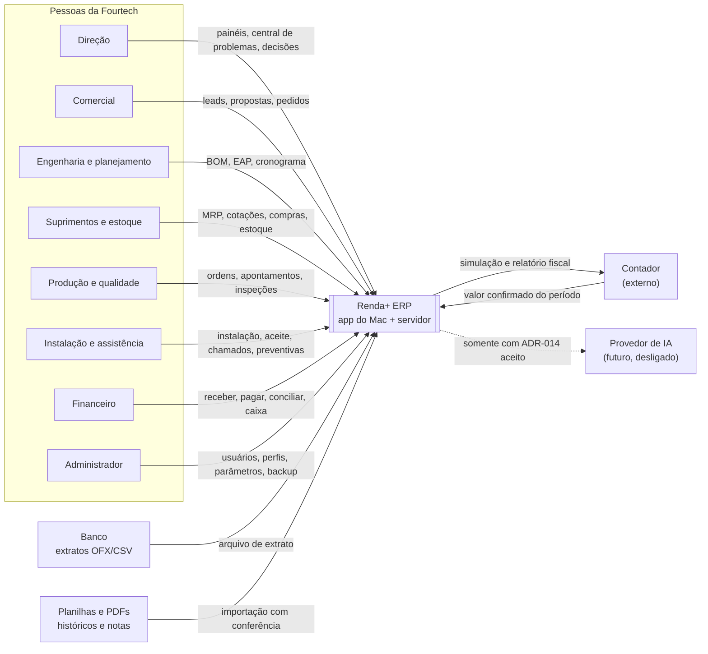
```mermaid
flowchart LR
    subgraph PESSOAS["Pessoas da Fourtech"]
        DIR["Direção"]
        COM["Comercial"]
        ENG["Engenharia e planejamento"]
        SUP["Suprimentos e estoque"]
        PRO["Produção e qualidade"]
        INS["Instalação e assistência"]
        FIN["Financeiro"]
        ADM["Administrador"]
    end
    ERP[["Renda+ ERP<br/>app do Mac + servidor"]]
    CONT["Contador<br/>(externo)"]
    BAN["Banco<br/>extratos OFX/CSV"]
    ARQ["Planilhas e PDFs<br/>históricos e notas"]
    IA["Provedor de IA<br/>(futuro, desligado)"]
    DIR -- "painéis, central de problemas, decisões" --> ERP
    COM -- "leads, propostas, pedidos" --> ERP
    ENG -- "BOM, EAP, cronograma" --> ERP
    SUP -- "MRP, cotações, compras, estoque" --> ERP
    PRO -- "ordens, apontamentos, inspeções" --> ERP
    INS -- "instalação, aceite, chamados, preventivas" --> ERP
    FIN -- "receber, pagar, conciliar, caixa" --> ERP
    ADM -- "usuários, perfis, parâmetros, backup" --> ERP
    ERP -- "simulação e relatório fiscal" --> CONT
    CONT -- "valor confirmado do período" --> ERP
    BAN -- "arquivo de extrato" --> ERP
    ARQ -- "importação com conferência" --> ERP
    ERP -. "somente com ADR-014 aceito" .-> IA
```

### 2. Contêineres: as partes que rodam

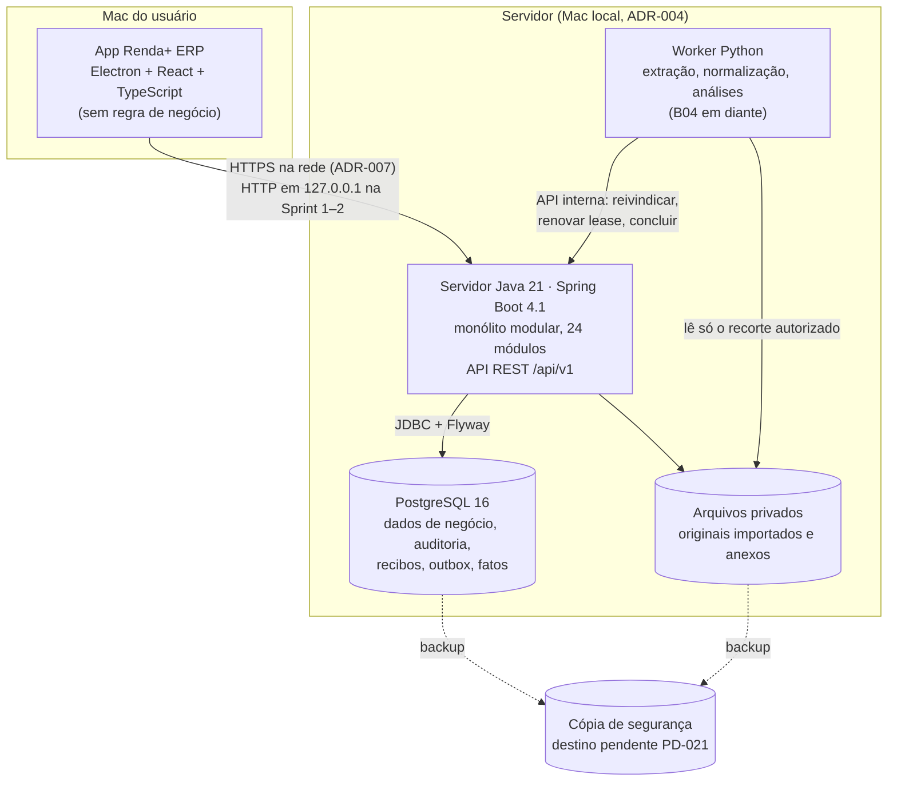
```mermaid
flowchart TB
    subgraph MAC["Mac do usuário"]
        APP["App Renda+ ERP<br/>Electron + React + TypeScript<br/>(sem regra de negócio)"]
    end
    subgraph SRV["Servidor (Mac local, ADR-004)"]
        API["Servidor Java 21 · Spring Boot 4.1<br/>monólito modular, 24 módulos<br/>API REST /api/v1"]
        PY["Worker Python<br/>extração, normalização, análises<br/>(B04 em diante)"]
        DB[("PostgreSQL 16<br/>dados de negócio, auditoria,<br/>recibos, outbox, fatos")]
        FS[("Arquivos privados<br/>originais importados e anexos")]
    end
    BK[("Cópia de segurança<br/>destino pendente PD-021")]
    APP -- "HTTPS na rede (ADR-007)<br/>HTTP em 127.0.0.1 na Sprint 1–2" --> API
    API -- "JDBC + Flyway" --> DB
    API --> FS
    PY -- "API interna: reivindicar,<br/>renovar lease, concluir" --> API
    PY -- "lê só o recorte autorizado" --> FS
    DB -. backup .-> BK
    FS -. backup .-> BK
```

### 3. Implantação

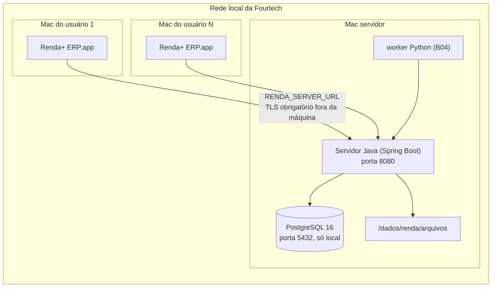
```mermaid
flowchart LR
    subgraph REDE["Rede local da Fourtech"]
        subgraph M1["Mac servidor"]
            J["Servidor Java (Spring Boot)<br/>porta 8080"]
            P[("PostgreSQL 16<br/>porta 5432, só local")]
            W["worker Python (B04)"]
            D["/dados/renda/arquivos"]
        end
        subgraph M2["Mac do usuário 1"]
            A1["Renda+ ERP.app"]
        end
        subgraph M3["Mac do usuário N"]
            A2["Renda+ ERP.app"]
        end
    end
    A1 -- "RENDA_SERVER_URL<br/>TLS obrigatório fora da máquina" --> J
    A2 --> J
    J --> P
    J --> D
    W --> J
```

A quantidade de usuários simultâneos (PD-020, ADR-007) e o destino do backup (PD-021) ainda são pendências. Até lá, o servidor escuta só em `127.0.0.1`; abrir para a rede exige `RENDA_SERVER_ADDRESS=0.0.0.0` e TLS.

### 4. Módulos e dependências

Os 24 módulos de `b01/modulos.json`. Cada seta aponta para um módulo do qual o de origem depende. As dependências indiretas foram omitidas para o desenho ficar legível: por exemplo, `comercial` também depende de `cadastros`, através de `projetos`. O `ArchitectureTest` confere todas no build.

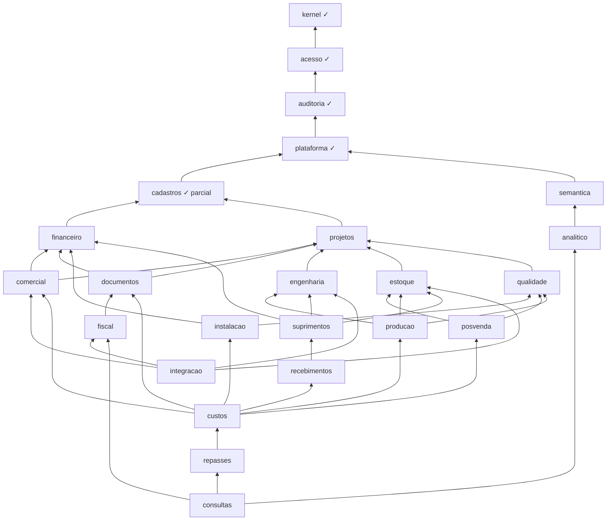
```mermaid
flowchart BT
    kernel["kernel ✓"]
    acesso["acesso ✓"] --> kernel
    auditoria["auditoria ✓"] --> acesso
    plataforma["plataforma ✓"] --> auditoria
    cadastros["cadastros ✓ parcial"] --> plataforma
    semantica["semantica"] --> plataforma
    analitico["analitico"] --> semantica
    financeiro["financeiro"] --> cadastros
    projetos["projetos"] --> cadastros
    comercial["comercial"] --> financeiro
    comercial --> projetos
    documentos["documentos"] --> financeiro
    documentos --> projetos
    engenharia["engenharia"] --> projetos
    estoque["estoque"] --> projetos
    qualidade["qualidade"] --> projetos
    fiscal["fiscal"] --> documentos
    instalacao["instalacao"] --> financeiro
    instalacao --> qualidade
    posvenda["posvenda"] --> estoque
    posvenda --> qualidade
    producao["producao"] --> engenharia
    producao --> estoque
    producao --> qualidade
    suprimentos["suprimentos"] --> engenharia
    suprimentos --> estoque
    suprimentos --> financeiro
    integracao["integracao"] --> comercial
    integracao --> engenharia
    integracao --> estoque
    integracao --> fiscal
    recebimentos["recebimentos"] --> suprimentos
    custos["custos"] --> comercial
    custos --> documentos
    custos --> instalacao
    custos --> posvenda
    custos --> producao
    custos --> recebimentos
    repasses["repasses"] --> custos
    consultas["consultas"] --> analitico
    consultas --> fiscal
    consultas --> repasses
```

✓ = já tem código (Sprints 1 e 2).

### 5. Fluxo de valor de ponta a ponta

O caminho de um equipamento vendido, do primeiro contato à assistência técnica, com o dinheiro correndo em paralelo. Cada raia é uma área da empresa.

```mermaid
flowchart LR
    subgraph C["Comercial"]
        C1["Lead e interações"] --> C2["Oportunidade"] --> C3["Proposta com revisões"] --> C4["Pedido confirmado"]
    end
    subgraph E["Engenharia"]
        E1["BOM da revisão aplicada"] --> E2["EAP e cronograma<br/>linha de base"]
    end
    subgraph S["Suprimentos e estoque"]
        S1["MRP: necessidade líquida"] --> S2["Cotação e pedido de compra"] --> S3["Recebimento conferido"] --> S4["Estoque: reserva e consumo"]
    end
    subgraph P["Produção e qualidade"]
        P1["Ordem de produção"] --> P2["Apontamentos"] --> P3["Inspeção"]
    end
    subgraph I["Instalação e pós-venda"]
        I1["Instalação"] --> I2["Aceite do cliente<br/>início da garantia"] --> I3["Chamados e preventivas"]
    end
    subgraph F["Financeiro e gestão"]
        F1["Parcelas a receber"] --> F2["Nota vinculada à parcela"] --> F3["Baixa e conciliação"] --> F4["Fluxo de caixa"]
        F5["Contas a pagar"] --> F3
        G1["Custo por projeto"] --> G2["Resultado"] --> G3["Repasses"]
        G4["Impostos gerenciais"]
        G5["Indicadores e central de problemas"]
    end
    C4 --> E1
    C4 --> F1
    E2 --> S1
    S2 --> F5
    S4 --> P1
    P3 --> I1
    S4 --> G1
    P2 --> G1
    I1 --> G1
    I3 --> G1
    F2 --> G4
    G2 --> G5
    F4 --> G5
```

### 6. Mapa de eventos entre módulos

Linha cheia: chamada direta dentro da mesma transação, usada quando a operação não pode ficar pela metade. Linha tracejada: evento pelo outbox, entregue depois do commit. Todos os eventos também alimentam o motor analítico (`analitico`) e as consultas (`consultas`), omitidos aqui.

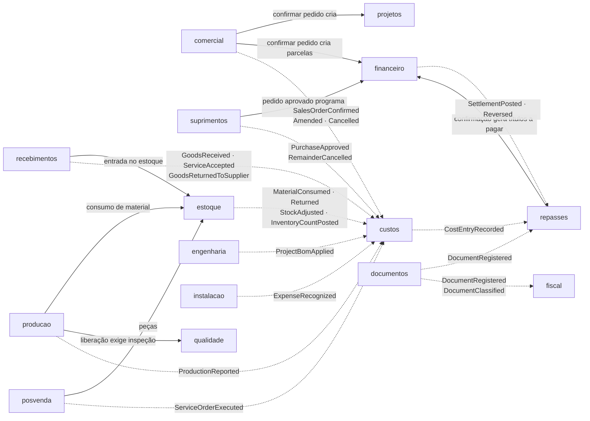
```mermaid
flowchart LR
    comercial -- "confirmar pedido cria" --> projetos
    comercial -- "confirmar pedido cria parcelas" --> financeiro
    suprimentos -- "pedido aprovado programa a pagar" --> financeiro
    recebimentos -- "entrada no estoque" --> estoque
    producao -- "consumo de material" --> estoque
    producao -- "liberação exige inspeção" --> qualidade
    posvenda -- "peças" --> estoque
    repasses -- "confirmação gera títulos a pagar" --> financeiro
    comercial -. "SalesOrderConfirmed<br/>Amended · Cancelled" .-> custos
    engenharia -. ProjectBomApplied .-> custos
    suprimentos -. "PurchaseApproved<br/>RemainderCancelled" .-> custos
    recebimentos -. "GoodsReceived · ServiceAccepted<br/>GoodsReturnedToSupplier" .-> custos
    estoque -. "MaterialConsumed · Returned<br/>StockAdjusted · InventoryCountPosted" .-> custos
    producao -. ProductionReported .-> custos
    instalacao -. ExpenseRecognized .-> custos
    posvenda -. ServiceOrderExecuted .-> custos
    custos -. CostEntryRecorded .-> repasses
    financeiro -. "SettlementPosted · Reversed" .-> repasses
    documentos -. DocumentRegistered .-> repasses
    documentos -. "DocumentRegistered<br/>DocumentClassified" .-> fiscal
```

## Parte 2 — Módulos

### 7. Núcleo compartilhado (`kernel`)

**Situação:** Implementado em parte (Sprint 1); os demais Value Objects estão especificados no B01. Java puro, sem framework. Detalhe do que existe: documento 17, diagrama 2.

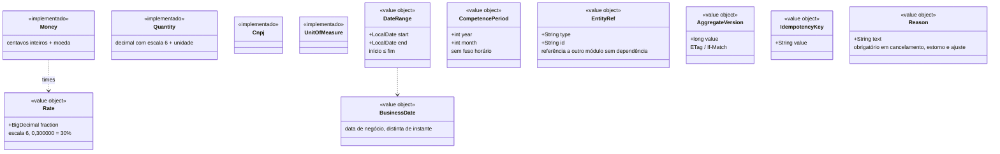
```mermaid
classDiagram
    class Money {
        <<implementado>>
        centavos inteiros + moeda
    }
    class Quantity {
        <<implementado>>
        decimal com escala 6 + unidade
    }
    class Cnpj {
        <<implementado>>
    }
    class UnitOfMeasure {
        <<implementado>>
    }
    class Rate {
        <<value object>>
        +BigDecimal fraction
        escala 6, 0,300000 = 30%
    }
    class DateRange {
        <<value object>>
        +LocalDate start
        +LocalDate end
        início ≤ fim
    }
    class CompetencePeriod {
        <<value object>>
        +int year
        +int month
        sem fuso horário
    }
    class BusinessDate {
        <<value object>>
        data de negócio, distinta de instante
    }
    class EntityRef {
        <<value object>>
        +String type
        +String id
        referência a outro módulo sem dependência
    }
    class AggregateVersion {
        <<value object>>
        +long value
        ETag / If-Match
    }
    class IdempotencyKey {
        <<value object>>
        +String value
    }
    class Reason {
        <<value object>>
        +String text
        obrigatório em cancelamento, estorno e ajuste
    }
    Money ..> Rate : times
    DateRange ..> BusinessDate
```

### 8. Acesso e identidade (`acesso`)

**Situação:** Implementado na Sprint 2 com dois perfis fixos (documento 17, diagrama 7). O desenho completo abaixo é **proposta**: perfis configuráveis, permissão por ação **e por objeto** (por exemplo, só os projetos em que a pessoa é responsável) e alçadas por valor, que continuam pendentes (PD-009) até o piloto.

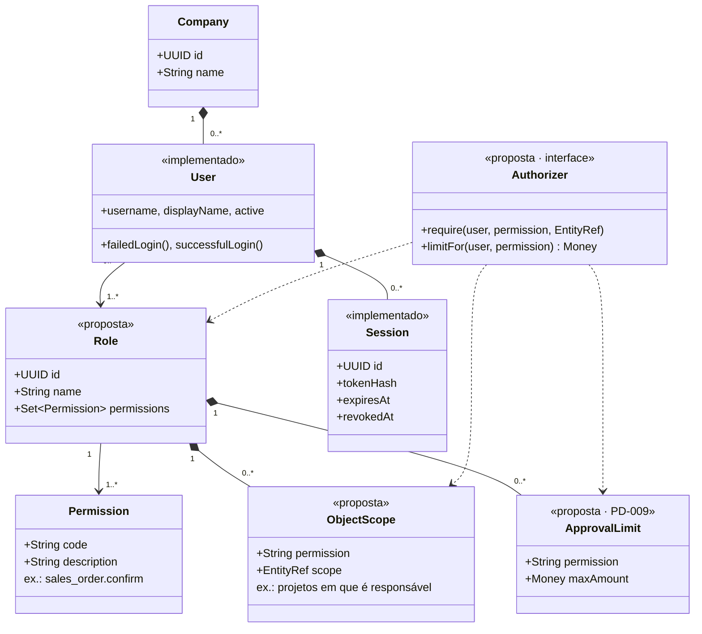
```mermaid
classDiagram
    class Company {
        +UUID id
        +String name
    }
    class User {
        <<implementado>>
        +username, displayName, active
        +failedLogin(), successfulLogin()
    }
    class Role {
        <<proposta>>
        +UUID id
        +String name
        +Set~Permission~ permissions
    }
    class Permission {
        +String code
        +String description
        ex.: sales_order.confirm
    }
    class Session {
        <<implementado>>
        +UUID id
        +tokenHash
        +expiresAt
        +revokedAt
    }
    class ObjectScope {
        <<proposta>>
        +String permission
        +EntityRef scope
        ex.: projetos em que é responsável
    }
    class ApprovalLimit {
        <<proposta · PD-009>>
        +String permission
        +Money maxAmount
    }
    class Authorizer {
        <<proposta · interface>>
        +require(user, permission, EntityRef)
        +limitFor(user, permission) Money
    }
    Company "1" *-- "0..*" User
    User "0..*" --> "1..*" Role
    Role "1" --> "1..*" Permission
    User "1" *-- "0..*" Session
    Role "1" *-- "0..*" ObjectScope
    Role "1" *-- "0..*" ApprovalLimit
    Authorizer ..> Role
    Authorizer ..> ObjectScope
    Authorizer ..> ApprovalLimit
```

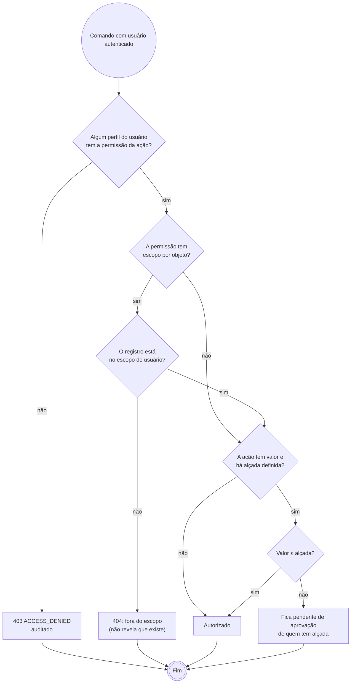
```mermaid
flowchart TD
    A((Comando com usuário autenticado)) --> P{"Algum perfil do usuário<br/>tem a permissão da ação?"}
    P -- não --> N["403 ACCESS_DENIED<br/>auditado"] --> Z(((Fim)))
    P -- sim --> O{"A permissão tem<br/>escopo por objeto?"}
    O -- não --> V
    O -- sim --> OB{"O registro está<br/>no escopo do usuário?"}
    OB -- não --> NF["404: fora do escopo<br/>(não revela que existe)"] --> Z
    OB -- sim --> V{"A ação tem valor e<br/>há alçada definida?"}
    V -- não --> OK["Autorizado"] --> Z
    V -- sim --> AL{"Valor ≤ alçada?"}
    AL -- sim --> OK
    AL -- não --> AP["Fica pendente de aprovação<br/>de quem tem alçada"] --> Z
```

### 9. Auditoria (`auditoria`)

**Situação:** Implementada (Sprints 1 e 2); a tela *Auditoria* em Administração é proposta para a próxima etapa de B03. Toda operação confirmada grava quem, quando, o quê (antes → depois), motivo e código de correlação, na mesma transação.

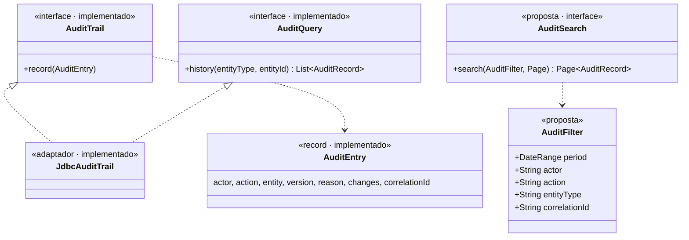
```mermaid
classDiagram
    class AuditTrail {
        <<interface · implementado>>
        +record(AuditEntry)
    }
    class AuditQuery {
        <<interface · implementado>>
        +history(entityType, entityId) List~AuditRecord~
    }
    class AuditSearch {
        <<proposta · interface>>
        +search(AuditFilter, Page) Page~AuditRecord~
    }
    class AuditFilter {
        <<proposta>>
        +DateRange period
        +String actor
        +String action
        +String entityType
        +String correlationId
    }
    class AuditEntry {
        <<record · implementado>>
        actor, action, entity, version, reason, changes, correlationId
    }
    class JdbcAuditTrail {
        <<adaptador · implementado>>
    }
    AuditTrail <|.. JdbcAuditTrail
    AuditQuery <|.. JdbcAuditTrail
    AuditSearch ..> AuditFilter
    AuditTrail ..> AuditEntry
```

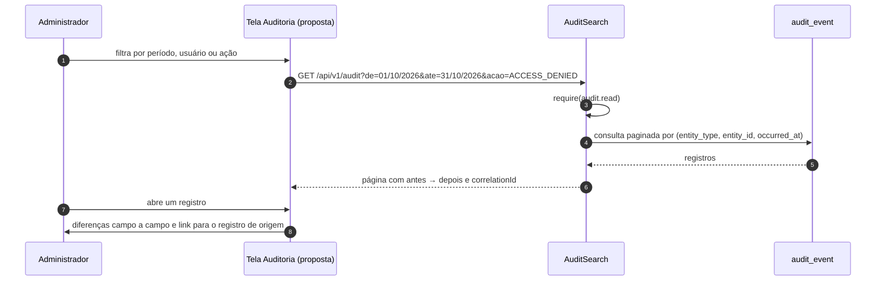
```mermaid
sequenceDiagram
    autonumber
    participant U as Administrador
    participant W as Tela Auditoria (proposta)
    participant S as AuditSearch
    participant DB as audit_event
    U->>W: filtra por período, usuário ou ação
    W->>S: GET /api/v1/audit?de=01/10/2026&ate=31/10/2026&acao=ACCESS_DENIED
    S->>S: require(audit.read)
    S->>DB: consulta paginada por (entity_type, entity_id, occurred_at)
    DB-->>S: registros
    S-->>W: página com antes → depois e correlationId
    U->>W: abre um registro
    W->>U: diferenças campo a campo e link para o registro de origem
```

### 10. Plataforma técnica (`plataforma`)

**Situação:** Implementados dados da empresa, sessão, recibos de comando, outbox e fatos (Sprints 1 e 2). Especificados para B02–B04: tarefas duráveis, arquivos privados e configurações. Backup é B13.

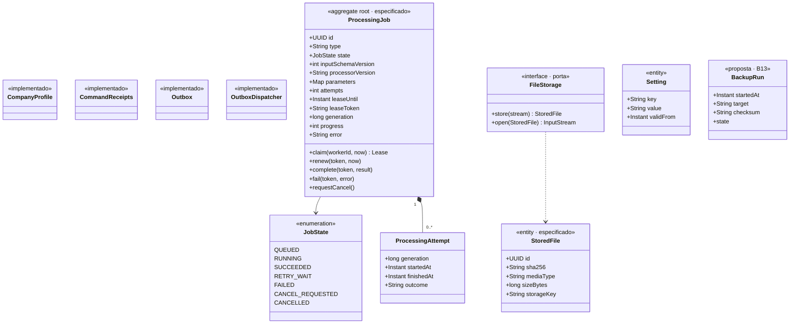
```mermaid
classDiagram
    class CompanyProfile {
        <<implementado>>
    }
    class CommandReceipts {
        <<implementado>>
    }
    class Outbox {
        <<implementado>>
    }
    class OutboxDispatcher {
        <<implementado>>
    }
    class ProcessingJob {
        <<aggregate root · especificado>>
        +UUID id
        +String type
        +JobState state
        +int inputSchemaVersion
        +String processorVersion
        +Map parameters
        +int attempts
        +Instant leaseUntil
        +String leaseToken
        +long generation
        +int progress
        +String error
        +claim(workerId, now) Lease
        +renew(token, now)
        +complete(token, result)
        +fail(token, error)
        +requestCancel()
    }
    class JobState {
        <<enumeration>>
        QUEUED
        RUNNING
        SUCCEEDED
        RETRY_WAIT
        FAILED
        CANCEL_REQUESTED
        CANCELLED
    }
    class ProcessingAttempt {
        +long generation
        +Instant startedAt
        +Instant finishedAt
        +String outcome
    }
    class StoredFile {
        <<entity · especificado>>
        +UUID id
        +String sha256
        +String mediaType
        +long sizeBytes
        +String storageKey
    }
    class FileStorage {
        <<interface · porta>>
        +store(stream) StoredFile
        +open(StoredFile) InputStream
    }
    class Setting {
        <<entity>>
        +String key
        +String value
        +Instant validFrom
    }
    class BackupRun {
        <<proposta · B13>>
        +Instant startedAt
        +String target
        +String checksum
        +state
    }
    ProcessingJob --> JobState
    ProcessingJob "1" *-- "0..*" ProcessingAttempt
    FileStorage ..> StoredFile
```

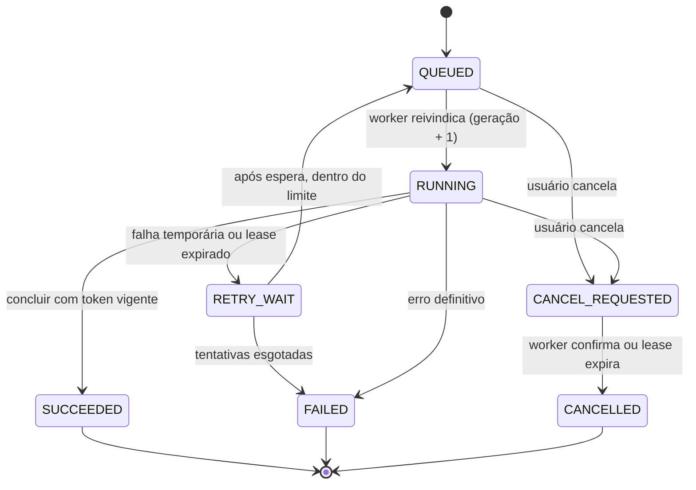
```mermaid
stateDiagram-v2
    [*] --> QUEUED
    QUEUED --> RUNNING : worker reivindica (geração + 1)
    RUNNING --> SUCCEEDED : concluir com token vigente
    RUNNING --> RETRY_WAIT : falha temporária ou lease expirado
    RETRY_WAIT --> QUEUED : após espera, dentro do limite
    RETRY_WAIT --> FAILED : tentativas esgotadas
    RUNNING --> FAILED : erro definitivo
    QUEUED --> CANCEL_REQUESTED : usuário cancela
    RUNNING --> CANCEL_REQUESTED : usuário cancela
    CANCEL_REQUESTED --> CANCELLED : worker confirma ou lease expira
    SUCCEEDED --> [*]
    FAILED --> [*]
    CANCELLED --> [*]
```

### 11. Catálogo semântico (`semantica`)

**Situação:** Especificado no B01 como dados (`b01/conceitos.json`, `b01/formularios.json`); as classes abaixo são proposta para B03. O catálogo define o significado de cada conceito e cada formulário; a classificação separa o que foi **sugerido** do que foi **confirmado**.

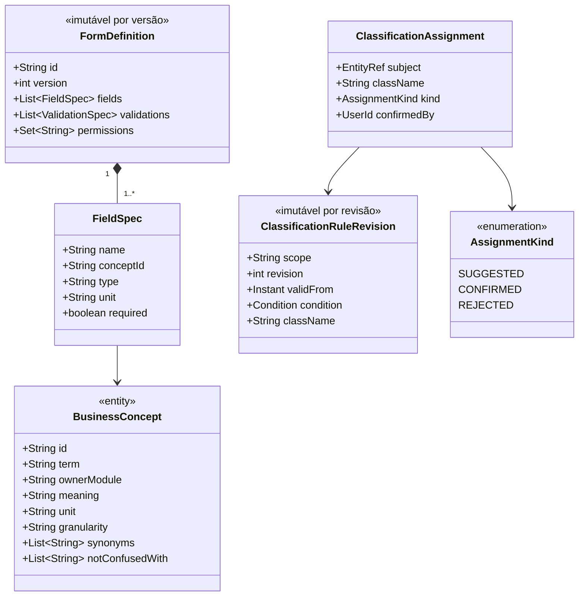
```mermaid
classDiagram
    class BusinessConcept {
        <<entity>>
        +String id
        +String term
        +String ownerModule
        +String meaning
        +String unit
        +String granularity
        +List~String~ synonyms
        +List~String~ notConfusedWith
    }
    class FormDefinition {
        <<imutável por versão>>
        +String id
        +int version
        +List~FieldSpec~ fields
        +List~ValidationSpec~ validations
        +Set~String~ permissions
    }
    class FieldSpec {
        +String name
        +String conceptId
        +String type
        +String unit
        +boolean required
    }
    class ClassificationRuleRevision {
        <<imutável por revisão>>
        +String scope
        +int revision
        +Instant validFrom
        +Condition condition
        +String className
    }
    class ClassificationAssignment {
        +EntityRef subject
        +String className
        +AssignmentKind kind
        +UserId confirmedBy
    }
    class AssignmentKind {
        <<enumeration>>
        SUGGESTED
        CONFIRMED
        REJECTED
    }
    FormDefinition "1" *-- "1..*" FieldSpec
    FieldSpec --> BusinessConcept
    ClassificationAssignment --> ClassificationRuleRevision
    ClassificationAssignment --> AssignmentKind
```

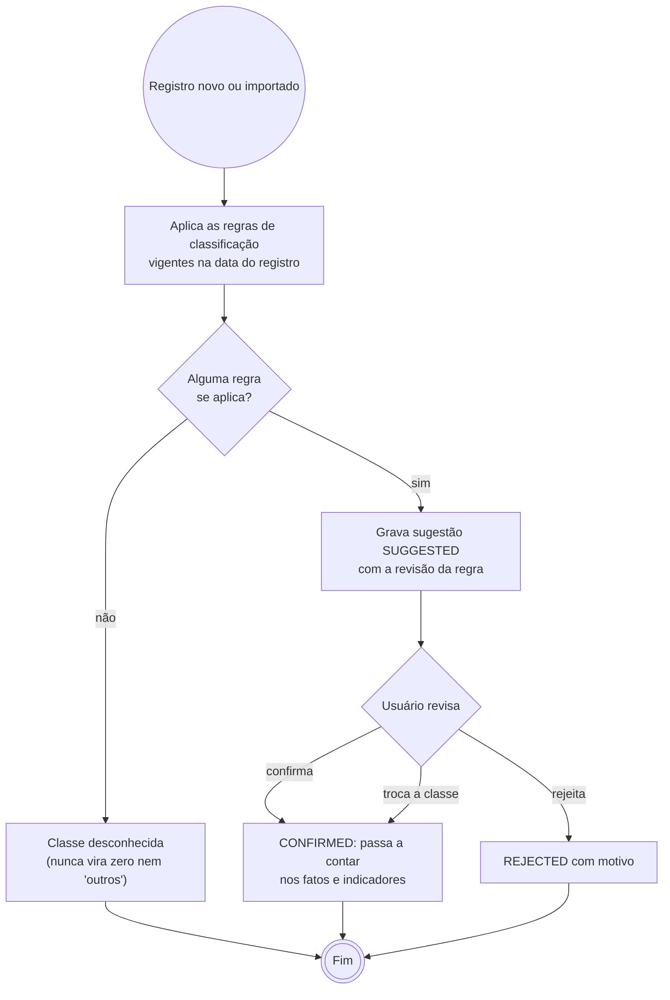
```mermaid
flowchart TD
    A((Registro novo ou importado)) --> R["Aplica as regras de classificação<br/>vigentes na data do registro"]
    R --> M{"Alguma regra<br/>se aplica?"}
    M -- não --> UN["Classe desconhecida<br/>(nunca vira zero nem 'outros')"] --> Z(((Fim)))
    M -- sim --> SG["Grava sugestão SUGGESTED<br/>com a revisão da regra"]
    SG --> RV{"Usuário revisa"}
    RV -- confirma --> CF["CONFIRMED: passa a contar<br/>nos fatos e indicadores"] --> Z
    RV -- rejeita --> RJ["REJECTED com motivo"] --> Z
    RV -- troca a classe --> CF
```

### 12. Cadastros (`cadastros`)

**Situação:** Clientes, unidades e contatos implementados na Sprint 2 (documento 17, diagrama 8). Fornecedores, itens, unidades de medida e conversões são a Sprint 3. Nomes alternativos vindos de importação entram em B04. Um parceiro tem um só cadastro, e ser cliente ou fornecedor é um **papel** dele.

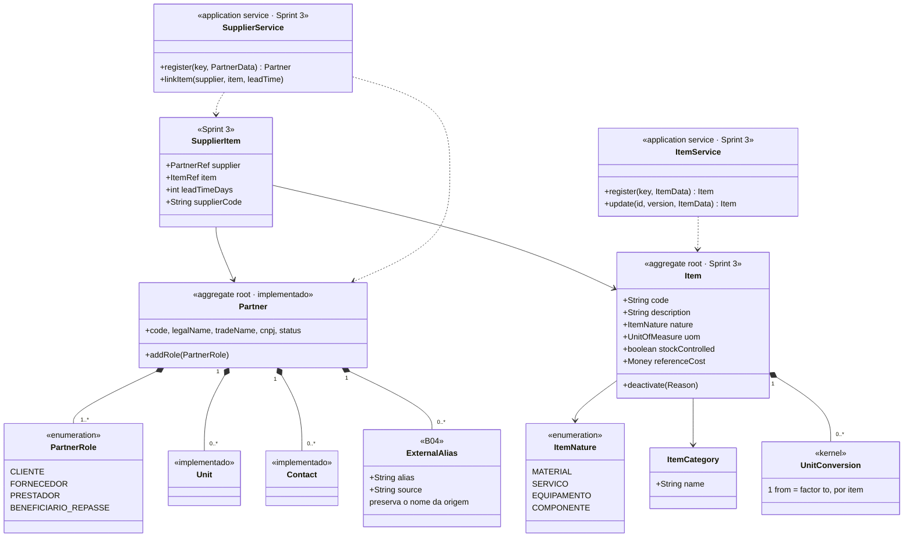
```mermaid
classDiagram
    class Partner {
        <<aggregate root · implementado>>
        +code, legalName, tradeName, cnpj, status
        +addRole(PartnerRole)
    }
    class PartnerRole {
        <<enumeration>>
        CLIENTE
        FORNECEDOR
        PRESTADOR
        BENEFICIARIO_REPASSE
    }
    class Unit {
        <<implementado>>
    }
    class Contact {
        <<implementado>>
    }
    class ExternalAlias {
        <<B04>>
        +String alias
        +String source
        preserva o nome da origem
    }
    class Item {
        <<aggregate root · Sprint 3>>
        +String code
        +String description
        +ItemNature nature
        +UnitOfMeasure uom
        +boolean stockControlled
        +Money referenceCost
        +deactivate(Reason)
    }
    class ItemNature {
        <<enumeration>>
        MATERIAL
        SERVICO
        EQUIPAMENTO
        COMPONENTE
    }
    class ItemCategory {
        +String name
    }
    class UnitConversion {
        <<kernel>>
        1 from = factor to, por item
    }
    class SupplierItem {
        <<Sprint 3>>
        +PartnerRef supplier
        +ItemRef item
        +int leadTimeDays
        +String supplierCode
    }
    class ItemService {
        <<application service · Sprint 3>>
        +register(key, ItemData) Item
        +update(id, version, ItemData) Item
    }
    class SupplierService {
        <<application service · Sprint 3>>
        +register(key, PartnerData) Partner
        +linkItem(supplier, item, leadTime)
    }
    Partner "1" *-- "1..*" PartnerRole
    Partner "1" *-- "0..*" Unit
    Partner "1" *-- "0..*" Contact
    Partner "1" *-- "0..*" ExternalAlias
    Item --> ItemNature
    Item --> ItemCategory
    Item "1" *-- "0..*" UnitConversion
    SupplierItem --> Partner
    SupplierItem --> Item
    ItemService ..> Item
    SupplierService ..> Partner
    SupplierService ..> SupplierItem
```

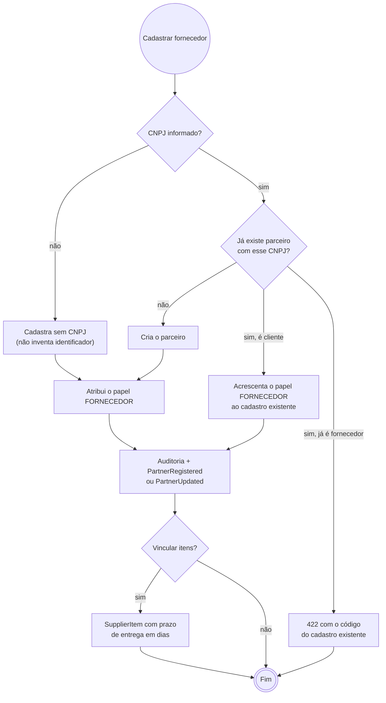
```mermaid
flowchart TD
    A((Cadastrar fornecedor)) --> C{"CNPJ informado?"}
    C -- não --> NV["Cadastra sem CNPJ<br/>(não inventa identificador)"] --> RL
    C -- sim --> EX{"Já existe parceiro<br/>com esse CNPJ?"}
    EX -- não --> NV2["Cria o parceiro"] --> RL["Atribui o papel FORNECEDOR"]
    EX -- "sim, é cliente" --> AD["Acrescenta o papel FORNECEDOR<br/>ao cadastro existente"] --> AU
    EX -- "sim, já é fornecedor" --> MS["422 com o código<br/>do cadastro existente"] --> Z(((Fim)))
    RL --> AU["Auditoria + PartnerRegistered<br/>ou PartnerUpdated"]
    AU --> IT{"Vincular itens?"}
    IT -- sim --> SI["SupplierItem com prazo<br/>de entrega em dias"] --> Z
    IT -- não --> Z
```

### 13. Projetos e equipamentos (`projetos`)

**Situação:** Especificado no B01 (confirmação de pedido cria projeto e equipamentos, PD-001); detalhes de estágios e marcos são proposta. Sprint 4. O projeto é o vínculo central de execução, custo e resultado. Cada máquina é um `Equipment` com identidade e número de série próprios.

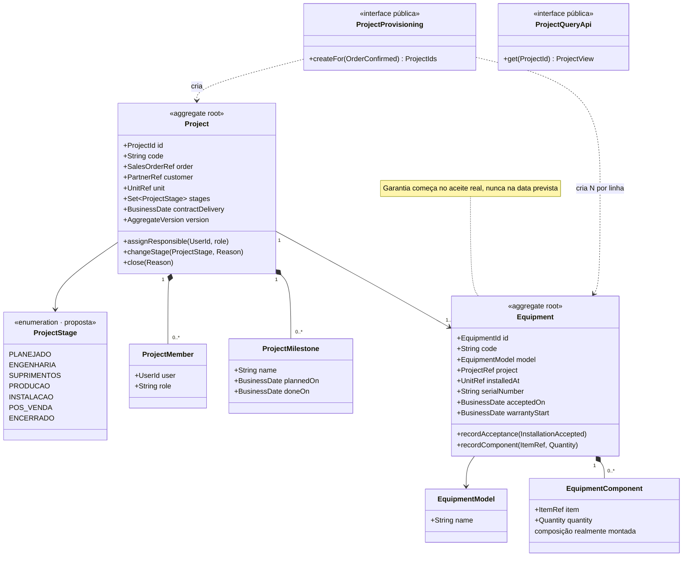
```mermaid
classDiagram
    class Project {
        <<aggregate root>>
        +ProjectId id
        +String code
        +SalesOrderRef order
        +PartnerRef customer
        +UnitRef unit
        +Set~ProjectStage~ stages
        +BusinessDate contractDelivery
        +AggregateVersion version
        +assignResponsible(UserId, role)
        +changeStage(ProjectStage, Reason)
        +close(Reason)
    }
    class ProjectStage {
        <<enumeration · proposta>>
        PLANEJADO
        ENGENHARIA
        SUPRIMENTOS
        PRODUCAO
        INSTALACAO
        POS_VENDA
        ENCERRADO
    }
    class ProjectMember {
        +UserId user
        +String role
    }
    class ProjectMilestone {
        +String name
        +BusinessDate plannedOn
        +BusinessDate doneOn
    }
    class EquipmentModel {
        +String name
    }
    class Equipment {
        <<aggregate root>>
        +EquipmentId id
        +String code
        +EquipmentModel model
        +ProjectRef project
        +UnitRef installedAt
        +String serialNumber
        +BusinessDate acceptedOn
        +BusinessDate warrantyStart
        +recordAcceptance(InstallationAccepted)
        +recordComponent(ItemRef, Quantity)
    }
    class EquipmentComponent {
        +ItemRef item
        +Quantity quantity
        composição realmente montada
    }
    class ProjectProvisioning {
        <<interface pública>>
        +createFor(OrderConfirmed) ProjectIds
    }
    class ProjectQueryApi {
        <<interface pública>>
        +get(ProjectId) ProjectView
    }
    Project --> ProjectStage
    Project "1" *-- "0..*" ProjectMember
    Project "1" *-- "0..*" ProjectMilestone
    Project "1" --> "1..*" Equipment
    Equipment --> EquipmentModel
    Equipment "1" *-- "0..*" EquipmentComponent
    ProjectProvisioning ..> Project : cria
    ProjectProvisioning ..> Equipment : cria N por linha
    note for Equipment "Garantia começa no aceite real, nunca na data prevista"
```

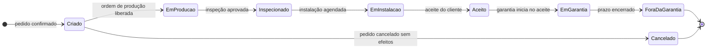
```mermaid
stateDiagram-v2
    direction LR
    [*] --> Criado : pedido confirmado
    Criado --> EmProducao : ordem de produção liberada
    EmProducao --> Inspecionado : inspeção aprovada
    Inspecionado --> EmInstalacao : instalação agendada
    EmInstalacao --> Aceito : aceite do cliente
    Aceito --> EmGarantia : garantia inicia no aceite
    EmGarantia --> ForaDaGarantia : prazo encerrado
    Criado --> Cancelado : pedido cancelado sem efeitos
    ForaDaGarantia --> [*]
    Cancelado --> [*]
```

Estados do equipamento: proposta de desenho, derivada dos eventos `ProductionOrderReleased`, `InspectionApproved`, `InstallationScheduled` e `InstallationAccepted`.

### 14. Comercial (`comercial`)

**Situação:** `SalesOrder` especificado no B01 (documento 17, diagramas 10 a 12). Prospecção, oportunidade e proposta são proposta de desenho para a Sprint 4. Uma revisão de proposta emitida não muda mais; o pedido guarda qual revisão foi contratada.

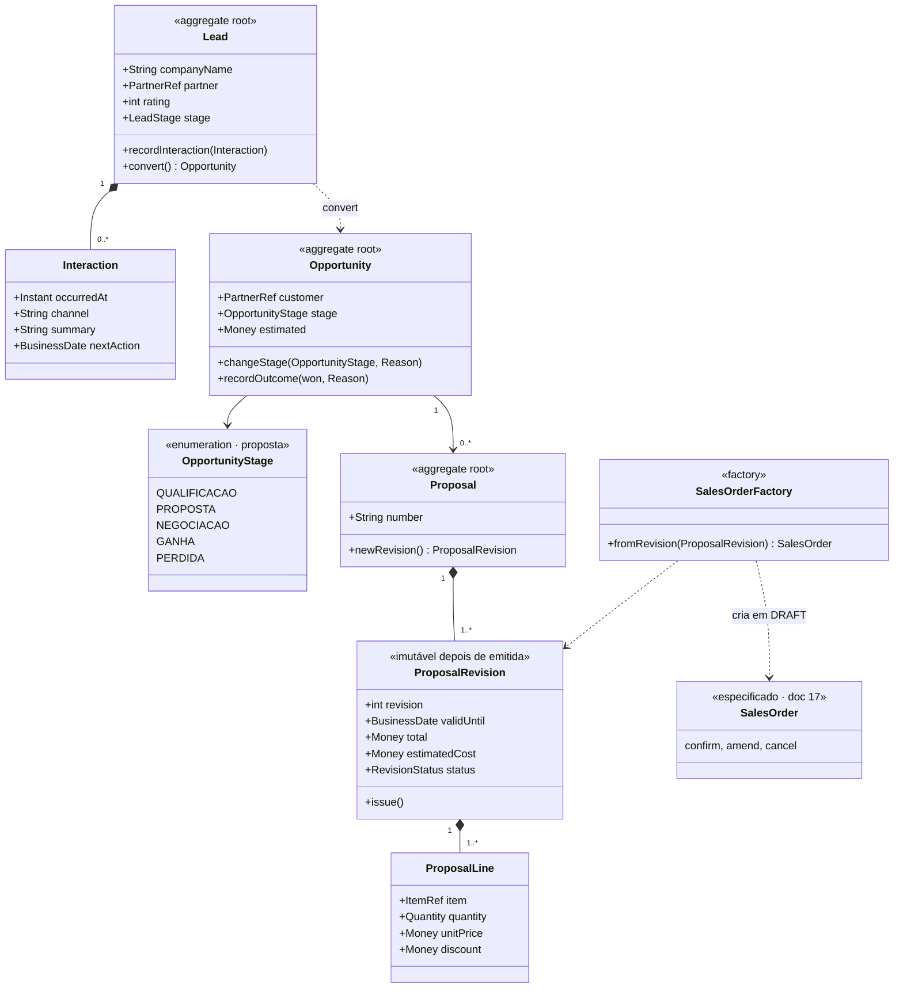
```mermaid
classDiagram
    class Lead {
        <<aggregate root>>
        +String companyName
        +PartnerRef partner
        +int rating
        +LeadStage stage
        +recordInteraction(Interaction)
        +convert() Opportunity
    }
    class Interaction {
        +Instant occurredAt
        +String channel
        +String summary
        +BusinessDate nextAction
    }
    class Opportunity {
        <<aggregate root>>
        +PartnerRef customer
        +OpportunityStage stage
        +Money estimated
        +changeStage(OpportunityStage, Reason)
        +recordOutcome(won, Reason)
    }
    class OpportunityStage {
        <<enumeration · proposta>>
        QUALIFICACAO
        PROPOSTA
        NEGOCIACAO
        GANHA
        PERDIDA
    }
    class Proposal {
        <<aggregate root>>
        +String number
        +newRevision() ProposalRevision
    }
    class ProposalRevision {
        <<imutável depois de emitida>>
        +int revision
        +BusinessDate validUntil
        +Money total
        +Money estimatedCost
        +RevisionStatus status
        +issue()
    }
    class ProposalLine {
        +ItemRef item
        +Quantity quantity
        +Money unitPrice
        +Money discount
    }
    class SalesOrder {
        <<especificado · doc 17>>
        confirm, amend, cancel
    }
    class SalesOrderFactory {
        <<factory>>
        +fromRevision(ProposalRevision) SalesOrder
    }
    Lead "1" *-- "0..*" Interaction
    Lead ..> Opportunity : convert
    Opportunity --> OpportunityStage
    Opportunity "1" --> "0..*" Proposal
    Proposal "1" *-- "1..*" ProposalRevision
    ProposalRevision "1" *-- "1..*" ProposalLine
    SalesOrderFactory ..> ProposalRevision
    SalesOrderFactory ..> SalesOrder : cria em DRAFT
```

```mermaid
flowchart TD
    A((Contato recebido)) --> L["Registra o lead<br/>e as interações"]
    L --> Q{"Tem potencial?"}
    Q -- não --> AR["Arquiva com motivo"] --> Z(((Fim)))
    Q -- sim --> O["Abre oportunidade"]
    O --> P["Monta a proposta<br/>(itens, preços, custo estimado)"]
    P --> E["Emite a revisão<br/>(fica imutável)"]
    E --> N{"Cliente responde"}
    N -- "pede mudança" --> R["Nova revisão<br/>(a anterior é preservada)"] --> E
    N -- recusa --> PE["Oportunidade PERDIDA<br/>com motivo"] --> Z
    N -- aceita --> G["Oportunidade GANHA"]
    G --> PD["Pedido em DRAFT a partir<br/>da revisão aceita"]
    PD --> PL["Plano de parcelas<br/>(soma = total)"]
    PL --> CF["Confirmar pedido<br/>(documento 18, atividade 15)"] --> Z
```

### 15. Financeiro (`financeiro`)

**Situação:** Título, baixa e estorno especificados no B01 (documento 17, diagrama 13; documento 18, atividades 18 a 20). Contas, transferências, extrato, conciliação e matriz de caixa são proposta de desenho para a Sprint 8+. Transferência entre contas próprias nunca vira receita nem despesa.

```mermaid
classDiagram
    class FinancialTitle {
        <<especificado · doc 17>>
        balance(), applyAllocation(), adjust()
    }
    class Settlement {
        <<especificado · doc 17>>
        allocations, reverse()
    }
    class BankAccount {
        <<aggregate root>>
        +String name
        +String bank
        +Money opening
        +BusinessDate openingOn
        +boolean active
        +balanceOn(BusinessDate) Money
    }
    class CashMovement {
        <<imutável>>
        +AccountId account
        +BusinessDate effectiveDate
        +Money amount
        +SettlementId settlement
        +TransferId transfer
        +CashMovementId reverses
    }
    class InternalTransfer {
        <<aggregate root>>
        +AccountId from
        +AccountId to
        +Money amount
        +post() dois movimentos que somam zero
    }
    class CustomerSupplierCredit {
        +PartnerRef partner
        +Money balance
        excedente explícito de baixa (PD-004)
    }
    class StatementBatch {
        +AccountId account
        +StoredFile file
        +int entries
    }
    class StatementEntry {
        +BusinessDate postedOn
        +Money amount
        +String description
        +String dedupKey
    }
    class ReconciliationGroup {
        <<aggregate root>>
        +AccountId account
        +Money difference
        +Instant undoneAt
        +undo(Reason)
    }
    class ReconciliationLink {
        +StatementEntryId entry
        +CashMovementId movement
    }
    class StatementParser {
        <<interface · adapter>>
        +parse(StoredFile) List~StatementEntry~
    }
    class OfxParser
    class CsvParser
    class CashMatrixQuery {
        <<consulta>>
        +matrix(period, accounts) CashMatrix
        realizado e previsto separados
    }
    Settlement "1" --> "1" CashMovement
    BankAccount "1" --> "0..*" CashMovement
    InternalTransfer ..> CashMovement : cria saída e entrada
    Settlement ..> CustomerSupplierCredit
    StatementBatch "1" *-- "1..*" StatementEntry
    ReconciliationGroup "1" *-- "1..*" ReconciliationLink
    ReconciliationLink --> StatementEntry
    ReconciliationLink --> CashMovement
    StatementParser <|.. OfxParser
    StatementParser <|.. CsvParser
    CashMatrixQuery ..> CashMovement : realizado
    CashMatrixQuery ..> FinancialTitle : previsto (saldos em aberto)
```

```mermaid
flowchart TD
    A((Importar extrato)) --> H["Guarda o arquivo<br/>e calcula o hash"]
    H --> DUP{"Arquivo já<br/>importado?"}
    DUP -- sim --> MS["Mostra a importação existente"] --> Z(((Fim)))
    DUP -- não --> PR["Lê as linhas (OFX ou CSV)"]
    PR --> DK["Para cada linha, chave de<br/>deduplicação: conta, data, valor, documento"]
    DK --> RP{"Linha já existe<br/>de outro arquivo?"}
    RP -- sim --> IG["Ignora a repetição"] --> SU
    RP -- não --> NV["Grava a linha do extrato"] --> SU["Sugere pares com movimentos<br/>de caixa (valor e data próximos)"]
    SU --> RV{"Usuário confere"}
    RV -- confirma --> GR["Grupo de conciliação<br/>(diferença explícita, se houver)"]
    RV -- "não há movimento" --> NM["Registra a baixa, a tarifa<br/>ou a transferência que falta"] --> SU
    GR --> OK["Linha conciliada<br/>(estorno da baixa passa a exigir<br/>desconciliar antes, PD-006)"] --> Z
```

### 16. Documentos e anexos (`documentos`)

**Situação:** Proposta de desenho para a Sprint 6 (B06). Notas e demais documentos recebidos ou emitidos são **vinculados** aos títulos que já existem; o documento não cria uma segunda cobrança. Anexos ligam arquivos a qualquer registro.

```mermaid
classDiagram
    class BusinessDocument {
        <<aggregate root>>
        +String number
        +Direction direction
        +DocumentKind kind
        +PartnerRef partner
        +BusinessDate issueDate
        +CompetencePeriod competence
        +Money total
        +linkToTitles(List~TitleLink~)
        +classify(ClassificationRef)
    }
    class DocumentKind {
        <<enumeration · proposta>>
        NFE_PRODUTO
        NFSE_SERVICO
        RECIBO
        CONTRATO
        OUTRO
    }
    class DocumentLine {
        +String kind
        +ItemRef item
        +Money amount
    }
    class DocumentTitleLink {
        +TitleId title
        +Money amount
    }
    class Attachment {
        +StoredFile file
        +String name
    }
    class AttachmentLink {
        +String ownerType
        +String ownerId
    }
    BusinessDocument --> DocumentKind
    BusinessDocument "1" *-- "1..*" DocumentLine
    BusinessDocument "1" *-- "0..*" DocumentTitleLink
    Attachment "1" *-- "1..*" AttachmentLink
    BusinessDocument "1" --> "0..*" Attachment
    note for DocumentTitleLink "Σ vínculos ≤ total do documento e ≤ saldo de cada título"
```

```mermaid
sequenceDiagram
    autonumber
    participant U as Financeiro
    participant D as DocumentService
    participant T as TitleQueryApi (financeiro)
    participant O as Outbox
    participant F as fiscal e repasses
    U->>D: registra a nota 1234 de R$ 50.000,00
    D->>D: número, emitente e data únicos? senão 422 com o existente
    U->>D: vincula à parcela 2 do pedido
    D->>T: saldo e direção do título
    T-->>D: título a receber, R$ 50.000,00
    D->>D: soma dos vínculos ≤ total e ≤ saldo
    D->>O: DocumentRegistered + DocumentLinkedToTitles
    Note over D,T: nenhum título novo é criado
    O-->>F: fiscal classifica a receita da competência
```

### 17. Engenharia e planejamento (`engenharia`)

**Situação:** Invariantes especificadas no B01 (revisão aprovada imutável; cronograma sem ciclos; linha de base preservada). As classes são proposta de desenho para B07. A contagem de dias (PD-017) e os pesos da EAP (PD-018) estão pendentes, por isso o calendário é uma estratégia trocável.

```mermaid
classDiagram
    class BomTemplate {
        <<aggregate root>>
        +EquipmentModel model
        +String name
        +newRevision() BomRevision
    }
    class BomRevision {
        <<imutável depois de aprovada>>
        +int revision
        +BomStatus status
        +approve(UserId)
        +total() Money
    }
    class BomStatus {
        <<enumeration>>
        RASCUNHO
        APROVADA
        SUBSTITUIDA
    }
    class BomLine {
        +ItemRef item
        +Quantity quantity
        +Money referenceCost
    }
    class ProjectBomRevision {
        +ProjectRef project
        +EquipmentRef equipment
        +BomRevision revision
        a máquina guarda a revisão que usou
    }
    class ProjectSchedule {
        <<aggregate root>>
        +ProjectRef project
        +List~ProjectActivity~ activities
        +addDependency(pred, succ, type, lag)
        +recalculate(CalendarPolicy) ScheduleResult
        +approveBaseline() ScheduleBaseline
    }
    class ProjectActivity {
        +String wbsCode
        +int durationDays
        +Rate weight
        +Rate progress
    }
    class ActivityDependency {
        +ActivityRef predecessor
        +ActivityRef successor
        +DependencyType type
        +int lagDays
    }
    class DependencyType {
        <<enumeration>>
        FS
        SS
        FF
        SF
    }
    class CalendarPolicy {
        <<interface · strategy>>
        +addWorkingDays(start, days) BusinessDate
    }
    class WorkCalendar {
        +String name
        +Set~DayOfWeek~ workingDays
        +Set~LocalDate~ holidays
    }
    class ScheduleBaseline {
        <<imutável>>
        +Instant approvedAt
        +List~BaselineActivity~ activities
    }
    class ProgressEntry {
        +Rate progress
        +BusinessDate recordedOn
    }
    BomTemplate "1" *-- "1..*" BomRevision
    BomRevision --> BomStatus
    BomRevision "1" *-- "1..*" BomLine
    ProjectBomRevision --> BomRevision
    ProjectSchedule "1" *-- "1..*" ProjectActivity
    ProjectSchedule "1" *-- "0..*" ActivityDependency
    ActivityDependency --> DependencyType
    CalendarPolicy <|.. WorkCalendar
    ProjectSchedule ..> CalendarPolicy
    ProjectSchedule "1" --> "0..*" ScheduleBaseline
    ProjectActivity "1" *-- "0..*" ProgressEntry
    note for BomRevision "Soma das linhas ≠ total impresso vira alerta (caso R$ 3.000,00), não correção automática"
```

```mermaid
flowchart TD
    A((Recalcular cronograma)) --> G["Monta o grafo de atividades<br/>e dependências"]
    G --> CY{"Há ciclo?"}
    CY -- sim --> E["422 com o ciclo encontrado<br/>(A → B → A)"] --> Z(((Fim)))
    CY -- não --> TO["Ordena as atividades<br/>(ordem topológica)"]
    TO --> FW["Passagem para frente:<br/>início e fim mais cedo pelo calendário"]
    FW --> BW["Passagem para trás:<br/>início e fim mais tarde"]
    BW --> FL["Folga = mais tarde − mais cedo"]
    FL --> CR["Caminho crítico = folga zero"]
    CR --> AV["Avanço do projeto =<br/>Σ peso × progresso (PD-018)"]
    AV --> BL{"Existe linha de base?"}
    BL -- sim --> CP["Compara com a linha de base<br/>(ela não é alterada)"] --> OK
    BL -- não --> OK["Grava o resultado<br/>ScheduleRecalculated"] --> Z
```

### 18. Suprimentos (`suprimentos`)

**Situação:** Proposta de desenho para B08. A fórmula da necessidade líquida (MRP) e o tratamento de lançamentos retroativos dependem de PD-016 e PD-011. Aprovar a compra registra o compromisso de custo e programa a obrigação a pagar; o pagamento em si é outro passo.

```mermaid
classDiagram
    class MrpRun {
        <<domain service>>
        +calculate(ProjectRef, cutoff) List~MaterialRequirement~
    }
    class MaterialRequirement {
        +ProjectRef project
        +ItemRef item
        +BusinessDate neededOn
        +Quantity gross
        +Quantity available
        +Quantity onOrder
        +Quantity net
    }
    class PurchaseRequest {
        <<aggregate root>>
        +RequirementRef requirement
        +RequestStatus status
    }
    class Quotation {
        +PartnerRef supplier
        +BusinessDate validUntil
        +List~QuotationLine~ lines
    }
    class QuotationLine {
        +ItemRef item
        +Money unitPrice
        +int leadTimeDays
    }
    class PurchaseOrder {
        <<aggregate root>>
        +String code
        +PartnerRef supplier
        +PoStatus status
        +Money total
        +List~PurchaseOrderLine~ lines
        +PaymentTerms terms
        +submit()
        +approve(UserId) PurchaseApproved
        +cancelRemainder(Reason)
    }
    class PurchaseOrderLine {
        +ItemRef item
        +ProjectRef project
        +Quantity quantity
        +Quantity received
        +Money unitPrice
        +BusinessDate deliveryOn
    }
    class PoStatus {
        <<enumeration>>
        RASCUNHO
        AGUARDANDO_APROVACAO
        APROVADO
        PARCIAL
        CONCLUIDO
        CANCELADO
    }
    class ApprovalPolicy {
        <<interface · policy>>
        +requiredApprovers(PurchaseOrder) List~Role~
    }
    class PayableScheduling {
        <<interface · financeiro>>
        +schedule(PurchaseApproved)
    }
    MrpRun ..> MaterialRequirement
    PurchaseRequest --> MaterialRequirement
    PurchaseRequest "1" --> "0..*" Quotation
    Quotation "1" *-- "1..*" QuotationLine
    PurchaseOrder "1" *-- "1..*" PurchaseOrderLine
    PurchaseOrder --> PoStatus
    PurchaseOrder ..> ApprovalPolicy
    PurchaseOrder ..> PayableScheduling : na aprovação
    note for PurchaseOrder "Σ condições de pagamento = total"
```

```mermaid
flowchart TD
    A((Rodar MRP do projeto)) --> B["Lê a BOM aplicada a cada<br/>equipamento (revisão do projeto)"]
    B --> BR["Necessidade bruta por item e data<br/>= quantidade da BOM × equipamentos"]
    BR --> CV["Converte para a unidade<br/>de estoque do item"]
    CV --> DS["Desconta o disponível<br/>(físico − reservado) no local"]
    DS --> OC["Desconta compras em aberto<br/>com entrega antes da data"]
    OC --> NL{"Necessidade<br/>líquida > 0?"}
    NL -- não --> RS["Sugere reservar o estoque"] --> Z(((Fim)))
    NL -- sim --> LT["Data de pedido = necessidade<br/>− prazo do fornecedor"]
    LT --> SR["Gera solicitação de compra"]
    SR --> CT["Cotações com fornecedores"]
    CT --> PO["Pedido de compra"]
    PO --> AP{"Aprovado<br/>conforme alçada?"}
    AP -- não --> AJ["Volta para ajuste"] --> PO
    AP -- sim --> EV["PurchaseApproved: compromisso de custo<br/>e obrigação a pagar programada"] --> Z
```

A fórmula acima é a premissa de trabalho; a regra final depende de PD-016.

### 19. Recebimentos (`recebimentos`)

**Situação:** Proposta de desenho para B08. O recebimento pode ser parcial. Cada linha conferida gera a entrada no estoque na mesma transação; o custo só entra no projeto no consumo, uma única vez.

```mermaid
classDiagram
    class GoodsReceipt {
        <<aggregate root>>
        +PurchaseOrderRef order
        +BusinessDate receivedOn
        +List~GoodsReceiptLine~ lines
        +post() GoodsReceived
    }
    class GoodsReceiptLine {
        +PurchaseOrderLineRef orderLine
        +Quantity quantity
        +Quantity rejected
        +LocationRef location
    }
    class ServiceAcceptance {
        <<aggregate root>>
        +PurchaseOrderLineRef orderLine
        +ProjectRef project
        +Money amount
        +accept(UserId) ServiceAccepted
    }
    class SupplierReturn {
        +GoodsReceiptLineRef line
        +Quantity quantity
        +Reason reason
    }
    class StockEntryApi {
        <<interface · estoque>>
        +receive(item, location, qty, unitCost, origin)
    }
    GoodsReceipt "1" *-- "1..*" GoodsReceiptLine
    GoodsReceiptLine "1" --> "0..*" SupplierReturn
    GoodsReceipt ..> StockEntryApi : na mesma transação
```

```mermaid
sequenceDiagram
    autonumber
    participant U as Almoxarifado
    participant R as GoodsReceiptService
    participant PO as PurchaseOrder
    participant E as StockEntryApi (estoque)
    participant O as Outbox
    U->>R: recebe 6 de 10 unidades do pedido PC-0042
    R->>PO: trava a linha e confere o saldo a receber
    PO-->>R: faltam 10
    R->>R: 6 ≤ 10, senão 422
    R->>E: receive(item, local, 6, custo unitário, origem)
    E-->>R: movimento de entrada + custo médio atualizado
    R->>PO: received = 6, status PARCIAL
    R->>O: GoodsReceived
    R-->>U: 200: ainda faltam 4
```

### 20. Estoque (`estoque`)

**Situação:** Invariante especificada no B01 (reservado ≤ físico, mesmo sob concorrência); o restante é proposta de desenho para B08. A posição é por item, local **e propriedade**: material de terceiros no nosso local, ou nosso material com terceiros, fica separado.

```mermaid
classDiagram
    class StockLocation {
        +String name
        +PartnerRef holder
        local em terceiro quando holder ≠ Fourtech
    }
    class StockPosition {
        <<aggregate root>>
        +ItemRef item
        +LocationRef location
        +Ownership ownership
        +Quantity physical
        +Quantity reserved
        +Money averageCost
        +available() Quantity
        +reserve(qty, project) Reservation
        +release(Reservation)
        +consume(Reservation, qty) Money
        +receive(qty, unitCost)
    }
    class Ownership {
        <<enumeration>>
        PROPRIO
        DE_TERCEIRO
    }
    class StockReservation {
        +ProjectRef project
        +Quantity quantity
    }
    class StockMovement {
        <<imutável>>
        +MovementKind kind
        +Quantity quantity
        +Money amount
        +ProjectRef project
        +MovementId reverses
    }
    class MovementKind {
        <<enumeration>>
        ENTRADA
        CONSUMO
        DEVOLUCAO
        TRANSFERENCIA
        AJUSTE
        REMESSA_TERCEIRO
        RETORNO_TERCEIRO
    }
    class InventoryCount {
        <<aggregate root>>
        +LocationRef location
        +BusinessDate countedOn
        +post() ajustes com motivo
    }
    class ThirdPartyDispatch {
        +PartnerRef partner
        +BusinessDate dispatchedOn
        +Quantity losses
    }
    class CostingPolicy {
        <<interface · strategy · PD-011>>
        +newAverage(position, qty, unitCost) Money
    }
    StockPosition --> Ownership
    StockPosition "1" *-- "0..*" StockReservation
    StockPosition "1" --> "0..*" StockMovement
    StockMovement --> MovementKind
    StockPosition ..> CostingPolicy
    InventoryCount ..> StockMovement : AJUSTE
    ThirdPartyDispatch ..> StockMovement
    note for StockPosition "reservado ≤ físico; disponível = físico − reservado ≥ 0"
```

```mermaid
sequenceDiagram
    autonumber
    participant A as Projeto A
    participant B as Projeto B
    participant S as StockService
    participant P as StockPosition (físico 10)
    A->>S: reservar 8
    B->>S: reservar 8
    S->>P: A: trava a posição
    S->>P: B: espera a trava
    S->>P: A: reserve(8)
    P-->>S: A: reservado 8, disponível 2
    S-->>A: 200 StockReserved
    S->>P: B: obtém a trava
    S->>P: B: reserve(8)
    P-->>S: B: recusa, disponível 2
    S-->>B: 422 com disponível 2
```

### 21. Qualidade (`qualidade`)

**Situação:** Inspeção e não conformidade especificadas no B01 (documento 17, diagrama 16; documento 18, atividade 25). Os critérios reais de inspeção dependem de PD-014. O checklist é versionado: cada inspeção guarda a revisão usada.

```mermaid
classDiagram
    class Checklist {
        <<aggregate root>>
        +String name
        +String appliesTo
        +newRevision() ChecklistRevision
    }
    class ChecklistRevision {
        <<imutável>>
        +int revision
        +List~Criterion~ criteria
    }
    class Criterion {
        +String description
        +boolean mandatory
        +TechnicalLimit limit
        +boolean evidenceRequired
    }
    class Inspection {
        <<especificado · doc 17>>
        approve(), reject()
    }
    class Nonconformity {
        <<aggregate root>>
        +InspectionRef inspection
        +Severity severity
        +NcStatus status
        +String rootCause
        +planAction(ActionPlan)
        +close(Evidence)
    }
    class NcStatus {
        <<enumeration · proposta>>
        ABERTA
        EM_TRATAMENTO
        VERIFICACAO
        ENCERRADA
    }
    class ReworkOrder {
        +NonconformityRef nonconformity
        +ProductionOrderRef productionOrder
    }
    class InspectionQueryApi {
        <<interface pública>>
        +releaseStatus(EntityRef) ReleaseStatus
    }
    Checklist "1" *-- "1..*" ChecklistRevision
    ChecklistRevision "1" *-- "1..*" Criterion
    Inspection --> ChecklistRevision
    Inspection "1" --> "0..*" Nonconformity
    Nonconformity --> NcStatus
    Nonconformity "1" --> "0..*" ReworkOrder
    InspectionQueryApi ..> Inspection
```

```mermaid
stateDiagram-v2
    direction LR
    [*] --> ABERTA : inspeção reprovada
    ABERTA --> EM_TRATAMENTO : causa e ação definidas
    EM_TRATAMENTO --> VERIFICACAO : retrabalho concluído
    VERIFICACAO --> EM_TRATAMENTO : nova inspeção reprovada
    VERIFICACAO --> ENCERRADA : nova inspeção aprovada
    ENCERRADA --> [*]
```

### 22. Produção (`producao`)

**Situação:** Invariante especificada no B01 (liberar exige a revisão da BOM e condições); o restante é proposta de desenho para B09. Tempos, esperas e perdas são gravados para as análises de capacidade de B14–B15.

```mermaid
classDiagram
    class ProductionOrder {
        <<aggregate root>>
        +ProjectRef project
        +EquipmentRef equipment
        +BomRevisionRef bomRevision
        +ProductionStatus status
        +List~RoutingOperation~ operations
        +release(ReleasePolicy)
        +report(ProductionEntry)
        +complete()
    }
    class ProductionStatus {
        <<enumeration>>
        PLANEJADA
        LIBERADA
        EM_EXECUCAO
        PAUSADA
        CONCLUIDA
        CANCELADA
    }
    class RoutingOperation {
        +int seq
        +String name
        +String workCenter
        +int plannedMinutes
    }
    class ProductionEntry {
        +Quantity done
        +Quantity losses
        +int waitMinutes
    }
    class LaborEntry {
        +UserId worker
        +BigDecimal hours
        +Money rate
    }
    class ReleasePolicy {
        <<interface · specification>>
        +check(ProductionOrder) List~Violation~
    }
    class BomRevisionApproved {
        <<specification>>
    }
    class MaterialsReserved {
        <<specification>>
    }
    class PriorInspectionOk {
        <<specification>>
    }
    ProductionOrder --> ProductionStatus
    ProductionOrder "1" *-- "1..*" RoutingOperation
    RoutingOperation "1" *-- "0..*" ProductionEntry
    RoutingOperation "1" *-- "0..*" LaborEntry
    ProductionOrder ..> ReleasePolicy
    ReleasePolicy <|.. BomRevisionApproved
    ReleasePolicy <|.. MaterialsReserved
    ReleasePolicy <|.. PriorInspectionOk
```

```mermaid
flowchart TD
    A((Liberar ordem de produção)) --> R{"Revisão da BOM<br/>aprovada e aplicada?"}
    R -- não --> E1["422: sem revisão válida"] --> Z(((Fim)))
    R -- sim --> M{"Materiais reservados<br/>para o projeto?"}
    M -- não --> E2["422 com os itens faltantes<br/>(ligação com o MRP)"] --> Z
    M -- sim --> I{"Há inspeção prévia<br/>exigida e pendente?"}
    I -- sim --> E3["422: inspeção pendente"] --> Z
    I -- não --> LB["LIBERADA:<br/>ProductionOrderReleased"]
    LB --> EX["Operadores apontam produção,<br/>horas, esperas e perdas"]
    EX --> CS["Consome o material reservado<br/>(custo entra no projeto uma vez)"]
    CS --> FM{"Todas as operações<br/>concluídas?"}
    FM -- não --> EX
    FM -- sim --> IN["Solicita inspeção final"]
    IN --> OK{"Aprovada?"}
    OK -- não --> RT["Não conformidade e retrabalho"] --> EX
    OK -- sim --> CO["CONCLUIDA:<br/>ProductionOrderCompleted"] --> Z
```

### 23. Instalação e entrega (`instalacao`)

**Situação:** Proposta de desenho para B09. A garantia começa no **aceite real** do cliente (PD-015), nunca na data prevista. Pendências do aceite ficam registradas com prazo.

```mermaid
classDiagram
    class Installation {
        <<aggregate root>>
        +EquipmentRef equipment
        +BusinessDate plannedStart
        +InstallationStatus status
        +List~UserId~ team
        +schedule(DateRange, team)
        +recordEntry(InstallationEntry)
        +recordExpense(InstallationExpense)
        +recordAcceptance(AcceptanceRecord)
    }
    class InstallationStatus {
        <<enumeration>>
        AGENDADA
        EM_EXECUCAO
        EM_TESTES
        ACEITA
        ACEITA_COM_PENDENCIAS
    }
    class InstallationEntry {
        +BusinessDate workedOn
        +BigDecimal hours
        +String notes
    }
    class InstallationExpense {
        +String category
        +Money amount
        +DocumentRef receipt
    }
    class AcceptanceRecord {
        +BusinessDate acceptedOn
        +String signedBy
        +List~Evidence~ evidence
    }
    class AcceptanceIssue {
        +String description
        +BusinessDate dueOn
        +boolean resolved
    }
    Installation --> InstallationStatus
    Installation "1" *-- "0..*" InstallationEntry
    Installation "1" *-- "0..*" InstallationExpense
    Installation "1" *-- "0..1" AcceptanceRecord
    AcceptanceRecord "1" *-- "0..*" AcceptanceIssue
```

```mermaid
sequenceDiagram
    autonumber
    participant T as Técnico
    participant I as InstallationService
    participant E as Equipment (projetos)
    participant O as Outbox
    participant C as custos
    participant PV as posvenda
    T->>I: registra horas e despesas da instalação
    I->>O: ExpenseRecognized (cada despesa)
    O-->>C: CostEntry com origem única
    T->>I: registra o aceite em 20/11/2026 com assinatura
    I->>E: recordAcceptance(20/11/2026)
    E->>E: warrantyStart = 20/11/2026
    I->>O: InstallationAccepted
    O-->>PV: cria o termo de garantia e o plano preventivo
```

### 24. Pós-venda (`posvenda`)

**Situação:** Invariante especificada no B01 (uma ocorrência preventiva por plano, revisão, equipamento e data; documento 18, atividade 26); o restante é proposta de desenho para B11. Todo chamado aponta para um equipamento, preservando o histórico da máquina.

```mermaid
classDiagram
    class ServiceTicket {
        <<aggregate root>>
        +EquipmentRef equipment
        +Priority priority
        +WarrantyStatus warranty
        +TicketStatus status
        +diagnose(String)
        +openOrder() ServiceOrder
        +close(Reason)
    }
    class WarrantyStatus {
        <<enumeration>>
        EM_GARANTIA
        FORA_DA_GARANTIA
        EM_ANALISE
    }
    class ServiceOrder {
        <<aggregate root>>
        +TicketRef ticket
        +OccurrenceRef occurrence
        +OsStatus status
        +execute(ServiceEntry)
    }
    class ServiceEntry {
        +BigDecimal hours
        +List~PartUsed~ parts
        +Money expenses
    }
    class WarrantyTerm {
        +EquipmentRef equipment
        +int months
        +String coverage
        +BusinessDate start
        +coversOn(BusinessDate) boolean
    }
    class PreventivePlan {
        <<aggregate root>>
        +EquipmentRef equipment
        +int revision
        +int periodicityDays
        +generate(until) List~PreventiveOccurrence~
    }
    class PreventiveOccurrence {
        +BusinessDate scheduledOn
        unique(plano, revisão, equipamento, data)
    }
    class FailureRecord {
        <<proposta · B14/B15>>
        +EquipmentRef equipment
        +String mode
        +Instant occurredAt
        +BigDecimal operatingHours
    }
    ServiceTicket --> WarrantyStatus
    ServiceTicket "1" --> "0..*" ServiceOrder
    ServiceOrder "1" *-- "0..*" ServiceEntry
    WarrantyTerm ..> ServiceTicket : define cobertura
    PreventivePlan "1" *-- "0..*" PreventiveOccurrence
    PreventiveOccurrence "1" --> "0..1" ServiceOrder
    ServiceTicket ..> FailureRecord : alimenta MTBF
```

```mermaid
flowchart TD
    A((Cliente abre chamado)) --> EQ["Identifica o equipamento<br/>(série ou código)"]
    EQ --> GA{"Garantia cobre<br/>na data de hoje?"}
    GA -- sim --> EG["EM_GARANTIA:<br/>sem cobrança ao cliente"]
    GA -- não --> FG["FORA_DA_GARANTIA:<br/>orçamento ao cliente"]
    GA -- "caso duvidoso" --> AN["EM_ANALISE"] --> GA
    EG --> DG["Diagnóstico"]
    FG --> DG
    DG --> OS["Ordem de serviço"]
    OS --> EX["Execução: horas, peças<br/>do estoque, despesas"]
    EX --> CT["ServiceOrderExecuted:<br/>custo registrado uma vez"]
    CT --> FR["Registra a falha<br/>(modo, horas de operação)"]
    FR --> FC["Fecha o chamado<br/>com a solução"] --> Z(((Fim)))
```

### 25. Custos e resultado (`custos`)

**Situação:** Invariante especificada no B01 (um custo por origem: `unique(sourceType, sourceId)`); o restante é proposta de desenho para B08–B10. O módulo não lança custo por conta própria: ele **consome eventos** das origens (consumo, apontamento, despesa, serviço) e aplica cada um uma única vez.

```mermaid
classDiagram
    class ProjectBudget {
        <<aggregate root · imutável por revisão>>
        +ProjectRef project
        +int revision
        +Instant approvedAt
        +List~BudgetLine~ lines
    }
    class BudgetLine {
        +CostCategory category
        +Money amount
    }
    class CostCommitment {
        +ProjectRef project
        +PurchaseOrderLineRef source
        +Money amount
        compromisso: comprado, ainda não consumido
    }
    class CostEntry {
        <<imutável>>
        +ProjectRef project
        +EquipmentRef equipment
        +CostCategory category
        +Money amount
        +String sourceType
        +String sourceId
        +CostEntryId reverses
    }
    class CostCategory {
        <<enumeration · proposta>>
        MATERIAL
        MAO_DE_OBRA
        SERVICO_TERCEIRO
        INSTALACAO
        ASSISTENCIA
        RATEIO
    }
    class AllocationRule {
        +String name
        +AllocationBasis basis
    }
    class AllocationEntry {
        +CostEntryRef cost
        +ProjectRef project
        +Money amount
    }
    class CostEventConsumer {
        <<EventConsumer>>
        MaterialConsumed, ProductionReported,
        ExpenseRecognized, ServiceOrderExecuted...
    }
    class ProjectResultQuery {
        <<consulta>>
        +result(ProjectRef) receita, custo, margem
    }
    ProjectBudget "1" *-- "1..*" BudgetLine
    BudgetLine --> CostCategory
    CostEntry --> CostCategory
    CostEventConsumer ..> CostEntry : cria, uma vez por origem
    AllocationRule "1" --> "0..*" AllocationEntry
    AllocationEntry --> CostEntry
    ProjectResultQuery ..> CostEntry
    ProjectResultQuery ..> ProjectBudget
    note for CostEntry "O pagamento ao fornecedor não repete o custo"
```

```mermaid
sequenceDiagram
    autonumber
    participant ES as estoque
    participant O as Outbox
    participant C as CostEventConsumer
    participant DB as cost_entry
    ES->>O: MaterialConsumed (projeto P-0007, R$ 12.400,00)
    O->>C: entrega
    C->>DB: insert (origem = MaterialConsumed:id) on conflict do nothing
    alt primeira vez
        DB-->>C: custo registrado
        C->>O: CostEntryRecorded
    else entregue de novo
        DB-->>C: já existe: nada muda
    end
    ES->>O: MaterialReturned (R$ 1.200,00)
    O->>C: entrega
    C->>DB: custo negativo que referencia o original
```

### 26. Repasses (`repasses`)

**Situação:** Invariantes especificadas no B01 (confirmação congela a memória de cálculo; títulos gerados uma vez; documento 18, atividade 27). Regras reais de repasse dependem de PD-012. Proposta de desenho para B10.

```mermaid
classDiagram
    class DistributionRule {
        <<aggregate root>>
        +String name
        +String scope
        +revise(DistributionBasis, rates, validFrom) DistributionRuleRevision
    }
    class DistributionRuleRevision {
        <<imutável>>
        +int revision
        +DistributionBasis basis
        +Map~PartnerRef, Rate~ rates
        +BusinessDate validFrom
    }
    class DistributionBasis {
        <<interface · strategy · PD-012>>
        +base(period, scope) Money
    }
    class OnReceived {
        base = recebido no período
    }
    class OnInvoiced {
        base = faturado no período
    }
    class OnMargin {
        base = margem do projeto
    }
    class DistributionRun {
        <<aggregate root>>
        +RevisionRef revision
        +CompetencePeriod competence
        +RunStatus status
        +Money base
        +String calculationMemory
        +simulate()
        +confirm(UserId) DistributionConfirmed
        +adjust(Money, Reason)
    }
    class DistributionLine {
        +PartnerRef beneficiary
        +Rate rate
        +Money amount
        +TitleId payable
    }
    class DistributionAdjustment {
        +Money delta
        +Reason reason
    }
    DistributionRule "1" *-- "1..*" DistributionRuleRevision
    DistributionRuleRevision --> DistributionBasis
    DistributionBasis <|.. OnReceived
    DistributionBasis <|.. OnInvoiced
    DistributionBasis <|.. OnMargin
    DistributionRun --> DistributionRuleRevision
    DistributionRun "1" *-- "1..*" DistributionLine
    DistributionRun "1" *-- "0..*" DistributionAdjustment
    note for DistributionRun "Σ linhas = base × taxas, rateio exato pelo AllocationPolicy"
```

```mermaid
sequenceDiagram
    autonumber
    participant U as Direção
    participant R as DistributionService
    participant B as DistributionBasis
    participant TP as TitleProvisioning (financeiro)
    participant PL as Recibo, auditoria e outbox
    U->>R: simular repasse de 10/2026
    R->>B: base(10/2026)
    B-->>R: R$ 185.000,00
    R-->>U: linhas por beneficiário (simulação, nada gravado em títulos)
    U->>R: confirmar
    Note over R,PL: uma única transação
    R->>R: já confirmado? devolve a confirmação existente
    R->>R: congela a memória de cálculo
    R->>TP: um título a pagar por beneficiário
    R->>PL: DistributionConfirmed
    R-->>U: 200 com os títulos gerados
```

### 27. Fiscal gerencial (`fiscal`)

**Situação:** Invariante especificada no B01 (histórico, simulação e valor do contador ficam separados; reabertura com motivo). Os parâmetros fiscais só valem depois de validados com o contador (PD-013). Sprint 7 (B10).

```mermaid
classDiagram
    class TaxPeriod {
        <<aggregate root>>
        +CompetencePeriod competence
        +TaxPeriodStatus status
        +simulate(TaxParameterRevision) TaxSimulation
        +recordAccountantAmount(Money)
        +close()
        +reopen(Reason)
    }
    class TaxPeriodStatus {
        <<enumeration>>
        ABERTO
        SIMULADO
        CONFIRMADO_PELO_CONTADOR
        FECHADO
        REABERTO
    }
    class FiscalRevenue {
        +DocumentLineRef source
        +String kind
        +Money amount
    }
    class TaxParameterRevision {
        <<imutável>>
        +String regime
        +BusinessDate validFrom
        +Map parameters
        +String confirmedBy
    }
    class ImportedTaxHistory {
        +StoredFile source
        +Money amount
        histórico da planilha, só leitura
    }
    class TaxSimulation {
        +ParameterRevisionRef parameters
        +Money result
        +String memory
    }
    class AccountantConfirmation {
        +Money amount
        +TitleId payable
    }
    class TaxCalculator {
        <<interface · strategy>>
        +calculate(revenues, parameters) TaxSimulation
    }
    TaxPeriod --> TaxPeriodStatus
    TaxPeriod "1" *-- "0..*" FiscalRevenue
    TaxPeriod "1" *-- "0..*" ImportedTaxHistory
    TaxPeriod "1" *-- "0..*" TaxSimulation
    TaxPeriod "1" *-- "0..1" AccountantConfirmation
    TaxSimulation --> TaxParameterRevision
    TaxPeriod ..> TaxCalculator
```

```mermaid
stateDiagram-v2
    [*] --> ABERTO : competência começa
    ABERTO --> SIMULADO : simulação com parâmetros vigentes
    SIMULADO --> SIMULADO : nova simulação (a anterior fica)
    SIMULADO --> CONFIRMADO_PELO_CONTADOR : valor informado pelo contador
    CONFIRMADO_PELO_CONTADOR --> FECHADO : título a pagar gerado
    FECHADO --> REABERTO : reabertura com motivo
    REABERTO --> SIMULADO
    FECHADO --> [*]
```

### 28. Motor de dados, análise e decisão (`analitico`)

**Situação:** Indicadores, execuções e achados especificados no B01 (documento 17, diagramas 14 e 15; documento 18, atividades 23 e 24). Os fatos operacionais já são gravados desde a Sprint 2. Modelos, planos de ação e experimentos são proposta de desenho para B10, B14 e B15.

```mermaid
classDiagram
    class IndicatorDefinition {
        <<especificado>>
    }
    class AnalysisRun {
        <<especificado>>
    }
    class Finding {
        <<aggregate root>>
        +RunRef run
        +EntityRef subject
        +Impact impact
        +Urgency urgency
        +FindingStatus status
        +List~Evidence~ evidence
    }
    class FindingStatus {
        <<enumeration>>
        NOVO
        EM_ANALISE
        ACEITO
        REJEITADO
        ADIADO
        RESOLVIDO
    }
    class Decision {
        +FindingRef finding
        +Choice choice
        +UserId decidedBy
        +String justification
        aceitar não executa pagamento sozinho
    }
    class ActionPlan {
        +DecisionRef decision
        +UserId owner
        +BusinessDate dueOn
        +List~ActionTask~ tasks
    }
    class ActionTask {
        +String description
        +TaskStatus status
    }
    class DecisionEvaluation {
        +expected
        +observed
        esperado × observado
    }
    class ModelVersion {
        <<aggregate root>>
        +AnalysisDefinitionRef definition
        +ModelState state
        +BusinessDate trainedUntil
        +validate(ValidationPolicy) ModelValidation
        +suspend(Reason)
    }
    class ModelState {
        <<enumeration>>
        DADOS_INSUFICIENTES
        EXPERIMENTAL
        VALIDADO
        SUSPENSO
    }
    class ValidationPolicy {
        <<interface · policy>>
        +beatsBaseline(metrics) boolean
    }
    class ModelMonitoring {
        +Instant observedAt
        +drift
    }
    class Experiment {
        +String hypothesis
        +status
        +List~Assignment~ groups
        +List~Measurement~ measurements
    }
    AnalysisRun "1" --> "0..*" Finding
    Finding --> FindingStatus
    Finding "1" --> "0..*" Decision
    Decision "1" --> "0..1" ActionPlan
    ActionPlan "1" *-- "1..*" ActionTask
    Decision "1" --> "0..*" DecisionEvaluation
    ModelVersion --> ModelState
    ModelVersion ..> ValidationPolicy
    ModelVersion "1" *-- "0..*" ModelMonitoring
    IndicatorDefinition ..> AnalysisRun : alimenta
```

```mermaid
stateDiagram-v2
    [*] --> DADOS_INSUFICIENTES
    DADOS_INSUFICIENTES --> EXPERIMENTAL : histórico mínimo atingido
    EXPERIMENTAL --> VALIDADO : supera o método de referência no teste fora da amostra
    EXPERIMENTAL --> EXPERIMENTAL : não supera, continua em teste
    VALIDADO --> SUSPENSO : desvio detectado no monitoramento
    SUSPENSO --> EXPERIMENTAL : revalidação
    note right of SUSPENSO : execuções antigas preservadas;<br/>volta ao método de referência
```

### 29. Integração e importação (`integracao`)

**Situação:** Especificado no B01 como fluxo (documento 18, atividade 22); as classes são proposta de desenho para B04 e B12. A importação nunca grava direto nas tabelas de negócio: ela aplica pelos **mesmos comandos** que as telas usam, com permissão, validação e idempotência.

```mermaid
classDiagram
    class ImportFile {
        <<aggregate root>>
        +StoredFile file
        +SourceType sourceType
        +JobRef job
        +ImportStatus status
    }
    class SourceType {
        <<enumeration · proposta>>
        PLANILHA_BASE_COMERCIAL
        BOM_PDF
        EXTRATO_OFX
        EXTRATO_CSV
        NOTA_XML
        HISTORICO_FISCAL
    }
    class Extractor {
        <<interface · adapter · Python>>
        +extract(StoredFile) List~CandidateRecord~
    }
    class Pipeline {
        <<pipeline>>
        extrair → normalizar → qualidade → conferência
    }
    class StagingRecord {
        +int page
        +int line
        +String originalText
        +Map proposed
    }
    class StagingIssue {
        <<DataQualityIssue>>
        +IssueKind kind
        +Severity severity
    }
    class ReviewDecision {
        +DecisionKind decision
        +Map corrected
        +UserId by
        +Reason reason
    }
    class ImportApplication {
        +EntityRef created
        +CommandReceiptRef command
        idempotente pela origem
    }
    class ExportJob {
        +String queryId
        +String format
        +StoredFile file
    }
    ImportFile --> SourceType
    ImportFile ..> Pipeline
    Pipeline ..> Extractor
    ImportFile "1" *-- "0..*" StagingRecord
    StagingRecord "1" *-- "0..*" StagingIssue
    StagingRecord "1" --> "0..1" ReviewDecision
    StagingRecord "1" --> "0..1" ImportApplication
```

```mermaid
sequenceDiagram
    autonumber
    participant U as Usuário
    participant I as ImportService
    participant W as Worker Python
    participant R as Conferência
    participant CMD as Comando público (ex.: CustomerService)
    U->>I: envia BASE comercial.xlsx
    I->>I: hash, guarda o original, cria a tarefa
    W->>I: reivindica, extrai 136 linhas
    I->>I: valida o esquema do resultado
    I->>R: 32 linhas da BASE (R$ 5.681.662,94) e 104 de prospecção, separadas
    U->>R: confere, corrige e aprova linha a linha
    R->>CMD: aplica cada linha aprovada com chave = origem (arquivo, página, linha)
    CMD-->>R: registro criado ou o já existente
    R-->>U: relatório: aplicadas, rejeitadas e diferenças
```

### 30. Consultas integradas (`consultas`)

**Situação:** Proposta de desenho para a Sprint 4 em diante. O módulo **não tem dados próprios**: ele monta telas que juntam vários módulos (fachadas de leitura) e nunca altera nada. Consultas gerenciais mostram a data da última atualização; decisões de pagamento sempre usam o estado transacional.

```mermaid
classDiagram
    class ProjectOverviewQuery {
        <<facade>>
        +overview(ProjectId) ProjectOverview
    }
    class DashboardQuery {
        <<facade>>
        +panel(PanelKind, filters) Panel
    }
    class PanelKind {
        <<enumeration>>
        VISAO_GERAL
        VENDAS
        FINANCEIRO
        INDUSTRIAL
        IMPOSTOS
    }
    class ReportQuery {
        <<facade>>
        +run(ReportId, params) ReportResult
    }
    class GlobalSearch {
        <<facade>>
        +search(text) List~SearchHit~
    }
    class ExportRequest {
        +ReportId report
        +String format
    }
    class ProjectQueryApi {
        <<projetos>>
    }
    class TitleQueryApi {
        <<financeiro>>
    }
    class CostQueryApi {
        <<custos>>
    }
    class ScheduleQueryApi {
        <<engenharia>>
    }
    class IndicatorQueryApi {
        <<analitico>>
    }
    ProjectOverviewQuery ..> ProjectQueryApi
    ProjectOverviewQuery ..> TitleQueryApi
    ProjectOverviewQuery ..> CostQueryApi
    ProjectOverviewQuery ..> ScheduleQueryApi
    DashboardQuery --> PanelKind
    DashboardQuery ..> IndicatorQueryApi
    ReportQuery ..> IndicatorQueryApi
    ReportQuery ..> ExportRequest
```

```mermaid
sequenceDiagram
    autonumber
    participant U as Usuário
    participant Q as ProjectOverviewQuery
    participant P as projetos
    participant F as financeiro
    participant C as custos
    participant E as engenharia
    U->>Q: abre o Detalhe do projeto P-0007
    Q->>Q: permissão de leitura do projeto
    par leituras independentes
        Q->>P: projeto, equipamentos e marcos
        Q->>F: parcelas, recebido e em aberto
        Q->>C: orçado, comprometido e incorrido
        Q->>E: cronograma, avanço e caminho crítico
    end
    Q-->>U: visão única com a data de atualização de cada bloco
```

