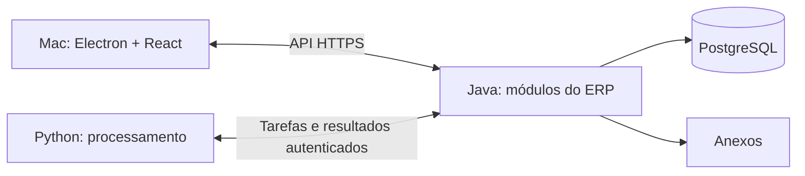

# Técnicas para desenvolver o ERP Renda+

Pesquisa aplicada em 21/09/2026. Base: estudo dos arquivos da Fourtech, plano funcional vigente e documentação primária de arquitetura, ERPs industriais, banco de dados, segurança e testes.

## 1. Conclusão e limites da pesquisa

A recomendação é desenvolver um ERP industrial orientado a projetos, com núcleo transacional Java modular, cliente Electron + React e processamento Python especializado. As prioridades são rastreabilidade, consistência entre áreas, planejamento de materiais e entrega incremental de fluxos completos.

Electron/React e Java/Python já foram definidos pelo usuário. Spring Boot, Spring Modulith, PostgreSQL e demais ferramentas citadas são recomendações deste estudo, ainda não decisões de infraestrutura. O documento complementa o plano; não inicia implementação nem altera os dados de negócio.

“ERP” abrange setores e problemas muito diferentes. A pesquisa concentra-se no que se aplica à Renda+: fabricação de equipamentos por encomenda/projeto, instalação, terceirização, finanças e pós-venda. Não é um levantamento exaustivo de todos os fornecedores nem uma certificação fiscal. Documentação de ERPNext e Odoo serve como referência de processos; não implica adoção desses produtos ou equivalência entre suas regras e as da Fourtech.

## 2. Começar pelos processos e pelas decisões

Minha recomendação é mapear os eventos reais, seus responsáveis e seus efeitos antes de definir as tabelas e telas. Para cada operação, registrar: condição de entrada, ator autorizado, documentos necessários, mudança de estado, efeitos em outros módulos, exceções e forma de correção.

| Fluxo Renda+ | Eventos que precisam ficar separados |
|---|---|
| Comercial | Proposta emitida, revisão aprovada, pedido confirmado, aditivo registrado, cancelamento |
| Produção | Projeto liberado, material reservado, material consumido, operação executada, inspeção aprovada |
| Suprimentos | Necessidade identificada, compra aprovada, recebimento parcial, devolução, serviço aceito |
| Financeiro | Parcela criada, documento fiscal vinculado, recebimento/pagamento realizado, estorno, renegociação |
| Entrega | Expedição, chegada, instalação, comissionamento, aceite |
| Assistência | Chamado aberto, garantia avaliada, atendimento executado, peças consumidas, encerramento |

Aplicação prática de modelagem orientada ao domínio: definir um vocabulário comum para “cliente”, “unidade”, “projeto”, “equipamento”, “faturamento”, “baixa” e “custo”. Um status genérico de projeto não deve representar simultaneamente fabricação, cobrança e garantia. Esses ciclos terão estados próprios.

Exemplo de critério verificável: dado um pedido aprovado, quando o operador o confirmar, o sistema cria os projetos e as parcelas uma única vez; uma segunda tentativa devolve a confirmação existente. O resultado deve ser verificável no banco, na API e na interface.

## 3. Arquitetura recomendada

Um núcleo Java implantado como uma aplicação, organizado por domínios, permite começar com transações locais e fronteiras de módulos que podem evoluir. A análise de Fowler explica o custo adicional dos microserviços e a dificuldade de acertar suas fronteiras no início; é uma orientação de arquitetura, não uma regra universal. Para o escopo atual da Renda+, recomendo começar com um monólito modular. [Monolith First](https://martinfowler.com/bliki/MonolithFirst.html).

Spring Boot é minha proposta para a aplicação Java, com Spring Modulith para estruturar módulos e verificar suas dependências. A ferramenta suporta verificação de ciclos e acesso indevido aos detalhes internos de outros módulos. [Spring Modulith](https://docs.spring.io/spring-modulith/reference/), [verificação de módulos](https://docs.spring.io/spring-modulith/reference/verification.html).

| Componente | Responsabilidade proposta |
|---|---|
| Electron + React, preferencialmente TypeScript | Interação, formulários, tabelas, navegação, Gantt e recursos nativos do Mac |
| API Java | Sessões, permissões, comandos, validação final e consultas |
| Módulos Java | Comercial, projetos/engenharia, produção, suprimentos/estoque, financeiro, repasses e assistência |
| PostgreSQL | Registros transacionais, integridade, auditoria e tarefas duráveis |
| Processo Python | Extração documental, preparação de importações, análises e geração de artefatos que justifiquem seu uso |
| Armazenamento de arquivos | PDFs originais, anexos, fotos e relatórios; acesso mediado pelo servidor |

Cada módulo controla suas alterações e expõe operações explícitas. Uma camada de aplicação coordena os casos que atravessam módulos. Separar domínio, casos de uso e adaptadores de banco/HTTP quando isso facilitar testes e mudança; cadastros simples não precisam de camadas artificiais.

Python não deve gravar diretamente em tabelas de estoque, caixa ou repasses. Ele devolve resultados estruturados; Java verifica e aplica as regras. Um erro na extração de PDF não pode confirmar uma obrigação financeira. Não é necessário criar uma segunda API pública apenas porque há Python no servidor.

## 4. Integridade dos dados como requisito central

Minha proposta é um banco relacional central, com chaves estrangeiras, unicidade, restrições e transações. A escolha de PostgreSQL é adequada à necessidade de operações relacionadas e controle de concorrência. Seu nível padrão de isolamento não resolve sozinho todas as regras; a estratégia deve ser definida por operação. [Isolamento no PostgreSQL](https://www.postgresql.org/docs/current/transaction-iso.html).

Exemplo: dois usuários tentam reservar o mesmo motorredutor. Conferir o saldo e depois gravar, em operações independentes, permite que ambos aprovem a reserva. A validação e a atualização devem ser atômicas, usando bloqueio apropriado ou atualização condicional, com restrições e tratamento de conflitos. Para regras complexas, avaliar isolamento mais forte com repetição controlada da transação.

Para edição de cadastros e propostas, usar número de versão: quem tenta salvar uma versão antiga recebe um conflito compreensível e pode comparar as mudanças. Para várias linhas de estoque, adotar ordem consistente de bloqueios. Testar concorrência real; um teste com uma única sessão não verifica esse risco.

Dinheiro exige precisão definida. Manter valores finais em centavos, conforme o plano; usar decimal exato para quantidade, custo unitário, percentuais e cálculos intermediários. Definir arredondamento e alocação de centavos residuais. Java pode usar BigDecimal; na API, strings decimais evitam perda de precisão entre linguagens. PostgreSQL distingue tipos exatos de tipos aproximados. [Tipos numéricos](https://www.postgresql.org/docs/current/datatype-numeric.html).

Cadastros precisam de identificadores próprios, aliases revisados e unidades de medida/conversões explícitas. Quantidade comprada em caixa não pode ser somada a quantidade consumida em unidade sem fator de conversão. Datas de negócio usam calendário definido; instantes de auditoria registram fuso/UTC adequadamente. Não converter competência mensal em um horário arbitrário sujeito a mudança de dia.

## 5. Lançamentos rastreáveis e correções

Recomendo registros de movimento para estoque, financeiro e custos, vinculados ao documento que os originou. Depois de confirmado, um movimento é corrigido por estorno ou ajuste rastreável. Rascunhos podem ser editados; o histórico confirmado conserva autoria, motivo e relação com sua correção.

ERPNext documenta esse princípio para seus registros de estoque e contabilidade, incluindo o efeito que lançamentos retroativos podem ter nas avaliações posteriores. Essa é a prática que interessa à Renda+, sem necessidade de blockchain. [Immutable Ledger](https://docs.frappe.io/erpnext/immutable-ledger-in-erpnext).

Aplicação proposta: distinguir data do evento, competência, momento do registro e versão da regra utilizada. Fechamentos congelam os resultados e reaberturas exigem motivo e permissão. Mudanças retroativas que afetem custo médio precisam de política de recálculo ou ajuste; não basta recalcular silenciosamente o saldo atual.

O histórico de auditoria registra quem mudou um cadastro; o registro de movimentos explica por que o saldo mudou. São necessidades diferentes. Saldo armazenado para desempenho deve ser reconciliável com seus movimentos.

## 6. Financeiro, custos e resultado

O modelo deve distinguir compromisso contratual, documento de faturamento, título, liquidação, alocação de pagamento e movimentação bancária. Um pagamento pode liquidar várias parcelas; uma parcela pode receber várias baixas. Valores excedentes precisam virar crédito/adiantamento identificado, e não saldo negativo sem significado.

Exemplo gerencial simplificado, sem tributos ou frete: comprar e receber R$ 1.000,00 em peças aumenta o estoque e registra a obrigação. Consumir R$ 400,00 no projeto deixa R$ 600,00 no estoque e apropria R$ 400,00 ao custo do projeto. Pagar R$ 1.000,00 liquida a obrigação e reduz o caixa. Esse pagamento não acrescenta outros R$ 1.000,00 ao custo do projeto.

Para cada projeto, mostrar orçamento aprovado, compras comprometidas, custo incorrido, saldo a executar, faturamento, recebimentos e previsão de resultado. Custo comprometido é um indicador; não deve ser somado outra vez ao incorrido quando uma compra é recebida/consumida. Materiais em fabricação devem continuar rastreáveis até sua aplicação ou conclusão.

Conciliação deve suportar agrupamentos, taxas bancárias, recebimentos líquidos e transferências. Transferência entre contas próprias não cria receita ou despesa. Comparação pedido de compra × recebimento/aceite × documento do fornecedor identifica divergências antes da baixa.

Repasses precisam de regra versionada, base de cálculo, beneficiário, vigência e memória congelada. Valores já distribuídos entram nos ajustes. Reserva de caixa permanece separada. Impostos gerenciais preservam origem, simulação e confirmação externa, como previsto no plano; regras tributárias de produção exigirão pesquisa e validação específica na sua implementação.

## 7. Planejamento industrial adequado à Renda+

A documentação industrial do ERPNext vincula BOM, ordens de produção e planejamento de materiais a pedidos. O plano de produção também distingue fabricação própria, aquisição e subcontratação de subconjuntos. Para a Renda+, proponho aplicar essa ligação por projeto/equipamento. [BOM](https://docs.frappe.io/erpnext/bill-of-materials), [ordem de produção](https://docs.frappe.io/erpnext/work-order), [plano de produção](https://docs.frappe.io/erpnext/production-plan).

As estruturas têm finalidades diferentes:

| Estrutura | Pergunta que responde |
|---|---|
| BOM, lista de materiais | Quais peças e quantidades compõem o equipamento? |
| Roteiro de produção | Quais operações, recursos e tempos são necessários? |
| EAP | Quais entregas e atividades compõem o projeto? |
| Cronograma | Quando executar, considerando dependências e restrições? |
| Ordem de produção | O que foi liberado para execução e o que foi produzido/consumido? |

Para os equipamentos Renda+, manter modelo/revisão e cópia vinculada ao projeto. Alterar a BOM padrão não muda automaticamente uma máquina já vendida ou em fabricação. Registrar substituição de componente, quantidade real, perda, retrabalho e aprovação da alteração. Ao final, conservar a composição efetivamente montada e sua relação com o número de série.

MRP, planejamento de necessidades de materiais, deve considerar demandas por data, estoque utilizável, reservas, recebimentos firmes e prazos de compra/produção. O cálculo precisa percorrer o tempo e alocar cada suprimento uma só vez, incluindo compromissos com outros projetos. Uma soma global de estoque e compras abertas pode esconder que o material chegará depois da necessidade.

Na primeira versão, gerar sugestões de compra/fabricação com rastreio da demanda e conferência humana. Não liberar automaticamente pedidos apenas porque uma previsão mudou. Materiais ainda em cotação não equivalem a recebimentos confirmados.

Dependências do Gantt precisam de tipo, defasagem, calendário e linha de base. Caminho crítico calculado pelas dependências não comprova disponibilidade da equipe ou máquina. Incluir ao menos alertas de sobreposição de recursos e evoluir a programação de capacidade conforme os dados reais amadureçam. A documentação do ERPNext diferencia planejamento de quantidades de programação que considera capacidade e turnos. [Production Plan Schedule](https://docs.frappe.io/erpnext/production-plan-schedule).

Em terceiros, controlar propriedade, localização, remessa, retorno, consumo e perda. Enviar material próprio ao prestador não transforma o material automaticamente em compra ou custo de serviço. A documentação do Odoo exemplifica a separação de material próprio, material do terceiro e serviço na composição do custo. [Subcontratação no Odoo](https://www.odoo.com/documentation/saas-16.3/applications/inventory_and_mrp/manufacturing/management/subcontracting.html).

## 8. Comunicação que tolera falhas

Toda operação com efeitos importantes deve receber um identificador persistente. Se a conexão cair após a confirmação do pedido, repetir a mesma solicitação deve recuperar o resultado, sem criar novas parcelas. A API da Stripe é uma referência concreta de uso de chaves de idempotência; sua política específica de retenção não será copiada automaticamente para o ERP. [Idempotent requests](https://docs.stripe.com/api/idempotent_requests).

Minha proposta: vincular a chave à operação, ao contexto autorizado e ao conteúdo da solicitação; rejeitar reutilização com dados diferentes. Guardar o resultado junto da transação. Restrições de unicidade de negócio complementam a chave, pois uma tentativa pode chegar com identificador novo. O prazo de retenção deve considerar importações e reprocessamentos históricos.

Para Python, registrar tarefa e referência ao arquivo de forma durável antes de processar. Se for necessário publicar uma mensagem externa junto com uma alteração no banco, usar outbox transacional: gravar a mudança e a intenção de publicação na mesma transação. O consumidor deve tolerar repetição. Esse padrão trata a falha entre gravação e envio; não torna toda a comunicação “exatamente uma vez”. [AWS: transactional outbox](https://docs.aws.amazon.com/prescriptive-guidance/latest/cloud-design-patterns/transactional-outbox.html).

Inicialmente, uma tabela de tarefas com processamento controlado pode ser suficiente, sem broker separado. Prever tentativas, prazo de posse da tarefa, heartbeat, erro, retomada e descarte de resultado de tentativa vencida. Não manter transação de negócio aberta enquanto um PDF é processado.

Documentar a API com OpenAPI, incluindo erros de negócio, paginação, datas, decimais, versões e idempotência. Contratos podem alimentar os tipos do cliente e os testes de integração. [OpenAPI](https://spec.openapis.org/oas/latest.html).

## 9. Migração como processo de qualidade

Aplicação direta ao material recebido: arquivo original → extração Python → registros propostos → conciliação → aprovação → importação Java → relatório de resultados.

Preservar hash, página, posição da linha, texto original, versão do extrator, correspondência de cadastro e correção humana. Hash detecta repetição do mesmo arquivo; não detecta sozinho o mesmo negócio exportado em dois PDFs diferentes. Combinar rastreio de lote com identidade de negócio e revisão de duplicidades.

Usar os problemas encontrados como casos de validação: 32 registros/R$ 5.681.662,94; diferença de R$ 3.000,00 na BOM; datas de entrega sempre +90 dias; etapas incompatíveis; ano divergente; pagamentos sem comprovação. O objetivo é preservar e classificar, sem corrigir por suposição.

Definir data de corte. Escolher por conjunto se entram movimentos completos ou saldos de abertura com referências históricas; somar ambos duplicaria saldos. Fazer ensaio de importação e relatório de reconciliação por entidade, projeto, título e estoque. Se surgirem planilhas estruturadas originais, preferi-las para os dados tabulares, mantendo os PDFs como evidência.

## 10. Interface de trabalho e segurança

Proposta de experiência: páginas por tarefa, filtros salvos, pesquisa de cliente/unidade/equipamento, navegação por teclado, valores com origem consultável e mensagens de validação junto ao campo. Confirmar uma baixa deve mostrar título, valor, conta e data, com resultado inequívoco. Se houver timeout, mostrar “resultado em verificação”, sem afirmar que falhou ou pedir uma nova baixa às cegas.

A interface pode ajudar com validações e simulações, mas a decisão final é do servidor. Não apresentar gravação financeira como concluída antes da resposta confirmada. Prévia de importação deve colocar origem e dado proposto lado a lado. Indicadores precisam explicitar período e base: vendido, faturado, recebido, previsto ou realizado.

No Electron, manter isolamento de contexto, sandbox, integração Node desativada no renderer e ponte nativa pequena com mensagens validadas. Restringir navegação e abertura de URLs; carregar a interface empacotada e manter dependências atualizadas. [Segurança do Electron](https://www.electronjs.org/docs/latest/tutorial/security).

Permissões devem ser verificadas no servidor por ação e recurso, inclusive exportação e anexos; esconder um botão não protege a operação. Começar com papéis compreensíveis e condições de negócio, como competência fechada e alçada de aprovação. A OWASP recomenda negar por padrão e conferir autorização em cada requisição. [Authorization Cheat Sheet](https://cheatsheetseries.owasp.org/cheatsheets/Authorization_Cheat_Sheet.html).

Definir sessão, revogação e armazenamento de credenciais sem segredos embutidos no aplicativo. Limitar tamanho/tipo de upload e isolar o processamento documental. Documentos e texto extraído são dados, nunca comandos executáveis do servidor.

## 11. Testes que provam o funcionamento do ERP

Recomendo testes concentrados nas regras com consequências financeiras e operacionais, além de percursos completos. Testcontainers permite testes de integração com dependências reais em contêineres; isso ajuda a verificar PostgreSQL em vez de simular suas transações em outro banco. Playwright oferece automação de Electron, atualmente documentada como experimental, devendo ser validada na versão adotada. [Testcontainers](https://java.testcontainers.org/), [Playwright/Electron](https://playwright.dev/docs/api/class-electron).

| Cenário | Resultado obrigatório |
|---|---|
| Pedido confirmado duas vezes | Um conjunto de projetos e parcelas |
| Nota vinculada após parcelamento | Nenhum título duplicado |
| Duas reservas simultâneas do último item | Apenas a quantidade disponível é reservada |
| Pagamento parcial seguido de estorno | Saldo e histórico reconciliados |
| Consumo seguido de pagamento da compra | Custo apropriado uma vez |
| R$ 100,00 dividido em três parcelas | Soma exata de R$ 100,00, com regra explícita de arredondamento |
| Transferência entre locais próprios | Quantidade consolidada preservada |
| Falha após commit e antes da resposta | Recuperação do resultado sem repetição do efeito |
| Python interrompido e reiniciado | Retomada sem duplicação de importação |
| Regra de repasse alterada | Memória de distribuição anterior preservada |
| Mudança na BOM modelo | Projeto já aprovado conserva sua revisão |
| Restauração de backup | Banco, anexos e vínculos recuperados e conferidos |

Além dos exemplos, testar propriedades: soma das parcelas corresponde ao contrato ajustado; soma das alocações corresponde à baixa; quantidade disponível não fica negativa; estorno válido compensa seu movimento; peso total da EAP obedece à convenção definida. Incluir autorização negativa e conflito de versão.

Na integração contínua: compilação, análise de tipos, testes de domínio, integração com banco, contrato Java/Python/cliente, migrações e percursos críticos. Medir correção dos comportamentos; percentual de cobertura isolado não comprova que o ERP fecha seus saldos.

## 12. Operação, atualizações e recuperação

Usar migrações versionadas e revisadas. Flyway registra versões e checksums; após aplicação em ambiente permanente, a correção deve ser uma migração nova. Para cliente e servidor atualizáveis separadamente, planejar alterações compatíveis e só remover campos depois de retirar os clientes antigos. [Flyway](https://documentation.red-gate.com/flyway/flyway-concepts/migrations/versioned-migrations).

A implantação inicial pode conter API Java, processo Python, banco e armazenamento, com procedimentos reproduzíveis de configuração. O local de hospedagem ainda precisa ser decidido. Contêineres são uma opção operacional; Kubernetes não é requisito demonstrado pelo tamanho conhecido da Renda+.

Backups devem abranger banco e anexos em um ponto consistente, ter cópia fora do servidor e teste de restauração. Definir perda máxima de dados aceitável e tempo de recuperação antes de escolher periodicidade e retenção. O PostgreSQL documenta dumps, backup físico e arquivamento contínuo; a técnica depende do objetivo de recuperação. [Backup e restauração](https://www.postgresql.org/docs/current/backup.html).

Associar requisição, transação e tarefa Python por identificadores de correlação. Monitorar erros, duração de operações, tarefas paradas, falhas de backup e diferenças de reconciliação. OpenTelemetry oferece conceitos comuns de logs, métricas e rastros de requisições; a proposta é instrumentar o necessário, preservando dados sensíveis nos registros. [OpenTelemetry](https://opentelemetry.io/docs/concepts/signals/).

## 13. Método de entrega recomendado

Entregar pequenos fluxos utilizáveis com validação do operador. A pesquisa DORA sustenta o trabalho em lotes pequenos que podem ser testados e validados com retorno rápido. Para a Renda+, isso significa completar operações de ponta a ponta em vez de construir todas as telas primeiro. [DORA: small batches](https://dora.dev/capabilities/working-in-small-batches/).

| Etapa | Entrega verificável |
|---|---|
| Descoberta objetiva | Vocabulário, eventos, estados, exceções e decisões pendentes |
| Fundação mínima | Login, API, banco, auditoria, anexo, tarefa Python e restauração comprovada |
| Primeiro fluxo comercial | Cliente/unidade → pedido → projeto/equipamento → parcelas → recebimento parcial → estorno |
| Primeiro fluxo industrial | BOM → necessidade → compra → recebimento → reserva → consumo → custo do projeto |
| Execução e entrega | EAP/cronograma → produção → inspeção → instalação → aceite |
| Gestão e pós-venda | Repasses, conferência fiscal, assistência, preventivas e relatórios |
| Entrada em operação | Migração ensaiada, saldos reconciliados, operador treinado e plano de recuperação |

Esse roteiro detalha as fases do plano vigente. Usar dados fictícios nos primeiros testes e um projeto real de referência na homologação, mantendo valores históricos pendentes claramente separados dos validados. Para cada entrega, registrar o que foi aceito, falhas conhecidas e próximo conjunto de regras.

## 14. O que adotar agora e o que adiar

| Adotar desde a fundação | Adiar até haver necessidade demonstrada |
|---|---|
| Módulos por negócio e contratos explícitos | Um microserviço por módulo |
| Banco relacional e transações | Bancos diferentes por área |
| Movimentos auditáveis e estornos | Event sourcing de todo o ERP |
| Idempotência e tarefas duráveis | Kafka ou outro broker por padrão |
| Revisões de BOM/EAP e reconciliação | Otimização automática complexa de capacidade |
| Consultas e indicadores rastreáveis | Data warehouse independente |
| Conexão ao servidor com recuperação de falhas | Escrita offline com sincronização bidirecional |
| Classificação assistida de documentos | IA aprovando impostos, custos ou pagamentos |

São escolhas recomendadas para reduzir custo operacional e incerteza inicial. Uma demanda real de escala, isolamento, disponibilidade ou equipe pode justificar outra solução depois.

## 15. Decisões necessárias antes da implementação correspondente

1. Onde ficará o servidor e quem administrará sua disponibilidade, atualizações e backups?
2. Quantos usuários e operações simultâneas devem ser atendidos, com quais permissões?
3. Existe necessidade real de concluir trabalho sem conexão, ou basta operar em rede local sem internet externa?
4. Quais BOMs detalhadas, saldos, documentos e regras de repasse estão disponíveis para validação?
5. Qual data de corte e quais critérios liberarão o histórico para uso operacional?
6. Qual projeto e operador serão referência para homologação?
7. Qual perda de dados e tempo de recuperação são aceitáveis?

A próxima entrega recomendada é uma especificação executável do primeiro fluxo, contendo entidades, estados, contratos da API, regras transacionais e cenários de aceitação. Ela transforma as recomendações desta pesquisa em decisões concretas e verificáveis antes de ampliar o código.

## Atualização do backend — 25/09/2026

O usuário solicitou incorporar o motor integrado de dados, análise e decisão e utilizar orientação a objetos e design patterns. O plano atualizado está em [Backend completo](backend/01-plano-completo-backend.md), com [roteiro B01–B16](backend/02-roteiro-e-backlog.md), [motor integrado](backend/05-motor-dados-analise-decisao.md), [OOP e padrões](backend/06-oop-e-design-patterns.md), [catálogo de recursos](backend/07-catalogo-funcional-analitico.md) e [prompts de backend](backend/04-prompts-implementacao.md).

As 32 áreas são a base inicial; o catálogo recebido amplia funções de marketing, valor para o cliente, gestão, indústria e decisões. Java confirma operações; Python processa dados versionados e devolve análises. Métodos avançados dependem de elegibilidade/validação e IA generativa permanece futura/desativada. Mantêm-se Electron + React e servidor Java/Python; JavaFX, SQLite e escrita offline citados na referência antiga não foram readotados. Indicadores/descritivos acompanham cada módulo; análises no servidor podem continuar com o Mac fechado. Este adendo atualiza o planejamento, sem declarar implementação concluída.
