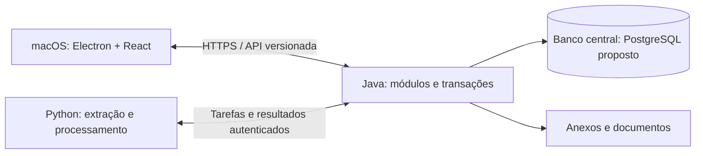

# ERP Renda+ — planejamento de desenvolvimento

Versão 1 — 23/09/2026. Situação: planejamento; aplicação ainda não implementada. Este roteiro complementa o [plano funcional](plano-funcional-erp-renda-mais.md). Os [prompts para o Codex](prompts-codex-erp-renda-mais.md) correspondem às etapas abaixo.

## 1. Objetivo e decisões

Entregar um ERP industrial orientado a projetos, integrando venda, engenharia, fabricação, instalação, finanças e assistência. Desenvolveremos fluxos completos, com banco, regras, API, interface e verificação na mesma entrega.

| Situação | Decisão |
|---|---|
| Definido pelo usuário | Arquitetura cliente-servidor; Electron + React no macOS; Java e Python no servidor |
| Definido pelo usuário | Design system fornecido em `design-system/renda-mais-erp`, com 49 componentes |
| Definido pelo usuário | Interface no modelo SAP Business One das capturas: janelas internas simultâneas e informações distribuídas em cabeçalho, abas, tabelas, resumo e ações |
| Base funcional vigente | Um CNPJ, português brasileiro, BRL, projeto como vínculo entre módulos |
| Proposta técnica de referência | React com TypeScript; Java com Spring Boot em monólito modular; PostgreSQL central; processo Python para documentos e tarefas |
| Premissa de planejamento | Gravações dependem de conexão ao servidor; interface empacotada no Mac; dados oficiais no servidor |
| A definir no início | Hospedagem, usuários simultâneos, perfis, Macs atendidos, operação/backup e versões compatíveis das ferramentas |

Spring Boot, PostgreSQL e TypeScript são propostas para orientar a execução, não escolhas já feitas pelo usuário. Na etapa 1, registrar as decisões técnicas em ADRs (registros curtos com escolha, motivo e consequências). As orientações dos PDFs e exemplos visuais são referências: não substituem decisões do usuário nem comprovam movimentos reais.

Java será o responsável por validar comandos e gravar dados de negócio. Python preparará resultados para conferência. O cliente não terá credenciais do banco. Os módulos Java terão limites explícitos, mantendo transações locais entre operações relacionadas. Spring Modulith é uma opção para verificar esses limites. [Documentação oficial](https://docs.spring.io/spring-modulith/reference/).

## 2. Sequência de desenvolvimento

As etapas representam entregas; uma etapa grande será dividida em várias tarefas pequenas. A ordem abaixo é o caminho principal. Levantamento de dados, testes e conferência acompanham todas as etapas.

### Etapa 1 — Especificar processos e fechar a fundação técnica

1. Transformar as 32 telas previstas em fluxos, entidades, estados, eventos e permissões.
2. Detalhar primeiro cliente → unidade → pedido → projeto/equipamento → parcela → recebimento parcial → estorno.
3. Definir dinheiro, arredondamento, quantidades, unidades, datas, concorrência, idempotência e correções.
4. Registrar ADRs de arquitetura, persistência, autenticação, arquivos e tarefas Python; selecionar versões compatíveis sem depender de versões flutuantes.
5. Criar backlog com identificadores, dependências e critérios verificáveis. Marcar dúvidas de negócio sem inventar respostas.

**Entrega:** mapa de processos, modelo de domínio, matriz de acesso inicial, contratos preliminares e backlog priorizado.

**Aceite:** explicar em exemplos como cada evento altera projeto, títulos, caixa, estoque e custos sem duplicação. Contemplar cancelamentos e exceções, além do caminho normal.

### Etapa 2 — Construir a base executável

1. Estruturar repositório para cliente, servidor Java, processo Python, contratos e infraestrutura.
2. Configurar ambientes locais reproduzíveis, migrações de banco, configuração externa, logs e verificação automática de compilação/testes.
3. Fazer Electron chamar a API Java; Java persistir um registro de demonstração em ambiente de desenvolvimento.
4. Implementar uma tarefa Python durável de demonstração, com identificador, tentativas, prazo de execução, recuperação de tarefa abandonada e resultado validado pelo Java.
5. Definir formato de erros, versão da API, consulta de resultado de comandos e separação de ambientes.

**Entrega:** aplicação mínima executável, instruções de inicialização e contratos testáveis.

**Aceite:** subir o conjunto a partir das instruções; reiniciar servidor/processador sem perder tarefa; falha de rede aparecer de forma compreensível. Demonstrações não entram como dados reais.

### Etapa 3 — Adaptar o design system para React

Seguir a [especificação de interface por janelas](interface-janelas-erp-renda-mais.md), incluindo o mapa de distribuição das 32 áreas. Implementar uma janela principal Electron e gerenciador de janelas internas React, com registro de instâncias, ativação, posição, tamanho, sobreposição e estado de edição.

1. Preservar a referência recebida e criar biblioteca React própria reutilizando tokens, ícones e estrutura visual.
2. Implementar moldura desktop, navegação, área de trabalho, janelas, formulário, botões, grade, filtros, diálogos e status.
3. Tratar foco, teclado no Mac, rolagem, zoom, mensagens de erro, carregamento e alterações não salvas. Implementar mover, redimensionar, minimizar, maximizar/restaurar, cascata/lado a lado, menu de janelas abertas e ativação de registro já aberto. Ferramentas globais atuam sobre a janela ativa; diálogos pertencem à origem.
4. Criar galeria React verificável. Adaptar somente os componentes necessários a cada fluxo; ampliar a biblioteca ao longo do projeto.

**Entrega:** estrutura visual navegável e componentes básicos, conforme o [guia de integração](../design-system/README.md).

**Aceite:** comparar telas representativas com a galeria original e as capturas fornecidas; validar teclado, foco e legibilidade no macOS. Executar os nove cenários da especificação de interface, inicialmente com dados sintéticos; repetir os cenários de negócio com a API real nas etapas correspondentes. O pacote atual é HTML/CSS/JavaScript, portanto sua cópia não equivale a integração React concluída.

### Etapa 4 — Acesso, cadastros e área de conferência

1. Implementar sessões, usuários, permissões por operação, auditoria, empresa e configurações.
2. Entregar clientes/unidades, contatos, fornecedores, materiais/serviços, unidades de medida, contas e categorias.
3. Criar estrutura mínima de projetos/equipamentos e anexos vinculados com acesso autorizado.
4. Implementar envio e processamento documental para uma área de conferência: arquivo, hash, página, linha/localização, sugestão, divergência e decisão.
5. Implementar backup e ensaiar restauração de banco e anexos em ambiente separado.

**Entrega:** primeiro cadastro real utilizável no aplicativo e primeiros documentos processados em homologação.

**Aceite:** um usuário sem permissão não consegue executar a operação diretamente na API; duas edições não se sobrescrevem silenciosamente; reenvio do mesmo arquivo não cria registros definitivos duplicados.

### Etapa 5 — Comercial e primeiro fluxo integrado

1. Implementar prospecção, oportunidades, propostas versionadas e exportação de proposta.
2. Implementar pedidos/contratos, aditivos e confirmação que cria projetos, equipamentos e parcelas de forma atômica e idempotente.
3. Entregar carteira e detalhe do projeto, com vínculos e navegação entre registros.
4. Implementar o mínimo financeiro necessário: título, recebimento parcial, saldo e estorno. A etapa 6 amplia esse núcleo.

**Entrega:** demonstração ponta a ponta do primeiro fluxo comercial, já usando o design system.

**Aceite:** confirmar duas vezes o mesmo pedido produz um único conjunto de projetos e títulos; a interface recupera o resultado após perda de conexão; um estorno recompõe o saldo e conserva histórico.

### Etapa 6 — Financeiro operacional

1. Completar contas a receber/pagar, parcelamento, baixas parciais, renegociação e adiantamentos.
2. Vincular documentos/faturamento aos títulos existentes; separar venda, faturamento e recebimento.
3. Implementar contas bancárias/caixa, transferências, importação OFX/CSV e conciliação.
4. Entregar fluxo realizado/projetado e despesas vinculadas ao projeto. Resultado industrial será completado com consumo e execução das etapas 8–9.

**Entrega:** versão A para homologação — comercial e financeiro.

**Aceite:** extrato reimportado não duplica movimentos; transferência própria não vira receita/despesa; recebimento e estorno conciliam com os títulos. Duas baixas simultâneas não ultrapassam o saldo.

### Etapa 7 — Engenharia e planejamento

1. Criar BOM e EAP versionadas, preservando a revisão aplicada a cada projeto.
2. Implementar atividades, pesos, responsáveis, calendários, dependências, datas contratuais e linha de base.
3. Implementar Gantt, recálculo, avanço e identificação de atrasos/caminho crítico conforme as regras especificadas.
4. Conectar materiais e serviços às atividades e necessidades do projeto.

**Entrega:** planejamento de um equipamento com materiais, custos estimados e cronograma.

**Aceite:** detectar ciclos e datas incompatíveis; recalcular sem alterar a linha de base; sinalizar a diferença de R$ 3.000,00 da BOM de origem, sem resolvê-la arbitrariamente. O Gantt é componente adicional, ausente no pacote visual recebido.

### Etapa 8 — Compras, estoque e terceiros

1. Calcular necessidade líquida a partir de BOM, estoque, reservas e fornecimentos pendentes.
2. Entregar cotações, pedidos de compra, aprovações, programação financeira e recebimentos parciais.
3. Implementar locais, inventário inicial, reservas, transferências, consumo, devoluções e ajustes motivados.
4. Controlar propriedade e localização de materiais enviados a terceiros; aplicar política de custo médio e ajustes retroativos especificada antes da implementação.

**Entrega:** fluxo necessidade → compra → recebimento → reserva → consumo → custo do projeto.

**Aceite:** duas reservas concorrentes não excedem o disponível; transferir a terceiro conserva o estoque próprio consolidado; consumo apropria custo uma única vez; pagamento não repete esse custo. Compra prevê obrigação, documento posterior a vincula sem duplicar.

### Etapa 9 — Produção, qualidade e instalação

1. Implementar ordens de produção, roteiro, execução própria/terceirizada, horas e consumo associado.
2. Implementar inspeções, não conformidades, retrabalho e liberação de etapas.
3. Entregar agenda de instalação, despesas, testes, pendências, entrega e aceite.
4. Consolidar composição efetivamente montada, identificação do equipamento e orçamento versus custo realizado.

**Entrega:** versão B para homologação — operação industrial completa até o aceite.

**Aceite:** rastrear cada material/custo até a origem; distinguir entrega prevista de realizada; preservar evidências de inspeção e de aceite. Critérios de qualidade pendentes não serão inventados a partir dos PDFs incompletos.

### Etapa 10 — Repasses, impostos gerenciais e gestão

1. Implementar regras de repasse versionadas, bases, beneficiários, vigência, simulação, confirmação e ajustes.
2. Separar reserva interna de caixa de obrigações com beneficiários.
3. Implementar conferência fiscal com histórico importado, simulação gerencial e valor confirmado pelo contador separados.
4. Consolidar custos/resultado, visão geral e relatórios com acesso aos registros que compõem cada indicador; exportar PDF, CSV e Excel conforme o caso.

**Entrega:** gestão de resultado por projeto e obrigações conferidas.

**Aceite:** confirmar repasse duas vezes não cria títulos extras; mudança de regra não altera memória confirmada; painel reconcilia com lançamentos. Parâmetros fiscais terão vigência e validação específica antes do uso, com pesquisa oficial atualizada nessa etapa; este roteiro não valida fórmulas tributárias.

### Etapa 11 — Assistência e manutenção preventiva

1. Implementar chamados, garantia, ordens de serviço, responsáveis, peças, horas e despesas.
2. Vincular atendimentos ao equipamento, cliente, projeto e histórico de instalação.
3. Implementar planos preventivos, agenda, checklists e geração controlada de ordens.

**Entrega:** versão C para homologação — ciclo completo com pós-venda.

**Aceite:** consumo e custos da assistência aparecem uma única vez; reexecutar a geração de preventivas não duplica ordens; garantia usa condições registradas, não inferências sobre datas previstas.

### Etapa 12 — Concluir a migração e reconciliar

A migração começa na etapa 4. Aqui consolidamos os lotes dos módulos já implementados e ensaiamos o corte de operação.

1. Conferir aliases, clientes/unidades e vínculos antes de importar títulos ou equipamentos.
2. Importar em ordem: cadastros → carteira/projetos → modelos → documentos/títulos → baixas comprovadas → saldos e regras validadas.
3. Separar histórico consultável de movimentos operacionais; definir data de corte e impedir dupla contagem entre saldos iniciais e histórico.
4. Produzir relatório de diferenças, pendências, totais por origem e decisões de conferência; repetir o ensaio a partir de base limpa.

**Entrega:** carga de homologação reconciliada e procedimento repetível de migração.

**Aceite:** reconciliar os 32 registros e R$ 5.681.662,94 da BASE antes de correções aprovadas; preservar separadamente as 104 linhas de prospecção; reimportar lotes sem duplicação. Valores ambíguos de “recebido ou a receber” não viram baixas sem evidência.

### Etapa 13 — Piloto, instalação e entrada em operação

1. Executar com operador de referência um projeto completo, incluindo exceções e falhas de rede.
2. Medir desempenho com o volume e usuários definidos na etapa 1; corrigir falhas críticas.
3. Preparar instalador macOS, assinatura/notarização conforme distribuição definida, compatibilidade cliente/API e atualização controlada.
4. Instalar servidor no ambiente escolhido, configurar monitoramento, backups e ensaiar restauração/atualização.
5. Treinar operadores, registrar aceite, executar corte e acompanhar o primeiro fechamento.

**Entrega:** ERP em operação assistida e documentação de suporte.

**Aceite:** banco, anexos e auditoria restaurados; recuperação dentro das metas acordadas; permissões e fluxos conferidos; saldos de abertura reconciliados; responsáveis operacionais definidos. Se houver retorno ao sistema anterior, reconciliar também os movimentos posteriores ao corte; restaurar backup antigo sozinho não resolve isso.

## 3. Método de trabalho e conclusão de cada tarefa

Organizar trabalho em ciclos de uma a duas semanas como cadência proposta, ajustada à disponibilidade. Cada ciclo entrega um fluxo demonstrável. Não há prazo total confirmado: faltam capacidade da equipe, disponibilidade dos responsáveis e infraestrutura. Após as etapas 1–3, estimar o restante com base na execução medida, apresentando faixa e dependências.

Cada tarefa terá: identificador, objetivo, dependências, regra de negócio, entrega, critério de aceite, verificação e situação. Situações: pendente, em execução, em revisão, concluída ou bloqueada com causa explícita.

Sequência de execução:

1. Ler documentos vigentes, inspecionar código e escolher a menor entrega útil com pré-requisitos disponíveis.
2. Detalhar estados, efeitos, exceções e contrato da operação.
3. Implementar migração/modelo, regra Java, API, interface e processamento Python quando necessário.
4. Verificar regras de risco com testes relevantes; executar integração contra o banco escolhido, não somente simulações.
5. Demonstrar pela interface e atualizar documentação, backlog e pendências.

Uma tarefa só está concluída quando funciona pelo cliente, persiste corretamente, respeita permissão e auditoria quando aplicáveis, apresenta erros compreensíveis e tem seus critérios verificados. Tela com dados fictícios é protótipo identificado, não módulo concluído. Mock temporário não encerra uma integração prevista. Validações executadas e não executadas devem constar no relatório.

## 4. Verificações transversais

| Área | Verificações ao longo das entregas |
|---|---|
| Financeiro | Precisão decimal, arredondamento, saldo, baixa parcial, estorno, reconciliação e ausência de custo/receita duplicado |
| Concorrência | Edição desatualizada, duas reservas/baixas concorrentes, reenvio de comando e resposta perdida |
| Importações | Procedência, página/linha, divergências, retomada, reimportação e validação antes de gravar movimentos |
| Interface | Fidelidade visual, teclado, foco, zoom, estados vazio/carregando/erro e tabela com volume realista |
| Operação | Backup/restore de banco e anexos, atualização, contrato de versões, logs e recuperação de tarefas |

A política de concorrência será definida por operação; o isolamento padrão do banco não substitui validação atômica de saldos. [PostgreSQL: isolamento de transações](https://www.postgresql.org/docs/current/transaction-iso.html).

Na fundação do Electron, manter renderer sem Node, isolamento de contexto, sandbox, política de conteúdo e ponte nativa restrita com validação. Credenciais e dados sensíveis não devem aparecer em logs. [Orientações oficiais do Electron](https://www.electronjs.org/docs/latest/tutorial/security).

## 5. Decisões e responsáveis necessários

Papéis abaixo são responsabilidades propostas; nomes e disponibilidade ainda serão definidos.

| Tema | Responsável pela informação/decisão | Momento limite |
|---|---|---|
| Prioridade, projeto piloto e aceite | Edson/responsável do negócio | Etapa 1 |
| Frameworks, versões, contratos e modelo | Desenvolvimento, documentando ADRs | Antes da base da etapa 2 |
| Servidor, usuários, Macs, acesso e responsável operacional | Negócio + infraestrutura | Premissas na etapa 1; definição antes do piloto |
| Regras de pagamento, saldos e repasses | Financeiro + negócio | Etapas 5–6 e 10 |
| BOM detalhada, estoque, checklists e critérios de aceite | Engenharia/operação | Etapas 7–9 |
| Parâmetros e conferência fiscal | Contador + financeiro | Antes de uso operacional da etapa 10 |
| Data de corte, perda tolerável e tempo de recuperação | Negócio + operação técnica | Metas iniciais na etapa 1; validadas antes da etapa 13 |

Ausência de informação bloqueia apenas a regra ou entrada em operação correspondente. Estrutura e testes com casos sintéticos podem avançar com premissas explícitas.

Continuam fora da primeira versão: folha de pagamento, contabilidade oficial, emissão/transmissão fiscal, integração bancária online e escrita offline com sincronização. Módulos e botões que aparecem apenas nos exemplos do design system não ampliam o escopo. IA pode futuramente auxiliar análise documental; não será responsável por confirmar pagamentos, impostos ou repasses.

## 6. Primeira execução concreta

Usar o prompt da etapa 1. A primeira entrega será a especificação do fluxo comercial, modelo inicial, decisões técnicas e backlog rastreável. Depois executar a base técnica e a estrutura visual; só então ampliar os módulos. Cada etapa seguinte usa o estado real do repositório e o registro de progresso, evitando reiniciar o projeto a cada prompt.

## Atualização do backend — 25/09/2026

O usuário solicitou incorporar o motor integrado de dados, análise e decisão e utilizar orientação a objetos e design patterns. O plano atualizado está em [Backend completo](backend/01-plano-completo-backend.md), com [roteiro B01–B16](backend/02-roteiro-e-backlog.md), [motor integrado](backend/05-motor-dados-analise-decisao.md), [OOP e padrões](backend/06-oop-e-design-patterns.md), [catálogo de recursos](backend/07-catalogo-funcional-analitico.md) e [prompts de backend](backend/04-prompts-implementacao.md).

As 32 áreas são a base inicial; o catálogo recebido amplia funções de marketing, valor para o cliente, gestão, indústria e decisões. Java confirma operações; Python processa dados versionados e devolve análises. Métodos avançados dependem de elegibilidade/validação e IA generativa permanece futura/desativada. Mantêm-se Electron + React e servidor Java/Python; JavaFX, SQLite e escrita offline citados na referência antiga não foram readotados. Indicadores/descritivos acompanham cada módulo; análises no servidor podem continuar com o Mac fechado. Este adendo atualiza o planejamento, sem declarar implementação concluída.
