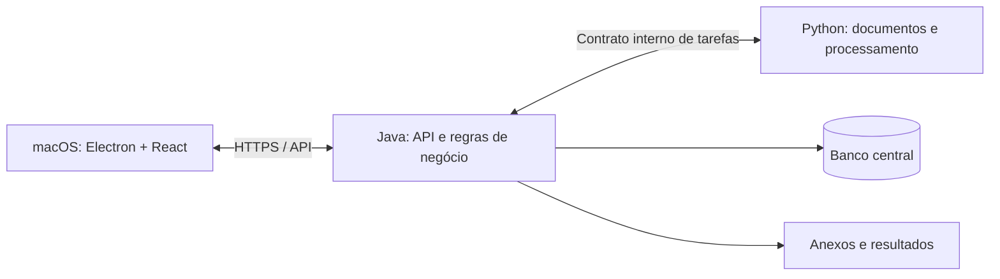

# ERP Renda+ — plano funcional e de desenvolvimento

Revisão 2 — 23/09/2026. Arquitetura definida pelo usuário: cliente macOS com Electron + React; servidor com Java e Python. Design system Renda+ ERP fornecido pelo usuário adotado como referência visual. Este é o plano funcional vigente. O arquivo `plano-funcional-recebido.txt` preserva a referência original.

Execução detalhada: [planejamento em 13 etapas](planejamento-desenvolvimento-erp-renda-mais.md) e [prompts para o Codex](prompts-codex-erp-renda-mais.md). Esses documentos organizam o desenvolvimento; não indicam implementação concluída.

A escolha das tecnologias acima está definida. A divisão de responsabilidades e as demais decisões técnicas abaixo são propostas de implementação; hospedagem, banco definitivo e quantidade de usuários ainda precisam ser definidos.

Pesquisa de apoio: [Técnicas para desenvolver o ERP Renda+](pesquisa-tecnicas-erp-renda-mais.md), com recomendações fundamentadas, riscos e cenários de aceitação. As ferramentas sugeridas nessa pesquisa permanecem propostas até sua adoção na implementação.

## 1. Direção definida

Criar um **sistema novo para a Fourtech**, abrangendo Renda+, mecânica e elétrica, com:

- Arquitetura **cliente-servidor**, com aplicativo **Electron + React instalado no macOS** e servidor executando **Java e Python**.
- Dados e operações de negócio centralizados no servidor. Como proposta inicial, o cliente depende da conexão com ele; operação desconectada com sincronização não está incluída automaticamente nesta alteração.
- Comercial, projetos, produção, compras, estoque, financeiro, impostos gerenciais e assistência técnica integrados.
- Importação assistida do histórico dos PDFs.
- Repasses configuráveis por atividade ou projeto.
- Registro e conferência de documentos fiscais; emissão e transmissão permanecem externas.
- **Design system Renda+ ERP escolhido pelo usuário.** A interface seguirá o pacote em `design-system/renda-mais-erp`, adaptado para React conforme o [guia de integração](../design-system/README.md). Este plano define informações, ações e relações entre as telas.

O elemento central será o **projeto**, ligado ao cliente, à unidade industrial e aos equipamentos. A partir dele será possível consultar venda, fabricação, materiais, fornecedores, instalação, custos, recebimentos e assistência.

## 2. O que os documentos estabelecem

Foram estudados **14 PDFs, com 39 páginas**. As orientações escritas nas planilhas serão tratadas como documentação do processo atual, sujeita às decisões deste planejamento.

- **Comercial:** a base contém 32 registros, cuja soma confere com R$ 5.681.662,94. Há clientes com várias unidades, equipamentos em diferentes estágios e uma lista de prospecção com classificação por estrelas. Os cabeçalhos de período estão desatualizados em relação a algumas linhas. Fontes: :codex-file-citation{path="/Users/edsondearaujocorral/Downloads/Vendas_Renda+ TOTAL - BASE.pdf" purpose="source"} :codex-file-citation{path="/Users/edsondearaujocorral/Downloads/Vendas_Renda+ TOTAL - DASHBOARD.pdf" purpose="source"} :codex-file-citation{path="/Users/edsondearaujocorral/Downloads/Vendas_Renda+ TOTAL - Cópia de LISTA DE FECULARIAS.pdf" purpose="source"}

- **Projetos e custos:** existem cronogramas de fabricação, entrega e instalação, com dependências e custos por categoria. A BOM apresenta total de R$ 69.398,51, mas suas linhas somam R$ 72.398,51; a diferença corresponde à pintura. Também há nomes de etapas divergentes entre Gantt e detalhamento. Fontes: :codex-file-citation{path="/Users/edsondearaujocorral/Downloads/CRONOGRAMA_MODELO - Cronograma (Gantt)-2.pdf" purpose="source"} :codex-file-citation{path="/Users/edsondearaujocorral/Downloads/CRONOGRAMA_MODELO - Detalhamento-2.pdf" purpose="source"} :codex-file-citation{path="/Users/edsondearaujocorral/Downloads/CRONOGRAMA_MODELO - Custos (BOM)-2.pdf" purpose="source"}

- **Produção e suprimentos:** a EAP relaciona atividades, componentes, fornecedores, predecessoras, pesos e inspeções. Os prazos de compra são estimativas; existem diferenças de datas entre documentos, inclusive atividades anteriores à disponibilidade prevista do material. Fontes: :codex-file-citation{path="/Users/edsondearaujocorral/Downloads/EAP_Mecanica_Renda_Mais_Fourtech - Cronograma.pdf" purpose="source"} :codex-file-citation{path="/Users/edsondearaujocorral/Downloads/EAP_Mecanica_Renda_Mais_Fourtech - EAP Mecânica.pdf" purpose="source"} :codex-file-citation{path="/Users/edsondearaujocorral/Downloads/EAP_Mecanica_Renda_Mais_Fourtech - Suprimentos.pdf" purpose="source"}

- **Financeiro:** o fluxo reúne parcelas de clientes, custos, impostos, repasses e reserva de caixa. A apresentação “recebidos ou a receber” não comprova individualmente a liquidação; o ERP precisará separar previsto, devido e realizado. Fonte: :codex-file-citation{path="/Users/edsondearaujocorral/Downloads/GESTAO_FLUXO_DE_CAIXA -  Fluxo de Caixa Total-2.pdf" purpose="source"}

- **Impostos:** existem classificação produto/serviço, parâmetros, lançamentos, apuração e painel. Há `#REF!` no painel e um lançamento de janeiro/2027 com ano 2026. O cálculo histórico inclui o mês corrente no RBT12; será preservado como informação da origem, separado da nova simulação. Fontes: :codex-file-citation{path="/Users/edsondearaujocorral/Downloads/GESTAO_IMPOSTOS - Parâmetros SN-2.pdf" purpose="source"} :codex-file-citation{path="/Users/edsondearaujocorral/Downloads/GESTAO_IMPOSTOS - Painel.pdf" purpose="source"} :codex-file-citation{path="/Users/edsondearaujocorral/Downloads/GESTAO_IMPOSTOS - Lançamentos Mensais-2.pdf" purpose="source"} :codex-file-citation{path="/Users/edsondearaujocorral/Downloads/GESTAO_IMPOSTOS - Apuração Mensal.pdf" purpose="source"}

## 3. Informações e ações de cada tela

**Organização de interface definida pelo usuário:** seguir o modelo de janelas do SAP Business One mostrado nas capturas, utilizando o design system Renda+. A [especificação de interface por janelas](interface-janelas-erp-renda-mais.md) detalha a área de trabalho, o comportamento das janelas e a distribuição das 32 áreas abaixo. Cada área pode ter listagem, formulário e janelas vinculadas, mantendo registros diferentes abertos simultaneamente.

Listagens terão pesquisa, ordenação, filtros pertinentes e exportação. Registros terão identificador, situação, observações, anexos e histórico de alterações. Indicadores permitirão abrir os registros que compõem seus valores.

| Tela | Informações principais | Ações |
|---|---|---|
| **Visão geral** | Carteira vendida, faturamento registrado, recebimentos, pagamentos, caixa, projetos atrasados, materiais faltantes e chamados pendentes | Filtrar período e área; abrir pendências |
| **Clientes e unidades** | Razão social, nome comercial, CNPJ quando disponível, grupo, unidades, cidade/UF, endereço, contatos e equipamentos | Cadastrar, editar e relacionar unidades; revisar possíveis duplicidades |
| **Prospecção** | Empresa/unidade, possui Renda+, classificação de 1–5 estrelas, contato, interesse, etapa, última interação e próxima ação | Registrar contato; agendar acompanhamento; abrir oportunidade |
| **Oportunidades e propostas** | Produtos, serviços, quantidades, preços, descontos, custos estimados, margem, validade, prazo e condições de pagamento | Versionar proposta; exportar PDF; registrar ganho/perda; converter em pedido |
| **Pedidos e contratos** | Cliente/unidade, itens contratados, valor, data, prazo prometido, parcelas, documentos e aditivos | Confirmar pedido; gerar projetos e títulos; registrar alteração ou cancelamento |
| **Carteira de projetos** | Código, cliente/unidade, equipamentos, responsável, datas, situação, progresso e custo previsto/realizado | Criar a partir do pedido; filtrar por estágio; abrir projeto |
| **Detalhe do projeto** | Resumo comercial, equipamentos, etapas, materiais, compras, custos, parcelas, documentos e pendências | Acessar todos os registros vinculados; registrar decisões |
| **Equipamentos** | Identificador interno, série quando existente, modelo, revisão, cliente/unidade, projeto, entrega, aceite e garantia | Consultar histórico completo; anexar documentação; abrir chamado |
| **Materiais e serviços** | Código, descrição, categoria, unidade de medida, especificação, fornecedores, custo de referência e controle de estoque | Cadastrar itens; atualizar referências; inativar |
| **BOM — composição de custos** | Modelo/revisão, componentes, quantidades, unidades, custos unitários, serviços, categorias e etapas associadas | Criar revisão; copiar para projeto; comparar custo estimado e realizado |
| **EAP e cronograma** | Atividade, entregável, responsável, duração, predecessoras, datas previstas/reais, peso, avanço e caminho crítico | Aplicar modelo; recalcular; registrar avanço; salvar linha de base; exportar Gantt |
| **Ordens de produção** | Projeto/equipamento, roteiro, componentes reservados, executor próprio/terceiro, início, término e situação | Liberar produção; registrar consumo, horas, execução parcial e conclusão |
| **Inspeções e qualidade** | Etapa, checklist, resultado, responsável, fotos, não conformidades e retrabalho | Aprovar/reprovar; abrir correção; liberar próxima etapa |
| **Fornecedores** | Identificação, contatos, categorias fornecidas, prazos, condições comerciais e histórico | Cadastrar; consultar compras, entregas e materiais sob sua guarda |
| **Necessidades e cotações** | Demanda por projeto, quantidade necessária, disponível, reservada, faltante e data de necessidade | Gerar solicitações; registrar propostas de fornecedores; comparar preço e prazo |
| **Pedidos de compra** | Fornecedor, itens/serviços, quantidades, preços, frete, projeto, entrega prevista e pagamento | Aprovar pedido; registrar alterações; gerar programação financeira |
| **Recebimentos e terceiros** | Pedido, entregue/pendente, local, conferência, documento, remessas, retornos e perdas | Receber parcialmente; devolver; movimentar materiais para/de terceiros |
| **Estoque e inventário** | Saldo físico, reservado e disponível por item/local/projeto; custo médio e movimentações | Reservar; consumir; transferir; devolver; ajustar inventário com motivo |
| **Instalação e entrega** | Agenda, equipe/prestador, local, despesas, etapas mecânicas/elétricas, testes, pendências e aceite | Programar instalação; registrar execução; emitir relatório; confirmar entrega |
| **Documentos e faturamento** | Cliente/fornecedor, projeto, número do documento, emissão, competência, produto/serviço, valor e anexos | Registrar faturamento parcial; vincular documentos aos títulos existentes |
| **Contas a receber** | Pedido/projeto, cliente, parcela, vencimento, valor original, ajustes, recebido e saldo | Parcelar; registrar recebimento parcial; renegociar; estornar |
| **Contas a pagar** | Fornecedor/beneficiário, compra/projeto, categoria, competência, vencimento, pago e saldo | Registrar obrigação; programar pagamento; baixar parcialmente; estornar |
| **Contas e conciliação** | Contas bancárias/caixa, saldo inicial, movimentações, extrato e correspondências | Importar OFX/CSV; conciliar; transferir entre contas; tratar diferenças |
| **Fluxo de caixa** | Saldo inicial, entradas/saídas, saldo final, realizado e projetado por mês | Filtrar conta, projeto e categoria; investigar composição; exportar |
| **Custos e resultado** | Receita contratada e faturada, materiais, serviços, horas, despesas, impostos, margem e desvios | Comparar orçamento/realizado; detalhar resultado por equipamento, projeto e área |
| **Repasses** | Beneficiário, vigência, base de cálculo, percentual/valor, reserva, previsto, aprovado, pago e saldo | Simular; aprovar distribuição; gerar títulos; registrar ajustes |
| **Impostos gerenciais** | Receitas por competência/tipo, RBT12, parâmetros vigentes, simulação, valor do contador, diferença e vencimento | Conferir; anexar apuração externa; confirmar obrigação; fechar competência |
| **Assistência técnica** | Equipamento, chamado, sintoma, prioridade, garantia, técnico, peças, horas, despesas e solução | Abrir ordem de serviço; consumir peças; registrar atendimento e encerramento |
| **Manutenção preventiva** | Equipamento, plano, periodicidade, última execução, próxima data e checklist | Programar manutenção; gerar ordem de serviço; registrar execução |
| **Relatórios** | Carteira por cliente/UF/status, concentração, atrasos, compras, estoque, resultado, caixa, repasses e assistência | Filtrar; detalhar; exportar PDF, CSV e Excel |
| **Importação e conferência** | Arquivo/página/linha de origem, registro proposto, correspondências, divergências e totais | Corrigir mapeamento; aprovar registros; importar lote sem duplicação |
| **Configurações e manutenção** | Empresa, usuário, conexão ao servidor, categorias, centros de resultado, calendários, parâmetros, modelos, auditoria e backups | Configurar conexão; versionar parâmetros; consultar alterações; administrar backups do servidor conforme permissão |

## 4. Regras de integração e base técnica

**Relações e movimentações**

- Um cliente pode ter várias unidades; um pedido pode conter vários equipamentos e serviços. Cada equipamento terá identidade própria.
- Confirmar um pedido gera projetos e parcelas uma única vez. Registrar uma nota posteriormente vincula o faturamento às parcelas existentes.
- Separar datas de contratação, competência, vencimento, pagamento, entrega e aceite.
- Compras terão valores previstos, comprometidos e realizados separados. Recebimento e pagamento não serão tratados como o mesmo evento.
- Custos de materiais entram no projeto pelo consumo; serviços, pela execução confirmada. O pagamento liquida a obrigação sem contabilizar novamente o custo.
- Estoque próprio em terceiros continua identificado como propriedade da Fourtech. Transferências não alteram o saldo consolidado.
- Impedir estoque disponível negativo e reservas superiores ao disponível. Ajustes e perdas exigem motivo.
- Correções de movimentos confirmados usarão estorno ou ajuste rastreável.

**Cronogramas, custos e repasses**

- Modelos de EAP e BOM terão revisão. Cada projeto manterá a versão utilizada.
- Adotar dias corridos inicialmente, com calendário configurável por projeto.
- Suportar dependências término–início e início–início, com defasagem explícita. Bloquear ciclos e sinalizar datas incompatíveis.
- Distinguir datas contratuais, planejamento recalculado e execução real.
- Usar custo médio móvel por item para estoque; despesas compartilhadas terão rateio explícito entre projetos.
- Repasses terão regras versionadas por área, com substituição explícita por projeto. Bases disponíveis: faturamento, recebimento ou resultado gerencial.
- A confirmação congelará a memória de cálculo e gerará títulos apenas uma vez. Valores já pagos serão considerados nos ajustes.
- Reserva interna de caixa será apresentada separadamente dos pagamentos a beneficiários.

**Fiscal e migração**

- Manter separados valor histórico da planilha, simulação gerencial e valor confirmado pelo contador.
- Na simulação, usar os 12 meses anteriores ao período para RBT12, conforme o [manual do PGDAS-D](https://www8.receita.fazenda.gov.br/SimplesNacional/Arquivos/manual/MANUAL_PGDAS-D_2018_V4.pdf). Histórico insuficiente ou enquadramento não configurado exigirá informação validada, sem preencher meses desconhecidos com zero.
- Parâmetros fiscais terão vigência e confirmação. A primeira versão não calculará automaticamente situações especiais fora do modelo configurado.
- Fechamentos preservarão a memória dos valores; reabertura exigirá motivo.
- Importar dados dos PDFs para uma área de conferência, preservando os arquivos e sua procedência.
- Totais e dashboards serão usados para reconciliação, sem gerar movimentos adicionais.
- Não deduzir pagamento pela posição da coluna, nem estoque físico a partir de custos agregados. Datas incompletas, duplicidades e divergências permanecerão pendentes até classificação.

**Arquitetura — decisão atual e proposta de implementação**

- Projeto novo e isolado do Fourtech Gestão existente.
- **Cliente definido:** aplicativo macOS em Electron + React. React implementa telas e navegação; Electron integra janelas, seleção de arquivos, impressão e recursos locais necessários. O cliente será distribuído como aplicativo instalável, sem exigir Java ou Python instalados no Mac cliente.
- **Servidor definido:** Java e Python. Proposta: Java concentra API, autenticação, autorização, regras de negócio, transações, auditoria e persistência. Python executa processamento documental, extração dos PDFs, preparação de importações e tarefas de análise em segundo plano.
- **Organização proposta:** backend Java modular por domínio e um processo Python de trabalho. A separação de linguagens não exige um serviço de rede para cada módulo do ERP. Frameworks e versões serão escolhidos na implementação.
- **Comunicação proposta:** cliente acessa uma API Java versionada por HTTPS/JSON. Python se comunica com Java por contrato interno autenticado. O cliente não acessa diretamente o banco nem o processo Python. Valores monetários atravessam a API como centavos inteiros ou strings decimais, conforme o contrato, sem perda de precisão.
- **Persistência proposta:** banco relacional central no servidor, com PostgreSQL como candidato recomendado, ainda não definido pelo usuário. A escolha considera seu suporte a transações e integridade relacional, descritos na [documentação oficial do PostgreSQL](https://www.postgresql.org/about/). SQLite local deixa de ser a premissa de armazenamento do ERP. Java controla as gravações de negócio e as migrações de banco.
- **Processamento Python:** Java registra tarefas duráveis com identificador, versão do processador e estados pendente/em execução/concluída/falha. O processo Python obtém os arquivos autorizados e devolve resultados estruturados e sua procedência. Java valida e grava esses resultados na área de conferência; a aprovação da importação continua sendo uma operação explícita. Retentativas devem reaproveitar o identificador e não duplicar registros. O mecanismo de execução das tarefas será detalhado depois.
- **Integridade:** cálculos financeiros oficiais do ERP e validações finais ficam em Java. Python pode propor classificações e produzir análises, mantendo visível sua origem. Confirmações de pedido, baixas, reservas e repasses usam transações e chaves de idempotência persistidas no servidor. Alterações concorrentes devem detectar versões desatualizadas, sem sobrescrever silenciosamente registros.
- **Identidade e acesso:** sessões de usuário e permissões são verificadas pelo servidor, com autoria nos registros de auditoria. A capacidade e os perfis para operação simultânea ainda serão definidos; a arquitetura não deve depender de um único cliente para proteger a integridade.
- **Conexão:** nesta proposta inicial, concluir operações depende de confirmação do servidor. Em falha de rede, o cliente informa a indisponibilidade e consulta o resultado de operações incertas pelo identificador antes de repeti-las. Servidor na rede local pode permitir uso sem internet externa; servidor remoto depende do acesso à rede correspondente. Hospedagem e sistema operacional do servidor permanecem em aberto.
- **Cliente Electron:** interface React empacotada com o aplicativo, isolamento de contexto, sandbox e integração Node desativada no renderer. Recursos nativos são expostos por uma ponte limitada, com validação das mensagens. A proposta segue as [orientações oficiais de segurança do Electron](https://www.electronjs.org/docs/latest/tutorial/security).
- **Arquivos e backups:** banco, anexos e resultados de importação ficam sob gestão do servidor. O Mac guarda preferências e arquivos temporários necessários. Backups consistentes de banco e anexos são agendados no servidor, antes de migrações e sob demanda, independentemente da abertura do cliente. Destino, retenção e prazo de recuperação serão definidos; restauração exige validar integridade e vínculos em ambiente separado.
- **Atualizações:** cliente e servidor têm versões próprias, com contrato de compatibilidade da API. Migrações são executadas de forma controlada no servidor. Atualização do aplicativo no Mac não modifica diretamente o banco.
- Valores monetários calculados com precisão decimal e armazenados em centavos; quantidades e custos unitários conservarão precisão adicional.
- Interface baseada no design system adotado desde a fundação, preservando tokens, componentes e estrutura desktop. A adaptação React e componentes adicionais, como o Gantt, serão implementados progressivamente.

A API serve ao aplicativo do ERP; acesso pela internet, exposição de serviços internos e integrações com terceiros dependem da topologia que será escolhida.

## 5. Entregas e critérios de aceitação

Todas as áreas fazem parte do escopo. Os grupos abaixo são detalhados no [roteiro de desenvolvimento](planejamento-desenvolvimento-erp-renda-mais.md), com entregas, dependências e critérios por etapa:

1. **Fundação:** cliente Electron + React, servidor Java, processo Python, contrato da API, sessões e permissões iniciais, persistência central, cadastros, estrutura de projetos/equipamentos, anexos, auditoria, backup e área de importação.
2. **Comercial e financeiro:** prospecção, propostas, pedidos, parcelas, faturamento, contas, caixa, conciliação e resultado.
3. **Operação industrial:** BOM, EAP/Gantt, compras, estoque, terceiros, produção, qualidade e instalação.
4. **Gestão completa:** repasses, conferência fiscal, assistência, preventivas, relatórios e conclusão da migração.
5. **Homologação:** instalação do cliente no Mac e do servidor no ambiente definido, conferência do histórico e execução de um projeto completo, incluindo indisponibilidade de rede e recuperação de tarefas.

A aceitação exigirá:

- Executar todo o fluxo pelo cliente macOS conectado ao servidor: proposta → pedido → fabricação → instalação → recebimento → assistência.
- Validar sessão, autorização no servidor e identificação do usuário na auditoria.
- Simular queda de conexão durante uma confirmação e recuperar seu resultado sem duplicação.
- Retomar tarefa Python interrompida preservando arquivo de origem e resultado da conferência.
- Validar conflitos entre versões de registros e impedir reservas ou baixas acima do saldo em requisições concorrentes.
- Verificar compatibilidade entre versões do cliente e da API.
- Reconciliar os 32 registros comerciais com R$ 5.681.662,94 antes de eventuais correções aprovadas.
- Detectar a diferença de R$ 3.000,00 na BOM e as inconsistências conhecidas de datas e cronogramas.
- Reimportar o mesmo lote e repetir comandos sem duplicar pedidos, títulos, custos ou repasses.
- Validar recebimentos e pagamentos parciais, estornos, transferências e renegociações.
- Validar reservas, consumo, devoluções e materiais em terceiros.
- Recalcular dependências e avanço sem alterar a linha de base aprovada.
- Demonstrar que parcelamento, faturamento e pagamento não duplicam receita ou custo.
- Restaurar um backup em ambiente separado, recuperando banco, anexos e histórico.
- Entregar telas com as informações especificadas e conformes ao design system escolhido, verificando navegação, teclado, foco e legibilidade no macOS.

Premissas finais mantidas: um CNPJ, português brasileiro e reais. Cliente macOS Electron + React e servidor Java + Python definidos pelo usuário. Hospedagem, sistema operacional do servidor, banco definitivo, número de usuários simultâneos e perfis de acesso permanecem a definir. A proposta inicial exige conexão ao servidor e não inclui gravações offline com sincronização posterior. Folha de pagamento, contabilidade oficial, emissão fiscal e integrações bancárias online ficam fora desta versão.

## Atualização do backend — 25/09/2026

O usuário solicitou incorporar o motor integrado de dados, análise e decisão e utilizar orientação a objetos e design patterns. O plano atualizado está em [Backend completo](backend/01-plano-completo-backend.md), com [roteiro B01–B16](backend/02-roteiro-e-backlog.md), [motor integrado](backend/05-motor-dados-analise-decisao.md), [OOP e padrões](backend/06-oop-e-design-patterns.md), [catálogo de recursos](backend/07-catalogo-funcional-analitico.md) e [prompts de backend](backend/04-prompts-implementacao.md).

As 32 áreas são a base inicial; o catálogo recebido amplia funções de marketing, valor para o cliente, gestão, indústria e decisões. Java confirma operações; Python processa dados versionados e devolve análises. Métodos avançados dependem de elegibilidade/validação e IA generativa permanece futura/desativada. Mantêm-se Electron + React e servidor Java/Python; JavaFX, SQLite e escrita offline citados na referência antiga não foram readotados. Indicadores/descritivos acompanham cada módulo; análises no servidor podem continuar com o Mac fechado. Este adendo atualiza o planejamento, sem declarar implementação concluída.
